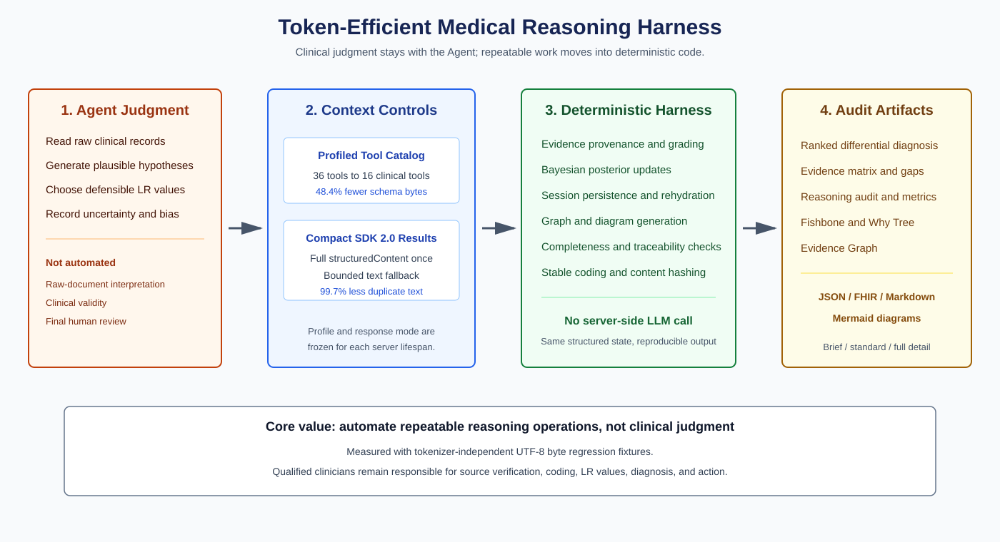
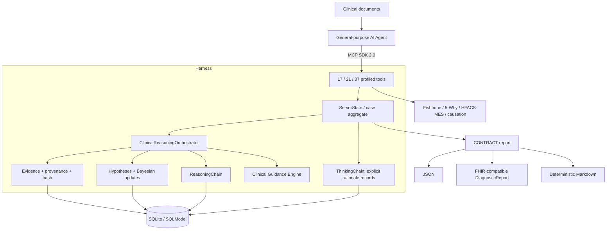
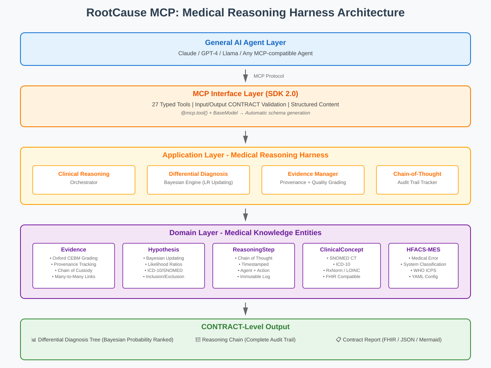

# RootCause MCP

> Medical reasoning, differential diagnosis, and clinical RCA harness for any MCP-compatible AI agent.

[](https://www.python.org/)
[](https://modelcontextprotocol.io/)
[](#tool-catalog)
[](#quality-gates)
[](LICENSE)

**English** | [繁體中文](README.zh-TW.md)

## Mission

RootCause MCP enables general-purpose agents such as Claude Code, Codex, Cline,
OpenCode, OpenClaw, and Z.ai agents to perform a specialized workflow:

1. Ingest clinical documents through the host agent.
2. Register source-grounded evidence and provenance with exact raw snippets.
3. Build and update differential diagnoses with Bayesian likelihood ratios.
4. Record explicit rationales, alternatives, uncertainty, and possible bias.
5. Connect diagnostic reasoning to Fishbone, 5-Why, HFACS-MES, and causation checks.
6. Produce a machine-readable, auditable report with full lineage back to raw records.

The **agent performs the reasoning**. The MCP server does not inspect hidden model
states or raw private chain-of-thought. It provides schemas, workflow constraints,
persistence, calculations, and audit records for reasoning the agent explicitly
chooses to externalize.

> This project is not a medical device and must not autonomously diagnose or treat
> patients. Clinical use requires qualified human review, local governance, privacy
> controls, and independent verification of source documents.

## Why This Harness Saves Work

A general Agent can read every document and write a report in one long prompt. That
approach works, but repeatedly spends context on tool schemas, prior facts,
formatting, probability arithmetic, graph construction, completeness checks, and
report prose. RootCause MCP moves those repeatable operations into deterministic
code while leaving clinical judgment with the Agent.

| Work | Agent-only workflow | RootCause MCP assistance |
| --- | --- | --- |
| Tool context | Load all schemas | `clinical` / `rca` profiles expose only the relevant surface |
| Tool results | Re-read duplicate text and JSON | Complete SDK 2.0 `structuredContent` plus a compact text fallback |
| Probability updates | Recalculate and narrate | Deterministic Bayesian update with retained LR rationale |
| Case continuity | Re-inject earlier conversation | Persisted aggregate and restart rehydration |
| Report assembly | Rewrite DDx, evidence, gaps, metrics, and graphs | Deterministic `brief` / `standard` / `full` Markdown artifact |
| Quality review | Remember every checklist item | Automatic structural traceability warnings |



Tokenizer-independent UTF-8 byte measurements from the regression fixtures:

- Clinical tool profile: 40,557 → 20,937 schema bytes (**48.4% reduction**).
- Compact structured-result fallback: 51,743 → 174 duplicated text bytes in a
  synthetic 50-record response (**99.7% reduction**).
- Markdown report generation: **0 server-side LLM tokens**.

These are byte proxies, not promises about a specific model tokenizer. The Agent
still must read the raw clinical documents, generate clinically plausible
hypotheses, choose defensible likelihood ratios, and review the final artifact.

## Multi-Loop Guidance for Lightweight (Flash) Models

Lightweight or fast models (such as Flash/mini variants) commonly struggle with
complex clinical cases: they tend to jump to conclusions, stop after a single
hypothesis (premature closure), neglect disconfirming tests, and skip cognitive
reflections.

RootCause MCP acts as an active **Reasoning State Machine**:

- Every core tool call returns a structured `guidance` payload evaluating the case state.
- **Stage Progression**: Automatically tracks progress through `EVIDENCE_COLLECTION` → `DIFFERENTIAL_EXPANSION` → `BAYESIAN_EVALUATION` → `COGNITIVE_AUDIT` → `READY_FOR_SYNTHESIS`.
- **Readiness Checklist**: Enforces clinical requirements (e.g., minimum 3 competing differential hypotheses, all evidence grounded in sources, at least one disconfirming test evaluated, uncertainty and cognitive bias explicitly reviewed).
- **Next Prompt Directives**: Provides explicit `next_recommended_actions` with exact tool names and Socratic `push_questions` in each response, allowing Flash agents to loop iteratively until the case is complete.
- **Audit Tool**: Agents or external orchestrators can call `rc_audit_reasoning_state` at any turn to inspect remaining prerequisites before report generation.

## Hard-Coded Provenance and Data Lineage

Inspired by data integration and ETL lineage architectures (such as Airbyte's stream/source verification models), RootCause MCP establishes deterministic, cryptographic evidence grounding without relying on probabilistic LLM memory:

- **Verbatim Snippets & Lineage Anchors**: Evidence records capture exact `raw_snippet` quotes, file paths, line locators, and SHA-256 digests.
- **Deterministic Provenance Verification**: The `ProvenanceVerifier` domain service scans physical raw files on disk (TXT, CSV, HL7, XML) to verify substring matches and line numbers without invoking an LLM.
- **Tamper & Hallucination Prevention**: If an agent hallucinates a quote or references a non-existent file, the server marks the evidence as unverified and generates audit diagnostics.
- **Clean Architecture Boundary**: RootCause MCP focuses strictly on medical reasoning and provenance verification; it does not duplicate document parsing or OCR chunking (the role of Asset-Aware MCP).

## Architecture





The dependency direction follows DDD:

```text
Interface -> Application -> Domain <- Infrastructure
```

## What Is Persisted

The SDK 2.0 server persists the medical reasoning aggregate in SQLite:

- Structured Evidence and source metadata
- Differential-diagnosis hypotheses and Bayesian update history
- Explicit ThinkingStep records supplied by the agent
- ReasoningStep audit records generated by the orchestrator
- RCA sessions and Fishbone diagrams

Known limitation: the legacy Why Tree repository remains in memory and is not yet
rehydrated after process restart. Authentication, encryption-at-rest, tenant
isolation, database migrations, and regulated deployment controls must be supplied
by the deployment environment before clinical production use.

## Quick Start

```powershell
# Install the locked environment
uv sync --all-extras

# Run the MCP SDK 2.0 stdio server
uv run rootcause-mcp
```

VS Code `.vscode/mcp.json`:

```json
{
  "servers": {
    "rootcause-mcp": {
      "type": "stdio",
      "command": "uv",
      "args": ["run", "rootcause-mcp"],
      "cwd": "${workspaceFolder}"
    }
  }
}
```

Environment variables:

| Variable | Purpose | Default |
| --- | --- | --- |
| `ROOTCAUSE_DATA_DIR` | SQLite database and generated exports | `data/` |
| `ROOTCAUSE_CONFIG_DIR` | Configuration root containing `hfacs/` | `config/` |
| `ROOTCAUSE_TOOL_PROFILE` | `clinical`, `rca`, or `all` tool catalog | `all` |
| `ROOTCAUSE_RESPONSE_MODE` | `compact` structured fallback or `verbose` JSON text | `compact` |

## Agent Workflow

A compatible agent should follow the sequence below instead of jumping directly to
a diagnosis:

```text
rc_start_session
  -> rc_add_evidence
  -> rc_think_aloud / rc_identify_gaps / rc_challenge_assumption
  -> rc_propose_hypothesis
  -> rc_link_evidence_to_hypothesis
  -> rc_get_differential_diagnosis
  -> rc_get_reasoning_chain
  -> rc_verify_causation
  -> rc_generate_contract_report(format="markdown", detail_level="standard")
```

`rc_propose_hypothesis` requires the agent to provide clinical rationale,
alternatives considered, supporting evidence, uncertainty factors, and confidence
rationale. These are explicit agent-authored records, not a dump of hidden model
reasoning.

See [Agent Integration Guide](docs/agent_integration_guide.md) for payload examples.

## Tool Catalog

| Category | Count | Purpose |
| --- | ---: | --- |
| Cognitive transparency | 5 | Explicit rationale, reflection, gaps, assumptions, thinking-chain retrieval |
| Evidence | 3 | Add, retrieve, and verify structured evidence with raw snippets and hash |
| Differential diagnosis | 4 | Propose, update, rank, and exclude hypotheses |
| Reasoning chain & guidance | 3 | Retrieve audit action chain, export diagrams, and audit reasoning completion |
| CONTRACT report | 1 | Generate finalized JSON, FHIR-compatible, or deterministic Markdown output |
| HFACS-MES | 6 | Suggest, confirm, inspect, learn, reload, and map classifications |
| Session | 4 | Start, retrieve, list, and archive RCA sessions |
| Fishbone | 4 | Initialize, add causes, inspect, and export |
| Why Tree | 6 | Ask why, inspect, cross-link, mark root causes, export, and teach |
| Causation verification | 1 | Conservative counterfactual and mechanism checks |
| **Total** | **37** | |

All tools expose an MCP SDK 2.0 `input_schema` and a structured output envelope.
New medical-reasoning tools return structured domain data; legacy RCA tools retain
human-readable text and also expose it through structured content.

## Visualization Outputs

| Artifact | Machine-readable output | Diagram output |
| --- | --- | --- |
| Fishbone | JSON | Mermaid 6M Ishikawa layout with spine, causes, and sub-causes |
| Why Tree | JSON | Mermaid hierarchy with root causes and cross-causal links |
| Reasoning Chain | JSON | Mermaid ordered audit trail with evidence/hypothesis references |
| Evidence Graph | CONTRACT JSON `nodes` / `edges` | Embedded Mermaid support/contradiction graph |

Mermaid exports are Markdown-fenced source that can be previewed by GitHub, VS Code,
or Mermaid-compatible clients. Diagram labels are normalized and escaped before
generation. The server does **not** currently bundle a browser renderer or directly
produce SVG, PNG, interactive HTML, Cytoscape, or D3 files; those remain integration
or roadmap items rather than advertised MCP formats.

## Evidence and Causation Safety

- Evidence provenance records document, location, verbatim raw snippets, and SHA-256 checksums.
- Evidence quality uses an Oxford CEBM-inspired strength/reliability model.
- Likelihood ratios and their rationale are retained in hypothesis history.
- A causal claim without explicit counterfactual or mechanism support is **not**
  marked fully verified.
- Finalized reports include a SHA-256 content hash.
- Generated paths are confined under `ROOTCAUSE_DATA_DIR/exports`.

## Quality Gates

Verified locally on Windows with Python 3.12:

```powershell
uv run pytest
uv run ruff check src tests
uv run mypy --no-incremental src/rootcause_mcp
uv run bandit -r src/rootcause_mcp -ll -q
uv run vulture src/rootcause_mcp --min-confidence 80
```

Current baseline:

- 66 tests passing
- 81.56% branch-aware coverage
- Ruff passing
- Strict mypy passing for 79 source files
- Bandit medium/high-severity scan passing
- No vulture findings at 80% confidence

## Project Layout

```text
src/rootcause_mcp/
├── domain/          # Entities, value objects, repository contracts, services
├── application/     # Case aggregate, orchestration, progress guidance
├── infrastructure/  # SQLModel repositories and safe export paths
├── interface/       # MCP tool schemas and handlers
└── server_v2.py     # Sole MCP SDK 2.0 entry point
```

## Documentation

- [Architecture](ARCHITECTURE.md)
- [Deep reasoning architecture](docs/architecture/deep_reasoning_architecture.md)
- [MCP API reference](docs/api.md)
- [Agent integration guide](docs/agent_integration_guide.md)
- [Existing solutions research](docs/research/existing_solutions.md)
- [Roadmap](ROADMAP.md)
- [Changelog](CHANGELOG.md)

## Research and Attribution

The design references publicly available work including MEDDxAgent, ClinClaw,
HFACS-MES, Oxford CEBM concepts, FHIR conventions, and the MCP Python SDK. See the
[research survey](docs/research/existing_solutions.md) for licenses and design notes.

## License

Apache License 2.0. See [LICENSE](LICENSE).
