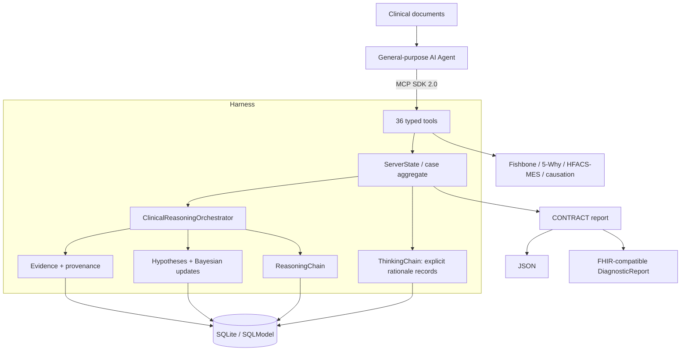

# RootCause MCP

> Medical reasoning, differential diagnosis, and clinical RCA harness for any MCP-compatible AI agent.

[](https://www.python.org/)
[](https://modelcontextprotocol.io/)
[](#tool-catalog)
[](#quality-gates)
[](LICENSE)

**English** | [繁體中文](README.zh-TW.md)

## Mission

RootCause MCP enables general-purpose agents such as Claude Code, Codex, Cline,
OpenCode, OpenClaw, and Z.ai agents to perform a specialized workflow:

1. Ingest clinical documents through the host agent.
2. Register source-grounded evidence and provenance.
3. Build and update differential diagnoses with likelihood ratios.
4. Record explicit rationales, alternatives, uncertainty, and possible bias.
5. Connect diagnostic reasoning to Fishbone, 5-Why, HFACS-MES, and causation checks.
6. Produce a machine-readable, auditable report.

The **agent performs the reasoning**. The MCP server does not inspect hidden model
states or raw private chain-of-thought. It provides schemas, workflow constraints,
persistence, calculations, and audit records for reasoning the agent explicitly
chooses to externalize.

> This project is not a medical device and must not autonomously diagnose or treat
> patients. Clinical use requires qualified human review, local governance, privacy
> controls, and independent verification of source documents.

## Architecture




The dependency direction follows DDD:

```text
Interface -> Application -> Domain <- Infrastructure
```

## What Is Persisted

The SDK 2.0 server persists the medical reasoning aggregate in SQLite:

- Structured Evidence and source metadata
- Differential-diagnosis hypotheses and Bayesian update history
- Explicit ThinkingStep records supplied by the agent
- ReasoningStep audit records generated by the orchestrator
- RCA sessions and Fishbone diagrams

Known limitation: the legacy Why Tree repository remains in memory and is not yet
rehydrated after process restart. Authentication, encryption-at-rest, tenant
isolation, database migrations, and regulated deployment controls must be supplied
by the deployment environment before clinical production use.

## Quick Start

```powershell
# Install the locked environment
uv sync --all-extras

# Run the MCP SDK 2.0 stdio server
uv run rootcause-mcp
```

VS Code `.vscode/mcp.json`:

```json
{
  "servers": {
    "rootcause-mcp": {
      "type": "stdio",
      "command": "uv",
      "args": ["run", "rootcause-mcp"],
      "cwd": "${workspaceFolder}"
    }
  }
}
```

Environment variables:

| Variable | Purpose | Default |
| --- | --- | --- |
| `ROOTCAUSE_DATA_DIR` | SQLite database and generated exports | `data/` |
| `ROOTCAUSE_CONFIG_DIR` | Configuration root containing `hfacs/` | `config/` |

## Agent Workflow

A compatible agent should follow the sequence below instead of jumping directly to
a diagnosis:

```text
rc_start_session
  -> rc_add_evidence
  -> rc_think_aloud / rc_identify_gaps / rc_challenge_assumption
  -> rc_propose_hypothesis
  -> rc_link_evidence_to_hypothesis
  -> rc_get_differential_diagnosis
  -> rc_get_reasoning_chain
  -> rc_verify_causation
  -> rc_generate_contract_report
```

`rc_propose_hypothesis` requires the agent to provide clinical rationale,
alternatives considered, supporting evidence, uncertainty factors, and confidence
rationale. These are explicit agent-authored records, not a dump of hidden model
reasoning.

See [Agent Integration Guide](docs/agent_integration_guide.md) for payload examples.

## Tool Catalog

| Category | Count | Purpose |
| --- | ---: | --- |
| Cognitive transparency | 5 | Explicit rationale, reflection, gaps, assumptions, thinking-chain retrieval |
| Evidence | 3 | Add, retrieve, and verify structured evidence |
| Differential diagnosis | 4 | Propose, update, rank, and exclude hypotheses |
| Reasoning chain | 2 | Retrieve and export the auditable action chain |
| CONTRACT report | 1 | Generate finalized JSON or FHIR-compatible output |
| HFACS-MES | 6 | Suggest, confirm, inspect, learn, reload, and map classifications |
| Session | 4 | Start, retrieve, list, and archive RCA sessions |
| Fishbone | 4 | Initialize, add causes, inspect, and export |
| Why Tree | 6 | Ask why, inspect, cross-link, mark root causes, export, and teach |
| Causation verification | 1 | Conservative counterfactual and mechanism checks |
| **Total** | **36** | |

All tools expose an MCP SDK 2.0 `input_schema` and a structured output envelope.
New medical-reasoning tools return structured domain data; legacy RCA tools retain
human-readable text and also expose it through structured content.

## Evidence and Causation Safety

- Evidence provenance records document, location, collector, and timestamps.
- Evidence quality uses an Oxford CEBM-inspired strength/reliability model.
- Likelihood ratios and their rationale are retained in hypothesis history.
- A causal claim without explicit counterfactual or mechanism support is **not**
  marked fully verified.
- Finalized reports include a SHA-256 content hash.
- Generated paths are confined under `ROOTCAUSE_DATA_DIR/exports`.

## Quality Gates

Verified locally on Windows with Python 3.12:

```powershell
uv run pytest
uv run ruff check src tests
uv run mypy --no-incremental src/rootcause_mcp
uv run bandit -r src/rootcause_mcp -ll -q
uv run vulture src/rootcause_mcp --min-confidence 80
```

Current baseline:

- 48 tests passing
- 80% branch-aware coverage gate passing
- Ruff passing
- Strict mypy passing for 71 source files
- Bandit medium/high-severity scan passing
- No vulture findings at 80% confidence

## Project Layout

```text
src/rootcause_mcp/
├── domain/          # Entities, value objects, repository contracts, services
├── application/     # Case aggregate, orchestration, progress guidance
├── infrastructure/  # SQLModel repositories and safe export paths
├── interface/       # MCP tool schemas and handlers
└── server_v2.py     # Sole MCP SDK 2.0 entry point
```

## Documentation

- [Architecture](ARCHITECTURE.md)
- [Deep reasoning architecture](docs/architecture/deep_reasoning_architecture.md)
- [MCP API reference](docs/api.md)
- [Agent integration guide](docs/agent_integration_guide.md)
- [Existing solutions research](docs/research/existing_solutions.md)
- [Roadmap](ROADMAP.md)
- [Changelog](CHANGELOG.md)

## Research and Attribution

The design references publicly available work including MEDDxAgent, ClinClaw,
HFACS-MES, Oxford CEBM concepts, FHIR conventions, and the MCP Python SDK. See the
[research survey](docs/research/existing_solutions.md) for licenses and design notes.

## License

Apache License 2.0. See [LICENSE](LICENSE).
