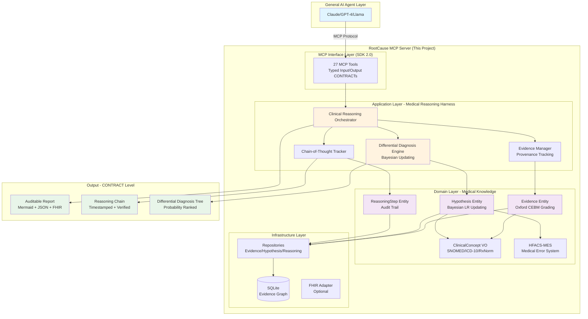
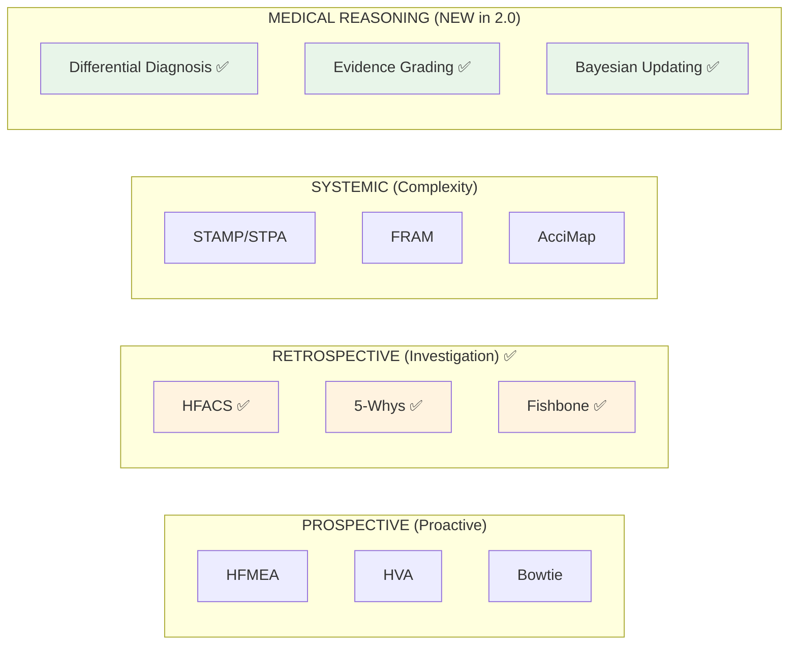

# RootCause MCP - Medical Reasoning & Differential Diagnosis Harness

> 🏥 **Empower any AI Agent with specialist-level medical reasoning**  
> MCP Server + Harness = Medical Reasoning Enablement Layer

[](https://www.python.org/downloads/)
[](https://modelcontextprotocol.io/)
[](https://opensource.org/licenses/Apache-2.0)
[](https://github.com/u9401066/rootcause-mcp)
[](#-available-tools)

**English** | [中文版](README.zh-TW.md)

---

## 🎯 Core Mission

**Enable any general-purpose AI Agent (GPT-4, Claude, Llama, etc.) to perform professional-grade medical reasoning analysis and differential diagnosis.**

We are NOT building:
- ❌ Another diagnostic AI engine (that's the LLM's job)
- ❌ A generic RCA tool (that's for software engineering)
- ❌ A clinical decision support system (that's for physicians)

We ARE building:
- ✅ **Medical Reasoning Harness** — Encapsulate specialist thinking frameworks as machine-executable CONTRACTs
- ✅ **Evidence-First Architecture** — Every hypothesis must cite structured evidence with provenance
- ✅ **Bayesian DDx Engine** — Quantitative diagnostic reasoning with likelihood ratios
- ✅ **Audit-Grade Traceability** — Complete chain-of-thought for legal/regulatory defense

---

## 🏗️ Architecture Overview



### Key Design Principles

1. **Agent-Friendly API**: Hide medical complexity behind simple tool calls
   ```python
   # Agent doesn't need to know Bayesian math
   rc_link_evidence(evidence_id="EVD-001", hypothesis_id="HYP-001", likelihood_ratio=5.0)
   ```

2. **Evidence as First-Class Citizen**: Every claim must cite structured evidence
   ```python
   Evidence(
       content="08:30 BP 75/40 mmHg",
       quality=EvidenceQuality(strength=STRONG, reliability=GRADE_A),
       source=EvidenceSource(document_id="nursing_flowsheet.csv", location="Line 42")
   )
   ```

3. **CONTRACT-Level Output**: Machine-readable, verifiable, auditable
   ```python
   ContractReport(
       hypotheses=[...],  # Bayesian-ranked differential diagnoses
       reasoning_chain=[...],  # Complete audit trail
       evidence_coverage=EvidenceCoverageMetrics(...),  # Quality metrics
       finalized=True  # Immutable after finalization
   )
   ```

---

## 🔬 What Makes Us Different

| Feature | Generic AI | DDx Tools | RCA Tools | **RootCause MCP** |
|---------|-----------|-----------|-----------|-------------------|
| **Medical DDx** | ❌ | ✅ | ❌ | ✅ |
| **Root Cause Analysis** | ❌ | ❌ | ✅ | ✅ |
| **Bayesian Reasoning** | △ | △ | ❌ | ✅ |
| **Evidence Provenance** | ❌ | ❌ | △ | ✅ |
| **HFACS-MES Classification** | ❌ | ❌ | ❌ | ✅ |
| **Chain-of-Thought Audit** | ❌ | ❌ | ❌ | ✅ |
| **FHIR-Compatible** | ❌ | △ | ❌ | ✅ (Phase 3) |
| **Agent-Agnostic** | N/A | ❌ | ❌ | ✅ (MCP Protocol) |

**Legend**: ✅ Full Support | △ Partial | ❌ Not Supported

---

## 🚀 Quick Start (MCP SDK 2.0)

### Installation

```bash
# Install from source
git clone https://github.com/u9401066/rootcause-mcp.git
cd rootcause-mcp
uv sync --all-extras

# Or install from PyPI (coming soon)
pip install rootcause-mcp>=2.0.0a1
```

### MCP Client Configuration

**Claude Desktop** (`claude_desktop_config.json`):
```json
{
  "mcpServers": {
    "rootcause-mcp": {
      "command": "uv",
      "args": ["run", "rootcause-mcp"],
      "cwd": "/path/to/rootcause-mcp"
    }
  }
}
```

**VS Code** (`.vscode/mcp.json`):
```json
{
  "servers": {
    "rootcause-mcp": {
      "command": "uv",
      "args": ["run", "rootcause-mcp"]
    }
  }
}
```

---

## 📖 Usage Example: Differential Diagnosis

### Scenario: Post-operative Hypotension

```python
# 1. Start clinical case
session = await rc_start_clinical_case(
    chief_complaint="Post-op Day 1 hypotension",
    patient_context="65M, s/p CABG, on norepinephrine 0.05 mcg/kg/min"
)

# 2. Add evidence (Agent provides natural language, system handles grading)
evidence_1 = await rc_add_evidence(
    content="08:30 BP 75/40 mmHg, HR 120 bpm",
    evidence_type="DOCUMENT",
    source_document="nursing_flowsheet.csv",
    source_location="Line 42",
    clinical_strength="STRONG",  # System validates Oxford CEBM grading
    source_reliability="GRADE_A"
)

# 3. Propose hypotheses (Bayesian priors)
hyp_cardiogenic = await rc_propose_hypothesis(
    diagnosis="Cardiogenic shock",
    icd10_code="R57.0",
    prior_probability=0.30,
    rationale="Recent CABG, on vasopressors",
    inclusion_criteria=["Elevated troponin", "Reduced EF", "Chest pain"],
    exclusion_criteria=["Normal cardiac function"]
)

hyp_septic = await rc_propose_hypothesis(
    diagnosis="Septic shock",
    icd10_code="R65.21",
    prior_probability=0.20,
    rationale="Post-op infection risk",
    inclusion_criteria=["Fever", "Elevated WBC", "Positive cultures"],
    exclusion_criteria=["No infection source"]
)

# 4. Link evidence to hypotheses (Bayesian updating)
await rc_link_evidence(
    evidence_id=evidence_1.id,
    hypothesis_id=hyp_cardiogenic.id,
    likelihood_ratio=5.0,  # Hypotension strongly supports cardiogenic shock
    supports=True
)

await rc_link_evidence(
    evidence_id=evidence_1.id,
    hypothesis_id=hyp_septic.id,
    likelihood_ratio=2.0,  # Also supports sepsis, but less strongly
    supports=True
)

# 5. Get ranked differential diagnosis
dd_tree = await rc_get_differential_diagnosis(session_id=session.id)
# Returns:
# 1. Cardiogenic shock (posterior: 0.68, 95% CI: [0.55, 0.79])
# 2. Septic shock (posterior: 0.22, 95% CI: [0.14, 0.32])

# 6. Generate CONTRACT-level report
report = await rc_generate_contract_report(
    session_id=session.id,
    include_reasoning_chain=True,
    include_evidence_graph=True,
    format="FHIR"  # or "JSON", "Mermaid"
)

# Report includes:
# - Complete audit trail (who, when, why)
# - Evidence coverage metrics
# - Bayesian update history
# - HFACS-MES classification (if applicable)
# - Legally defensible documentation
```

---

## 🛠️ Available Tools (27 Total)

### Evidence Management (NEW in 2.0)
| Tool | Description |
|------|-------------|
| `rc_add_evidence` | Add structured evidence with provenance |
| `rc_get_evidence` | Retrieve evidence by ID |
| `rc_link_evidence_to_cause` | Link evidence to root cause |
| `rc_verify_evidence` | Mark evidence as independently verified |

### Differential Diagnosis (NEW in 2.0)
| Tool | Description |
|------|-------------|
| `rc_propose_hypothesis` | Propose a differential diagnosis |
| `rc_link_evidence_to_hypothesis` | Bayesian update with evidence |
| `rc_get_differential_diagnosis` | Get probability-ranked DDx tree |
| `rc_exclude_hypothesis` | Rule out a hypothesis |

### Reasoning Chain (NEW in 2.0)
| Tool | Description |
|------|-------------|
| `rc_get_reasoning_chain` | Retrieve complete audit trail |
| `rc_export_reasoning_chain` | Export to JSON/Mermaid |

### HFACS Classification (Existing)
| Tool | Description |
|------|-------------|
| `rc_suggest_hfacs` | HFACS code suggestions |
| `rc_confirm_classification` | Confirm classification + learn |
| `rc_get_hfacs_framework` | Get framework structure |
| `rc_get_6m_hfacs_mapping` | 6M↔HFACS mapping |
| `rc_list_learned_rules` | List learned rules |
| `rc_reload_rules` | Reload rule database |

### Session Management (Existing)
| Tool | Description |
|------|-------------|
| `rc_start_session` | Create new RCA session |
| `rc_get_session` | Get session details |
| `rc_list_sessions` | List all sessions |
| `rc_archive_session` | Archive session |

### Fishbone Diagram (Existing)
| Tool | Description |
|------|-------------|
| `rc_init_fishbone` | Initialize fishbone |
| `rc_add_cause` | Add cause |
| `rc_get_fishbone` | Get fishbone |
| `rc_export_fishbone` | Export (Mermaid/MD/JSON) |

### 5-Why Analysis (Existing)
| Tool | Description |
|------|-------------|
| `rc_ask_why` | 5-Why iterative questioning |
| `rc_get_why_tree` | Get complete analysis tree |
| `rc_mark_root_cause` | Mark root cause |
| `rc_export_why_tree` | Export (Mermaid/MD/JSON) |

### Verification (Existing)
| Tool | Description |
|------|-------------|
| `rc_verify_causation` | Counterfactual testing |

---

## 🏛️ Domain Cartridges

RootCause MCP supports three categories of analysis models:



---

## 📚 Technology Stack

- **MCP SDK**: 2.0+ (typed contracts, structured output)
- **Data Validation**: Pydantic v2 (strict mode)
- **Persistence**: SQLModel + SQLite
- **Graph Analysis**: NetworkX
- **Medical Standards**: SNOMED CT, ICD-10, RxNorm, LOINC (via `fhir.resources`)
- **Evidence Grading**: Oxford CEBM, GRADE
- **Bayesian Reasoning**: Custom LR-based updating

---

## 🤝 Contributing

We welcome contributions! See [CONTRIBUTING.md](CONTRIBUTING.md) for guidelines.

---

## 📄 License

Apache License 2.0 - See [LICENSE](LICENSE) for details.

---

## 🙏 Acknowledgments

Inspired by:
- [MEDDxAgent](https://github.com/nec-research/meddxagent) - Differential diagnosis agent architecture
- [ClinClaw](https://github.com/rbr7/ClinClaw) - Medical AI harness pattern
- [fastmcp](https://github.com/PrefectHQ/fastmcp) - Pythonic MCP server framework
- Oxford CEBM - Evidence grading methodology

---

**⭐ Star this repo if you find it useful!**


## 🏗️ Domain Cartridges

RootCause MCP supports three categories of analysis models through **Domain Cartridges**:

```text
┌─────────────────────────────────────────────────────────────────┐
│                      RootCause MCP                              │
├─────────────────────────────────────────────────────────────────┤
│  ┌─────────────┐  ┌─────────────┐  ┌─────────────┐             │
│  │ PROSPECTIVE │  │RETROSPECTIVE│  │   SYSTEMIC  │             │
│  │  Proactive  │  │Investigation│  │  Complexity │             │
│  ├─────────────┤  ├─────────────┤  ├─────────────┤             │
│  │ • HFMEA     │  │ • HFACS  ✅ │  │ • STAMP/STPA│             │
│  │ • HVA       │  │ • 5-Whys ✅ │  │ • FRAM      │             │
│  │ • Bowtie    │  │ • Fishbone✅│  │ • AcciMap   │             │
│  └─────────────┘  └─────────────┘  └─────────────┘             │
│                          ▼                                      │
│              ┌───────────────────────┐                          │
│              │   Unified Graph API   │                          │
│              │    (19 MCP Tools)     │                          │
│              └───────────────────────┘                          │
└─────────────────────────────────────────────────────────────────┘
```

## 💎 Core Value Propositions

### What This Tool Actually Does

1. **🔒 Legal Armor**
   - Generates audit-compliant reports for JCAHO, CMS, state boards
   - Provides methodology traceability ("we followed TJC Framework")
   - Creates defensible documentation for litigation

2. **👥 Collaboration Substrate**
   - Shared Fishbone that 10 people can edit simultaneously
   - Version-controlled causation chains
   - Multi-stakeholder review workflow

3. **📚 Knowledge Graph**
   - `learned_rules.yaml` grows smarter with each case
   - Pattern recognition: "Last 3 LVOT obstruction cases all had this signature"
   - Institutional memory that survives staff turnover

4. **🎓 Educational Framework**
   - Trains residents in critical thinking (not just answer-seeking)
   - Teaches counterfactual reasoning ("What if we HAD identified HOCM?")
   - Provides structured practice for QI competencies

5. **🧪 Verification Layer**
   - Causation testing (Temporality, Necessity, Sufficiency, Mechanism)
   - Prevents spurious correlations from becoming "root causes"
   - Forces evidence-based reasoning

---

## ✨ Core Features

### Retrospective Cartridge (Implemented ✅)

| Feature | Description | Status |
|---------|-------------|--------|
| 🐟 **Fishbone (6M)** | Healthcare-specialized Ishikawa diagram | ✅ 4 tools |
| 🔍 **5-Why Analysis** | Deep cause exploration with Proximate/Ultimate classification | ✅ 4 tools |
| 📊 **HFACS-MES** | Human Factors Analysis auto-suggestion (5-level, 25 categories) | ✅ 6 tools |
| ✅ **Causation Verify** | Bradford Hill criteria-based verification | ✅ 1 tool |
| 🔗 **6M-HFACS Mapping** | Cross-reference between taxonomies | ✅ 1 tool |
| 💾 **Session Management** | Persistent analysis sessions | ✅ 4 tools |

### Prospective Cartridge (Planned 📋)

- **HFMEA** - Healthcare Failure Mode and Effect Analysis
- **HVA** - Hazard Vulnerability Analysis
- **Bowtie** - Threat and consequence analysis

### Systemic Cartridge (Planned 📋)

- **STAMP/STPA** - Control loop analysis
- **FRAM** - Functional Resonance Analysis Method

## 🔧 Available Tools

### HFACS Tools (6)
| Tool | Description |
|------|-------------|
| `rc_suggest_hfacs` | Auto-suggest HFACS codes from cause description |
| `rc_confirm_classification` | Confirm or override HFACS classification |
| `rc_get_hfacs_framework` | Get full HFACS-MES framework structure |
| `rc_list_learned_rules` | List learned classification rules |
| `rc_reload_rules` | Hot-reload YAML rules |
| `rc_get_6m_hfacs_mapping` | Get 6M-HFACS cross-reference table |

### Session Tools (4)
| Tool | Description |
|------|-------------|
| `rc_start_session` | Create new RCA session |
| `rc_get_session` | Get session details |
| `rc_list_sessions` | List all sessions |
| `rc_archive_session` | Archive completed session |

### Fishbone Tools (4)
| Tool | Description |
|------|-------------|
| `rc_init_fishbone` | Initialize fishbone diagram |
| `rc_add_cause` | Add cause to 6M category |
| `rc_get_fishbone` | Get fishbone structure |
| `rc_export_fishbone` | Export as Mermaid/Markdown/JSON |

### Why Tree Tools (4)
| Tool | Description |
|------|-------------|
| `rc_ask_why` | Progressive 5-Why questioning |
| `rc_get_why_tree` | Get Why tree structure |
| `rc_mark_root_cause` | Mark node as root cause |
| `rc_export_why_tree` | Export as Mermaid/Markdown/JSON |

### Verification Tools (1)
| Tool | Description |
|------|-------------|
| `rc_verify_causation` | Verify causation with 4-criteria test |

## 🚀 Quick Start

```bash
# Install with uv (recommended)
uv pip install -e .

# Or development mode
uv pip install -e ".[dev]"

# Run MCP Server
python -m rootcause_mcp.interface.server
```

### VS Code Integration

Add to your `.vscode/mcp.json`:

```json
{
  "servers": {
    "rootcause-mcp": {
      "type": "stdio",
      "command": "uv",
      "args": ["run", "python", "-m", "rootcause_mcp.interface.server"],
      "cwd": "${workspaceFolder}"
    }
  }
}
```

## 📁 Project Structure

```text
rootcause-mcp/
├── src/rootcause_mcp/
│   ├── domain/           # Domain Layer (DDD)
│   │   ├── entities/     # Session, Cause, Fishbone, WhyNode
│   │   ├── value_objects/# HFACSCode, Scores, Identifiers
│   │   ├── repositories/ # Repository interfaces
│   │   └── services/     # HFACSSuggester, CausationValidator
│   ├── application/      # Application Layer
│   │   ├── session_progress_tracker.py
│   │   └── guided_response_builder.py
│   ├── infrastructure/   # Infrastructure Layer
│   │   └── persistence/  # SQLite + SQLModel
│   └── interface/        # Interface Layer
│       ├── tools/        # MCP Tool definitions
│       ├── handlers/     # Tool handlers
│       └── server.py     # MCP Server entry
├── config/hfacs/         # YAML configurations
│   ├── hfacs_mes.yaml    # HFACS-MES framework
│   ├── fishbone_6m.yaml  # Healthcare 6M categories
│   └── keyword_rules.yaml# Classification rules
├── tests/                # Test suites
├── docs/                 # Documentation
│   └── spec_v2.md        # Full specification v2.5.0
└── memory-bank/          # Project memory (for AI)
```

## 🔗 Related MCPs

| MCP | Purpose | Integration |
|-----|---------|-------------|
| [asset-aware-mcp](https://github.com/u9401066/asset-aware-mcp) | Data decomposition & table refactoring | Pre-processing |
| HHRAG MCP | Knowledge graph retrieval | Context enrichment |
| CGU MCP | Creative divergent thinking | Cause brainstorming |

## 📚 Documentation

- [Full Specification](docs/spec_v2.md) - v2.5.0 (3700+ lines)
- [Architecture](ARCHITECTURE.md) - DDD layers
- [Roadmap](ROADMAP.md) - Cartridge expansion plan
- [Literature Review](docs/literature_review_clinical_rca.md) - HFACS-MES research

## 🔧 Development

```bash
# Run tests
pytest tests/ -v

# Code linting
ruff check src tests
mypy src --strict

# Security scan
bandit -r src

# Dead code detection
vulture src
```

## 🤝 Contributing

Contributions welcome! Please see [CONTRIBUTING.md](CONTRIBUTING.md).

## 📄 License

Apache 2.0 License - See [LICENSE](LICENSE)

---

## 🎯 When Should You Use This?

### ❌ DON'T Use This If:
- You just want a quick personal learning exercise
- You're working solo and don't need to justify your reasoning
- Your organization doesn't require structured RCA

### ✅ DO Use This If:
- 🏥 You need to pass JCAHO/CMS audits
- 👥 Multiple departments need to collaborate (Surgery + Anesthesia + Nursing + Pharmacy)
- 📚 You want to build institutional knowledge base
- 🎓 You're training residents/fellows in RCA methodology
- ⚖️ You're preparing for potential litigation
- 🔬 You need reproducible, evidence-based analysis

---

**Made with ❤️ for Healthcare Quality Improvement**  
*"AI can find the answer in 30 seconds. We help you defend it for 30 years."*
