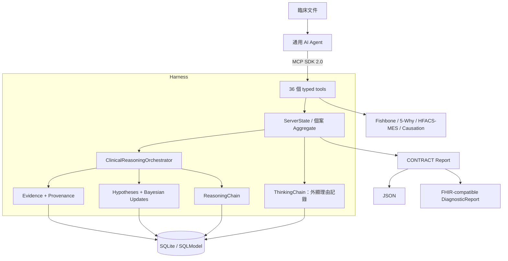

# RootCause MCP

> 讓任何相容 MCP 的通用 AI Agent 執行醫學推理、鑑別診斷與臨床根因分析的 Harness。

[](https://www.python.org/)
[](https://modelcontextprotocol.io/)
[](#工具目錄)
[](#品質閘門)
[](LICENSE)

[English](README.md) | **繁體中文**

## 核心目標

RootCause MCP 讓 Claude Code、Codex、Cline、OpenCode、OpenClaw、Z.ai Agent 等
通用 Agent 執行下列專門工作流：

1. 由宿主 Agent 讀取大量臨床文件。
2. 登錄有來源定位的結構化證據。
3. 使用 likelihood ratio 建立與更新鑑別診斷。
4. 記錄 Agent 明確提供的理由、替代方案、不確定性與潛在偏差。
5. 串接魚骨圖、5-Why、HFACS-MES 與因果驗證。
6. 產生機器可讀、可稽核的報告。

**真正進行推理的是 Agent。** MCP Server 不會讀取模型隱藏狀態，也不會擷取私密的原始
chain-of-thought。它提供 schema、流程約束、計算、持久化與稽核記錄，保存 Agent
主動外顯的結構化推理理由。

> 本專案不是醫療器材，不可自主診斷或治療病人。臨床使用必須由合格人員審查，並配合
> 在地治理、隱私保護、來源文件核驗與機構安全控制。

## 架構




DDD 依賴方向：

```text
Interface -> Application -> Domain <- Infrastructure
```

## 持久化範圍

SDK 2.0 Server 會將醫學推理 Aggregate 寫入 SQLite：

- 結構化 Evidence 與來源 metadata
- 鑑別診斷 Hypothesis 與 Bayesian update history
- Agent 明確提交的 ThinkingStep
- Orchestrator 自動建立的 ReasoningStep
- RCA Session 與 Fishbone

已知限制：舊 Why Tree Repository 目前仍為記憶體實作，程序重啟後不會自動還原。
Authentication、靜態加密、多租戶隔離、資料庫 migration 與法規部署控制，仍須由部署
環境補齊，才能用於臨床 production。

## 快速開始

```powershell
# 安裝 lockfile 定義的環境
uv sync --all-extras

# 啟動 MCP SDK 2.0 stdio server
uv run rootcause-mcp
```

VS Code `.vscode/mcp.json`：

```json
{
  "servers": {
    "rootcause-mcp": {
      "type": "stdio",
      "command": "uv",
      "args": ["run", "rootcause-mcp"],
      "cwd": "${workspaceFolder}"
    }
  }
}
```

環境變數：

| 變數 | 用途 | 預設值 |
| --- | --- | --- |
| `ROOTCAUSE_DATA_DIR` | SQLite 與匯出產物根目錄 | `data/` |
| `ROOTCAUSE_CONFIG_DIR` | 包含 `hfacs/` 的設定根目錄 | `config/` |

## Agent 工作流

相容 Agent 應按順序建立推理記錄，而不是直接跳到診斷：

```text
rc_start_session
  -> rc_add_evidence
  -> rc_think_aloud / rc_identify_gaps / rc_challenge_assumption
  -> rc_propose_hypothesis
  -> rc_link_evidence_to_hypothesis
  -> rc_get_differential_diagnosis
  -> rc_get_reasoning_chain
  -> rc_verify_causation
  -> rc_generate_contract_report
```

`rc_propose_hypothesis` 強制要求 Agent 提供臨床理由、曾考慮的替代診斷、支持證據、
不確定因素與信心理由。這些是 Agent 主動撰寫的可稽核記錄，不是模型隱藏思考的 dump。

完整 payload 範例請見 [Agent 整合指南](docs/agent_integration_guide.md)。

## 工具目錄

| 類別 | 數量 | 用途 |
| --- | ---: | --- |
| 認知透明度 | 5 | 外顯理由、反思、缺口、假設挑戰與 ThinkingChain |
| Evidence | 3 | 新增、查詢與驗證結構化證據 |
| 鑑別診斷 | 4 | 提出、更新、排序與排除 Hypothesis |
| Reasoning Chain | 2 | 查詢與匯出可稽核行動鏈 |
| CONTRACT Report | 1 | 產生 finalized JSON 或 FHIR-compatible 報告 |
| HFACS-MES | 6 | 建議、確認、檢視、學習、重載與分類對照 |
| Session | 4 | 建立、查詢、列出與封存 RCA Session |
| Fishbone | 4 | 初始化、新增原因、檢視與匯出 |
| Why Tree | 6 | 追問、檢視、跨鏈接、標記根因、匯出與教學案例 |
| 因果驗證 | 1 | 保守的反事實、時序與機制檢查 |
| **總計** | **36** | |

36 個工具都有 MCP SDK 2.0 `input_schema` 與 structured output envelope。新的醫學推理
工具回傳結構化 domain data；舊 RCA 工具保留人類可讀文字，同時包裝成 structured
content。

## 證據與因果安全

- Provenance 記錄文件、位置、收集者與時間。
- Evidence quality 使用 Oxford CEBM 啟發的 strength/reliability 模型。
- Likelihood ratio 與理由保存在 Hypothesis history。
- 沒有明確反事實或機制支持的因果主張，不會標成完全 VERIFIED。
- Finalized report 包含 SHA-256 content hash。
- 匯出路徑被限制在 `ROOTCAUSE_DATA_DIR/exports` 下。

## 品質閘門

已在 Windows / Python 3.12 驗證：

```powershell
uv run pytest
uv run ruff check src tests
uv run mypy --no-incremental src/rootcause_mcp
uv run bandit -r src/rootcause_mcp -ll -q
uv run vulture src/rootcause_mcp --min-confidence 80
```

目前基線：

- 48 個測試通過
- branch-aware coverage 80% 閘門通過
- Ruff 通過
- 71 個 source files 通過 strict mypy
- Bandit 中高風險掃描通過
- Vulture 80% confidence 無孤兒程式碼

## 專案結構

```text
src/rootcause_mcp/
├── domain/          # Entity、Value Object、Repository Contract、Domain Service
├── application/     # Case Aggregate、Orchestrator、進度引導
├── infrastructure/  # SQLModel Repository、安全匯出路徑
├── interface/       # MCP Tool Schema 與 Handler
└── server_v2.py     # 唯一 MCP SDK 2.0 入口
```

## 文件

- [架構文件](ARCHITECTURE.md)
- [深度推理架構](docs/architecture/deep_reasoning_architecture.md)
- [MCP API 參考](docs/api.md)
- [Agent 整合指南](docs/agent_integration_guide.md)
- [公開方案研究](docs/research/existing_solutions.md)
- [Roadmap](ROADMAP.md)
- [Changelog](CHANGELOG.md)

## 研究與引用

設計參考 MEDDxAgent、ClinClaw、HFACS-MES、Oxford CEBM、FHIR 慣例與 MCP Python
SDK 等公開研究及專案。授權與設計取捨請見
[研究整理](docs/research/existing_solutions.md)。

## 授權

Apache License 2.0，詳見 [LICENSE](LICENSE)。
