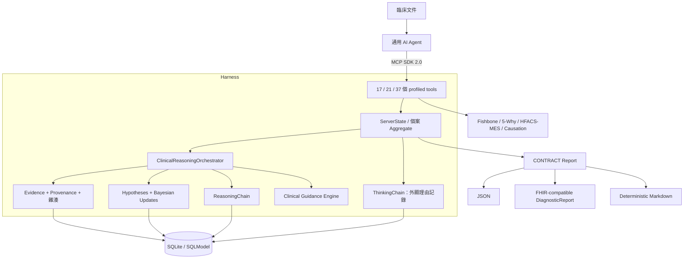

# RootCause MCP

> 讓任何相容 MCP 的通用 AI Agent 執行醫學推理、鑑別診斷與臨床根因分析的 Harness。

[](https://www.python.org/)
[](https://modelcontextprotocol.io/)
[](#工具目錄)
[](#品質閘門)
[](LICENSE)

[English](README.md) | **繁體中文**

## 核心目標

RootCause MCP 讓 Claude Code、Codex、Cline、OpenCode、OpenClaw、Z.ai Agent 等
通用 Agent 執行下列專門工作流：

1. 由宿主 Agent 讀取大量臨床文件。
2. 登錄有來源定位與字面引文（raw snippet）的結構化證據。
3. 使用 Bayesian likelihood ratio 建立與更新鑑別診斷。
4. 記錄 Agent 明確提供的理由、替代方案、不確定性與潛在偏差。
5. 串接魚骨圖、5-Why、HFACS-MES 與因果驗證。
6. 產生機器可讀、可追溯至原始病歷的稽核報告。

**真正進行推理的是 Agent。** MCP Server 不會讀取模型隱藏狀態，也不會擷取私密的原始
chain-of-thought。它提供 schema、流程約束、計算、持久化與稽核記錄，保存 Agent
主動外顯的結構化推理理由。

> 本專案不是醫療器材，不可自主診斷或治療病人。臨床使用必須由合格人員審查，並配合
> 在地治理、隱私保護、來源文件核驗與機構安全控制。

## Harness 如何節省工作

通用 Agent 當然可以在一個超長 prompt 中讀完所有文件並撰寫報告，但每次都會重複消耗
context 來載入 tool schemas、重述既有事實、排版、計算機率、畫圖、跑完整性清單及撰寫
報告。RootCause MCP 把可重複部分移到 deterministic code，臨床判斷仍由 Agent 負責。

| 工作 | 只有 Agent | RootCause MCP 自動化 |
| --- | --- | --- |
| Tool context | 載入所有 schemas | `clinical` / `rca` profiles 只曝光相關工具 |
| Tool results | 重讀重複的 text 與 JSON | 完整 SDK 2.0 `structuredContent` 加精簡 text fallback |
| 機率更新 | 重算並重新敘述 | deterministic Bayesian update 並保留 LR 理由 |
| 個案延續 | 重新注入先前對話 | aggregate 持久化與重啟還原 |
| 報告組裝 | 重寫 DD、證據、缺口、指標與圖 | deterministic `brief` / `standard` / `full` Markdown |
| 品質檢查 | 靠 Agent 記住清單 | 自動產生結構與可追溯性 warnings |


Regression fixtures 的 tokenizer-independent UTF-8 bytes 量測：

- Clinical tool profile：40,557 → 20,937 schema bytes（**減少 48.4%**）。
- Compact structured-result fallback：50 筆合成回應的重複 text 從 51,743 → 174
  bytes（**減少 99.7%**）。
- Markdown report generation：**server-side LLM tokens 為 0**。

這些是 byte proxy，不是特定模型 tokenizer 的保證。Agent 仍須閱讀 raw 病歷、產生合理
臨床假設、選擇可辯護的 likelihood ratio，並由合格人員審查最終產物。

## 輕量 (Flash) 模型的自我校正多輪導引

輕量或速度優先的 Flash/mini 模型在複雜臨床個案常見的失敗模式是：**提早下結論 (premature diagnostic closure)、只提出單一假設、忽略否定性排除測試、漏掉不確定性與認知偏差審查**。

RootCause MCP 透過**確定性推理狀態機 (Reasoning State Machine)** 來約束與賦能：

- 每次核心工具呼叫均回傳結構化 `guidance` 評估個案狀態。
- **階段進程追蹤**：自動識別 `EVIDENCE_COLLECTION` → `DIFFERENTIAL_EXPANSION` → `BAYESIAN_EVALUATION` → `COGNITIVE_AUDIT` → `READY_FOR_SYNTHESIS`。
- **臨床完備檢查清單**：強制要求至少 3 個競爭性鑑別診斷、證據必須全部具備來源定位、至少進行一項否定性排除測試（避免確認偏誤）、明確宣告臨床不確定因素與偏差。
- **下一步 Prompt 指令**：在工具回傳中直接給出 `next_recommended_actions` 與蘇格拉底式臨床詰問 `push_questions`，讓 Flash 模型在多輪迴圈中自然步步推進直到完成。
- **主動稽核工具**：Agent 或外部 orchestrator 可隨時呼叫 `rc_audit_reasoning_state` 檢查報告生成前尚缺的要件。

## 硬性證據溯源與資料血緣 (Hard-Coded Provenance)

借鑑大型資料整合與 ETL 血緣架構（如 Airbyte 的 source/stream/lineage 驗證概念），RootCause MCP 建立確定性、無幻覺的證據溯源契約：

- **逐字引文與密碼學錨定**：每筆 Evidence 包含 `raw_snippet`（原始病歷字面引文）、檔案路徑、行號定位與 SHA-256 雜湊摘要。
- **確定性實體驗證**：`ProvenanceVerifier` 領域服務直接掃描磁碟上的原始病歷檔案（TXT、CSV、HL7、XML），比對字面引文並計算行號與雜湊，完全不使用神經網路或 LLM。
- **防竄改與防幻覺**：若 Agent 捏造不存在的引文或指向不存在的文件，伺服器立即標記為未驗證並產出診斷報告。
- **清晰架構邊界**：RootCause MCP 專注於醫學推理與血緣約束，不重疊 Asset-Aware MCP 的多模態 OCR、表格分割與 PDF 排版工作。

## 臨床可自訂範本、推論 SOP 與麻醉專科 4-Tier 倒推因果

為保證臨床可重現性並允許科部在不修改代碼的前提下更新指引：

- **可編輯 SOP 與次專科手冊 (`config/protocols/`, `config/domains/`)**：
  - `anesthesia_mm_rca_protocol.yaml`：麻醉專科 4-Tier 倒推因果架構（Tier 0 終末心律 → Tier 1 ACLS 5H5T → Tier 2 術中三方觸發流 [病人初始狀況 vs 外科處置干擾 vs 麻醉用藥通氣] → Tier 3 系統潛在漏洞）。
  - `perioperative_shock.yaml` 與 `toxicology_sedation.yaml`：針對動態 LVOT 阻塞 (SAM) 與 Propofol 輸注症候群 (PRIS) 的專科鑑別標準。
- **純文字可覆寫 Markdown 報告範本 (`config/templates/`)**：
  - `anesthesia_mm_rca_report_template.md`：麻醉部 M&M 併發症與死亡病例討會專用結構化報告。
  - `clinical_reasoning_report_template.md`：通用臨床決策輔助與病安行動計畫報告。

## 架構




DDD 依賴方向：

```text
Interface -> Application -> Domain <- Infrastructure
```

## 持久化範圍

SDK 2.0 Server 會將醫學推理 Aggregate 寫入 SQLite：

- 結構化 Evidence、字面引文與來源 metadata
- 鑑別診斷 Hypothesis 與 Bayesian update history
- Agent 明確提交的 ThinkingStep
- Orchestrator 自動建立的 ReasoningStep
- RCA Session 與 Fishbone

已知限制：舊 Why Tree Repository 目前仍為記憶體實作，程序重啟後不會自動還原。
Authentication、靜態加密、多租戶隔離、資料庫 migration 與法規部署控制，仍須由部署
環境補齊，才能用於臨床 production。

## 快速開始與自動化安裝

### 🚀 一鍵快速自動安裝

你可以透過一鍵腳本自動偵測 `uv`、同步虛擬環境、註冊客戶端 MCP harness 設定（`.vscode/mcp.json`、Claude Desktop、Cline），並自動執行自檢診斷：

**Windows PowerShell：**

```powershell
powershell -ExecutionPolicy Bypass -File scripts/setup.ps1
```

**Linux / macOS / WSL：**

```bash
chmod +x scripts/setup.sh
./scripts/setup.sh
```

**通用 Python CLI 安裝器：**

```powershell
uv run python scripts/install.py --profile all --target all
```

### 🔬 臨床真實案例推理試跑 (Trial Run)

對包含多個非結構化原始數據檔的臨床案例（`dynamic_lvot_obstruction_sam`、`pris_status_epilepticus`、`trauma_hyperkalemia_arrest` 與 `postop_pe_death`）進行端到端多迴圈推理試跑：

```powershell
uv run python scripts/run_case_trial.py --case all
```

### 🛠️ 手動安裝與啟動

```powershell
# 安裝 lockfile 定義的環境
uv sync --all-extras

# 啟動 MCP SDK 2.0 stdio server
uv run rootcause-mcp
```

VS Code `.vscode/mcp.json`：

```json
{
  "servers": {
    "rootcause-mcp": {
      "type": "stdio",
      "command": "uv",
      "args": ["run", "rootcause-mcp"],
      "cwd": "${workspaceFolder}"
    }
  }
}
```

環境變數：

| 變數 | 用途 | 預設值 |
| --- | --- | --- |
| `ROOTCAUSE_DATA_DIR` | SQLite 與匯出產物根目錄 | `data/` |
| `ROOTCAUSE_CONFIG_DIR` | 包含 `hfacs/`、`domains/`、`protocols/`、`templates/` 的設定根目錄 | `config/` |
| `ROOTCAUSE_TOOL_PROFILE` | 工具目錄：`condensed` (8 個 Facade 工具)、`clinical` (23)、`rca` (23) 或 `all` (43) | `all` |
| `ROOTCAUSE_RESPONSE_MODE` | `compact` structured fallback 或 `verbose` JSON text | `compact` |

## Agent 工作流

相容 Agent 可以使用細粒度 Discrete 工具工作流，或是超精簡的 8-Facade 工具工作流：

### 細粒度工具工作流 (Discrete Tool Workflow)

```text
rc_start_session
  -> rc_add_evidence(source_document=..., raw_snippet=...)
  -> rc_think_aloud / rc_identify_gaps / rc_challenge_assumption
  -> rc_propose_hypothesis(diagnosis=..., clinical_reasoning=...)
  -> rc_link_evidence_to_hypothesis(evidence_id=..., hypothesis_id=..., likelihood_ratio=...)
  -> rc_get_differential_diagnosis
  -> rc_audit_reasoning_state
  -> rc_detect_conflicts
  -> rc_create_checkpoint
  -> rc_verify_causation
  -> rc_generate_contract_report(format="markdown", detail_level="standard")
```

### 超精簡 Facade 工具工作流 (8 Tools Profile)

```text
rc_rca(action="session_start")
  -> rc_evidence(action="add")
  -> rc_thinking(action="think" / "gap" / "challenge" / "reflect")
  -> rc_hypothesis(action="propose" / "link" / "rank")
  -> rc_audit(action="stage_guidance" / "detect_conflicts")
  -> rc_checkpoint(action="create")
  -> rc_diagram(action="render_timeline" / "validate_syntax")
  -> rc_report(action="generate_contract")
```

`rc_propose_hypothesis`（或 `rc_hypothesis(action="propose")`）強制要求 Agent 提供臨床理由、曾考慮的替代診斷、支持證據、不確定因素與信心理由。這些是 Agent 主動撰寫的可稽核記錄，不是模型隱藏思考的 dump。

完整 payload 範例請見 [Agent 整合指南](docs/agent_integration_guide.md)。

## MCP SDK 2.0 進階功能

RootCause MCP 深度整合 MCP SDK 2.0 完整原生功能，提供極致的 Agent 體驗：

### 1. 🧰 工具濃縮與 Facade 架構 (8 Unified Facade Tools)

當設定 `ROOTCAUSE_TOOL_PROFILE=condensed` 時，伺服器將 43 個離散工具濃縮為 **8 個多型 Facade 工具**，將工具 Schema 所佔用的 Context Window 大幅縮減 **>80%**，同時透過 `action` 參數保留 100% 完整功能：

- `rc_evidence`: 登錄、查詢或物理檢驗病歷引文血緣。
- `rc_hypothesis`: 提出、連結證據、取得鑑別清單、更新或排除假設。
- `rc_thinking`: 記錄外顯臨床理由、反思認知偏差、標記數據缺口或挑戰既有假設。
- `rc_audit`: 查詢多迴圈導引、稽核完備性清單、或偵測臨床矛盾與指引遺漏。
- `rc_report`: 產生確定性 Contract 報告或匯出稽核產物。
- `rc_diagram`: 渲染時序圖、稽核修復 Mermaid 語法、或匯出圖表。
- `rc_checkpoint`: 建立、檢視或還原不可變案例狀態快照。
- `rc_rca`: 路由傳統 6M 魚骨圖、5-Why 原因樹與 HFACS-MES 分類法。

### 2. 📚 MCP 靜態與動態資源 (Resources)

無須消耗 Tool Call 即可即時讀取專業臨床協議與案例狀態：

- **靜態協議與範本 URI**：
  - `clinical://protocols/anesthesia-mm-rca-protocol`: 麻醉專科 4-Tier 倒推因果推理 SOP。
  - `clinical://protocols/clinical-reasoning-sop`: 臨床鑑別診斷標準作業流程。
  - `clinical://templates/anesthesia-mm-rca-report-template`: Markdown 報告範本。
  - `clinical://templates/near-miss-adverse-event-rca-template`: 瑞士乳酪與屏障失效範本。
  - `clinical://domains/*`: 7 個圍術期重症危機 Playbooks (`perioperative-shock`, `anaphylaxis`, `last-toxicity`, `difficult-airway`, `lvad-crisis`, `delayed-diagnosis`, `trauma-hyperkalemia`)。
- **動態案例資源範本 (Resource Templates)**：
  - `clinical://sessions/{session_id}/report`: 即時渲染的案例報告。
  - `clinical://sessions/{session_id}/timeline`: 即時臨床事件時序圖。
  - `clinical://sessions/{session_id}/guidance`: 即時推理階段、檢查清單與蘇格拉底詰問。
  - `clinical://sessions/{session_id}/conflicts`: 即時診斷矛盾、藥物反常反應與指引遺漏報告。

### 3. 🎯 MCP 預設臨床 Prompts

支援在 Claude Desktop、VS Code、Cline 等客戶端一鍵發起專業臨床調查：

- `anesthesia_mm_investigation`: 麻醉專科 4-Tier 倒推因果 M&M 調查。
- `perioperative_crisis_differential`: 圍術期危機 5H5T 鑑別診斷擴展。
- `near_miss_barrier_analysis`: 瑞士乳酪非死亡不良事件屏障分析。
- `delayed_diagnosis_investigation`: 診斷延遲軌跡與認知偏差調查。

### 4. 🧠 伺服器級系統指令 (Server Instructions & Meta-Prompt)

在 MCP 連線握手時自動注入系統級 Meta-Prompt，確保任何連接的 AI Agent 自動遵守嚴格證據溯源、4-Tier 倒推因果、否定性假設檢驗與認知透明度。

## 工具目錄

| 類別 | 數量 | 用途 |
| --- | ---: | --- |
| 認知透明度 | 5 | 外顯理由、反思、缺口、假設挑戰與 ThinkingChain |
| Evidence 與溯源 | 3 | 新增、查詢與字面引文物理驗證結構化證據 (SHA-256 雜湊) |
| 鑑別診斷 | 4 | 提出、更新、排序與排除 Hypothesis (Bayesian Likelihood Ratios) |
| Reasoning Chain 與導引 | 3 | 查詢行動鏈、匯出圖表、以及稽核推理完備性 |
| 缺口分析與衝突偵測 | 1 | 偵測診斷矛盾、藥物反常惡化反應與指引監測遺漏 |
| 案例快照 Checkpointing | 3 | 建立、檢視與還原不可變 JSON 狀態快照 |
| CONTRACT Report | 1 | 產生 finalized JSON、FHIR-compatible 或 deterministic Markdown 報告 |
| HFACS-MES 分類法 | 6 | 建議、確認、檢視、學習、重載與分類對照 |
| Session 管理 | 4 | 建立、查詢、列出與封存 RCA Session (SQLite 持久化) |
| Fishbone (Ishikawa 6M) | 4 | 初始化、新增原因、檢視與匯出 |
| Why Tree (5-Why 分析) | 6 | 追問、檢視、跨鏈接、標記根因、匯出與教學案例 (SQLite 持久化) |
| 驗證與圖表工具 | 3 | 保守的反事實因果檢核、Mermaid 語法稽核器與時序圖渲染器 |
| **總計 (Discrete)** | **43** | 提供 43 個離散工具（臨床 Profile 23 個、RCA Profile 23 個、All 43 個，或 `condensed` Profile **8 個 Facade 工具**） |

## 圖表輸出

| 產物 | 機器可讀輸出 | 圖表輸出 |
| --- | --- | --- |
| Fishbone | JSON | Mermaid 6M Ishikawa 版型，包含主脊、原因與次因 |
| Why Tree | JSON | Mermaid 階層圖，包含根因與跨因果連結 |
| Reasoning Chain | JSON | Mermaid 有序稽核鏈，包含 evidence/hypothesis 參照 |
| Evidence Graph | CONTRACT JSON `nodes` / `edges` | 內嵌 Mermaid 支持／反對關係圖 |
| Event Timeline | JSON `events` / Markdown 表格 | 內嵌 Mermaid `timeline` 時序圖（臨床分期與時間標記） |

## 品質閘門

已在 Windows / Python 3.12 驗證：

```powershell
uv run pytest
uv run ruff check src tests
uv run mypy --no-incremental src tests scripts
uv run bandit -r src/rootcause_mcp -ll -q
uv run vulture src/rootcause_mcp --min-confidence 80
```

目前基線：

- **82 個測試全部通過**
- **branch-aware coverage 80.73%**
- **Ruff 通過 (0 錯誤)**
- **102 個 source files 通過 strict mypy**
- **Bandit 中高風險掃描通過 (0 漏洞)**
- **Vulture 80% confidence 無孤兒程式碼**
- **6/6 臨床真實案例 Trial Run 於 0.039 秒內完成且 100% 物理引文驗證通過**

## 專案結構

```text
src/rootcause_mcp/
├── domain/          # Entity、Value Object、Repository Contract、Domain Service
├── application/     # Case Aggregate、Orchestrator、進度引導
├── infrastructure/  # SQLModel Repository、安全匯出路徑
├── interface/       # MCP Tool Schema、Handler、以及 Presenters
└── server_v2.py     # 唯一 MCP SDK 2.0 入口
```

## 文件

- [架構文件](ARCHITECTURE.md)
- [深度推理架構](docs/architecture/deep_reasoning_architecture.md)
- [MCP API 參考](docs/api.md)
- [Agent 整合指南](docs/agent_integration_guide.md)
- [公開方案研究](docs/research/existing_solutions.md)
- [Roadmap](ROADMAP.md)
- [Changelog](CHANGELOG.md)

## 研究與引用

設計參考 MEDDxAgent、ClinClaw、HFACS-MES、Oxford CEBM、FHIR 慣例與 MCP Python
SDK 等公開研究及專案。授權與設計取捨請見
[研究整理](docs/research/existing_solutions.md)。

## 授權

Apache License 2.0，詳見 [LICENSE](LICENSE)。
