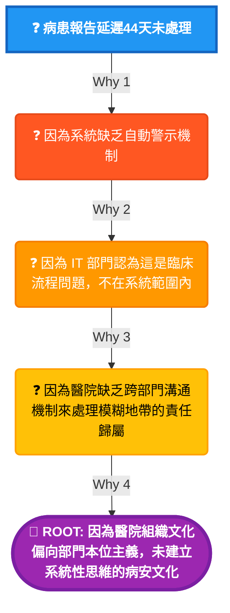

# Why Tree Export

**Session:** `rc_sess_282d51c4`
**Exported:** 2026-01-16T01:25:23.790698

```mermaid
flowchart TB

    %% === 5-WHY ANALYSIS TREE ===
    %% Deeper levels show progression toward root cause

    PROBLEM["❓ 病患報告延遲44天未處理"]:::problem

    %% --- Why Level 1 ---
    Nbc31cd10("❓ 因為系統缺乏自動警示機制"):::why1
    PROBLEM -->|"Why 1"| Nbc31cd10

    %% --- Why Level 2 ---
    N043fb251("❓ 因為 IT 部門認為這是臨床流程問題，不在系統範圍內"):::why2
    Nbc31cd10 -->|"Why 2"| N043fb251

    %% --- Why Level 3 ---
    Neeac255d("❓ 因為醫院缺乏跨部門溝通機制來處理模糊地帶的責任歸屬"):::why3
    N043fb251 -->|"Why 3"| Neeac255d

    %% --- Why Level 4 ---
    Nde00d6ac(["🎯 ROOT: 因為醫院組織文化偏向部門本位主義，未建立系統性思維的病安文化"]):::rootcause
    Neeac255d -->|"Why 4"| Nde00d6ac

    %% Analysis Depth: 4
    %% Root Causes Found: 1

    %% === STYLING ===
    %% Colors progress from red (surface) to green (root)
    classDef problem fill:#2196F3,stroke:#1565C0,stroke-width:3px,color:#fff,font-weight:bold
    classDef why1 fill:#FF5722,stroke:#E64A19,stroke-width:2px,color:#fff
    classDef why2 fill:#FF9800,stroke:#F57C00,stroke-width:2px,color:#fff
    classDef why3 fill:#FFC107,stroke:#FFA000,stroke-width:2px,color:#000
    classDef why4 fill:#8BC34A,stroke:#689F38,stroke-width:2px,color:#fff
    classDef why5 fill:#4CAF50,stroke:#388E3C,stroke-width:2px,color:#fff
    classDef rootcause fill:#9C27B0,stroke:#7B1FA2,stroke-width:4px,color:#fff,font-weight:bold
```