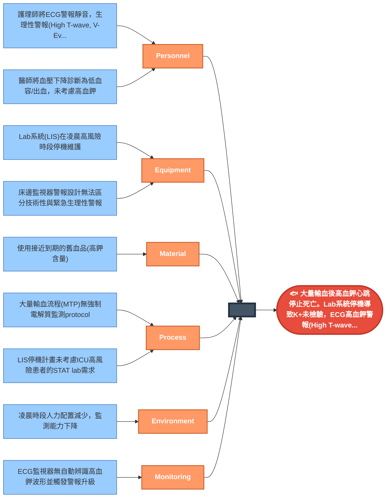

# Fishbone Export

**Session:** `rc_sess_415940b8`
**Exported:** 2026-01-16T01:48:24.820289

```mermaid
flowchart LR

    %% === FISHBONE (ISHIKAWA) DIAGRAM ===
    %% Problem is the fish head on the right
    %% Categories branch up/down from spine

    %% Fish Head (Problem Statement)
    HEAD(["🐟 大量輸血後高血鉀心跳停止死亡。Lab系統停機導致K+未檢驗，ECG高血鉀警報(High T-wave..."]):::head

    %% Main Spine
    SPINE[ ]:::spine
    SPINE --> HEAD

    %% === UPPER BRANCHES (Personnel, Equipment, Material) ===
    PERS["Personnel"]:::category
    PERS --> SPINE
    PERS_0["護理師將ECG警報靜音，生理性警報(High T-wave, V-Ev..."]:::cause
    PERS_0 --> PERS
    PERS_1["醫師將血壓下降診斷為低血容/出血，未考慮高血鉀"]:::cause
    PERS_1 --> PERS

    EQUI["Equipment"]:::category
    EQUI --> SPINE
    EQUI_0["Lab系統(LIS)在凌晨高風險時段停機維護"]:::cause
    EQUI_0 --> EQUI
    EQUI_1["床邊監視器警報設計無法區分技術性與緊急生理性警報"]:::cause
    EQUI_1 --> EQUI

    MATE["Material"]:::category
    MATE --> SPINE
    MATE_0["使用接近到期的舊血品(高鉀含量)"]:::cause
    MATE_0 --> MATE

    %% === LOWER BRANCHES (Process, Environment, Monitoring) ===
    PROC["Process"]:::category
    PROC --> SPINE
    PROC_0["大量輸血流程(MTP)無強制電解質監測protocol"]:::cause
    PROC_0 --> PROC
    PROC_1["LIS停機計畫未考慮ICU高風險患者的STAT lab需求"]:::cause
    PROC_1 --> PROC

    ENVI["Environment"]:::category
    ENVI --> SPINE
    ENVI_0["凌晨時段人力配置減少，監測能力下降"]:::cause
    ENVI_0 --> ENVI

    MONI["Monitoring"]:::category
    MONI --> SPINE
    MONI_0["ECG監視器無自動辨識高血鉀波形並觸發警報升級"]:::cause
    MONI_0 --> MONI

    %% === STYLING ===
    classDef head fill:#e74c3c,stroke:#c0392b,stroke-width:3px,color:#fff,font-weight:bold
    classDef spine fill:#456,stroke:#234,stroke-width:4px,color:#fff
    classDef category fill:#f96,stroke:#c63,stroke-width:2px,color:#fff,font-weight:bold
    classDef cause fill:#9cf,stroke:#36a,stroke-width:1px
```