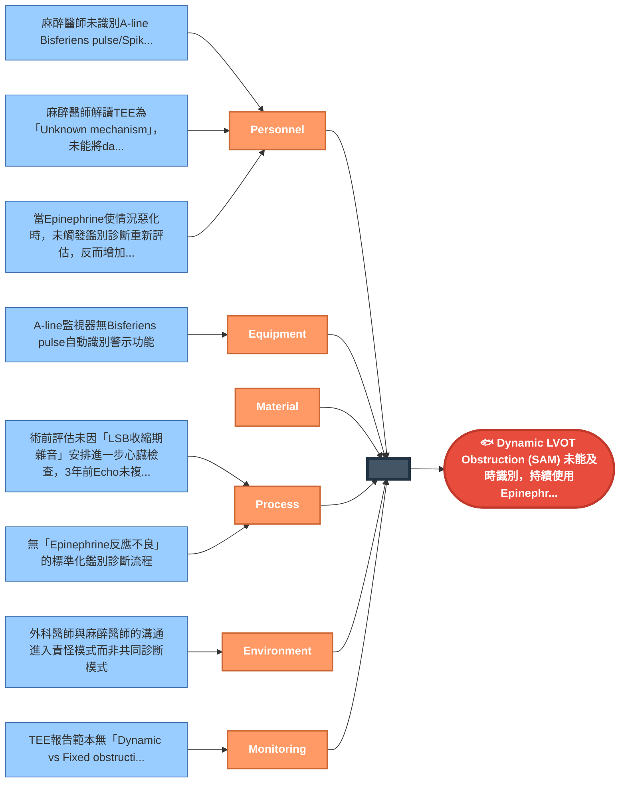

# Fishbone Export

**Session:** `rc_sess_5c486e7c`
**Exported:** 2026-01-16T02:15:51.956704

```mermaid
flowchart LR

    %% === FISHBONE (ISHIKAWA) DIAGRAM ===
    %% Problem is the fish head on the right
    %% Categories branch up/down from spine

    %% Fish Head (Problem Statement)
    HEAD(["🐟 Dynamic LVOT Obstruction (SAM) 未能及時識別，持續使用Epinephr..."]):::head

    %% Main Spine
    SPINE[ ]:::spine
    SPINE --> HEAD

    %% === UPPER BRANCHES (Personnel, Equipment, Material) ===
    PERS["Personnel"]:::category
    PERS --> SPINE
    PERS_0["麻醉醫師未識別A-line Bisferiens pulse/Spik..."]:::cause
    PERS_0 --> PERS
    PERS_1["麻醉醫師解讀TEE為「Unknown mechanism」，未能將da..."]:::cause
    PERS_1 --> PERS
    PERS_2["當Epinephrine使情況惡化時，未觸發鑑別診斷重新評估，反而增加..."]:::cause
    PERS_2 --> PERS

    EQUI["Equipment"]:::category
    EQUI --> SPINE
    EQUI_0["A-line監視器無Bisferiens pulse自動識別警示功能"]:::cause
    EQUI_0 --> EQUI

    MATE["Material"]:::category
    MATE --> SPINE

    %% === LOWER BRANCHES (Process, Environment, Monitoring) ===
    PROC["Process"]:::category
    PROC --> SPINE
    PROC_0["術前評估未因「LSB收縮期雜音」安排進一步心臟檢查，3年前Echo未複..."]:::cause
    PROC_0 --> PROC
    PROC_1["無「Epinephrine反應不良」的標準化鑑別診斷流程"]:::cause
    PROC_1 --> PROC

    ENVI["Environment"]:::category
    ENVI --> SPINE
    ENVI_0["外科醫師與麻醉醫師的溝通進入責怪模式而非共同診斷模式"]:::cause
    ENVI_0 --> ENVI

    MONI["Monitoring"]:::category
    MONI --> SPINE
    MONI_0["TEE報告範本無「Dynamic vs Fixed obstructi..."]:::cause
    MONI_0 --> MONI

    %% === STYLING ===
    classDef head fill:#e74c3c,stroke:#c0392b,stroke-width:3px,color:#fff,font-weight:bold
    classDef spine fill:#456,stroke:#234,stroke-width:4px,color:#fff
    classDef category fill:#f96,stroke:#c63,stroke-width:2px,color:#fff,font-weight:bold
    classDef cause fill:#9cf,stroke:#36a,stroke-width:1px
```