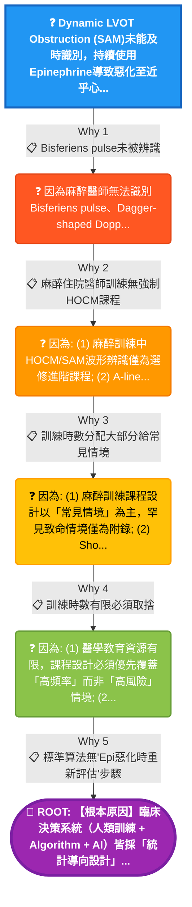

# Why Tree Export

**Session:** `rc_sess_5c486e7c`
**Exported:** 2026-01-16T02:15:52.001514

```mermaid
flowchart TB

    %% === 5-WHY ANALYSIS TREE ===
    %% Deeper levels show progression toward root cause

    PROBLEM["❓ Dynamic LVOT Obstruction (SAM)未能及時識別，持續使用Epinephrine導致惡化至近乎心..."]:::problem

    %% --- Why Level 1 ---
    N016107ea("❓ 因為麻醉醫師無法識別Bisferiens pulse、Dagger-shaped Dopp..."):::why1
    PROBLEM -->|"Why 1<br/>📋 Bisferiens pulse未被辨識"| N016107ea

    %% --- Why Level 2 ---
    Nf32a570a("❓ 因為: (1) 麻醉訓練中HOCM/SAM波形辨識僅為選修進階課程; (2) A-line..."):::why2
    N016107ea -->|"Why 2<br/>📋 麻醉住院醫師訓練無強制HOCM課程"| Nf32a570a

    %% --- Why Level 3 ---
    N072d885b("❓ 因為: (1) 麻醉訓練課程設計以「常見情境」為主，罕見致命情境僅為附錄; (2) Sho..."):::why3
    Nf32a570a -->|"Why 3<br/>📋 訓練時數分配大部分給常見情境"| N072d885b

    %% --- Why Level 4 ---
    N7385593f("❓ 因為: (1) 醫學教育資源有限，課程設計必須優先覆蓋「高頻率」而非「高風險」情境; (2..."):::why4
    N072d885b -->|"Why 4<br/>📋 訓練時數有限必須取捨"| N7385593f

    %% --- Why Level 5 ---
    N5b5c1bd3(["🎯 ROOT: 【根本原因】臨床決策系統（人類訓練 + Algorithm + AI）皆採「統計導向設計」..."]):::rootcause
    N7385593f -->|"Why 5<br/>📋 標準算法無'Epi惡化時重新評估'步驟"| N5b5c1bd3

    %% Analysis Depth: 5
    %% Root Causes Found: 1

    %% === STYLING ===
    %% Colors progress from red (surface) to green (root)
    classDef problem fill:#2196F3,stroke:#1565C0,stroke-width:3px,color:#fff,font-weight:bold
    classDef why1 fill:#FF5722,stroke:#E64A19,stroke-width:2px,color:#fff
    classDef why2 fill:#FF9800,stroke:#F57C00,stroke-width:2px,color:#fff
    classDef why3 fill:#FFC107,stroke:#FFA000,stroke-width:2px,color:#000
    classDef why4 fill:#8BC34A,stroke:#689F38,stroke-width:2px,color:#fff
    classDef why5 fill:#4CAF50,stroke:#388E3C,stroke-width:2px,color:#fff
    classDef rootcause fill:#9C27B0,stroke:#7B1FA2,stroke-width:4px,color:#fff,font-weight:bold
```