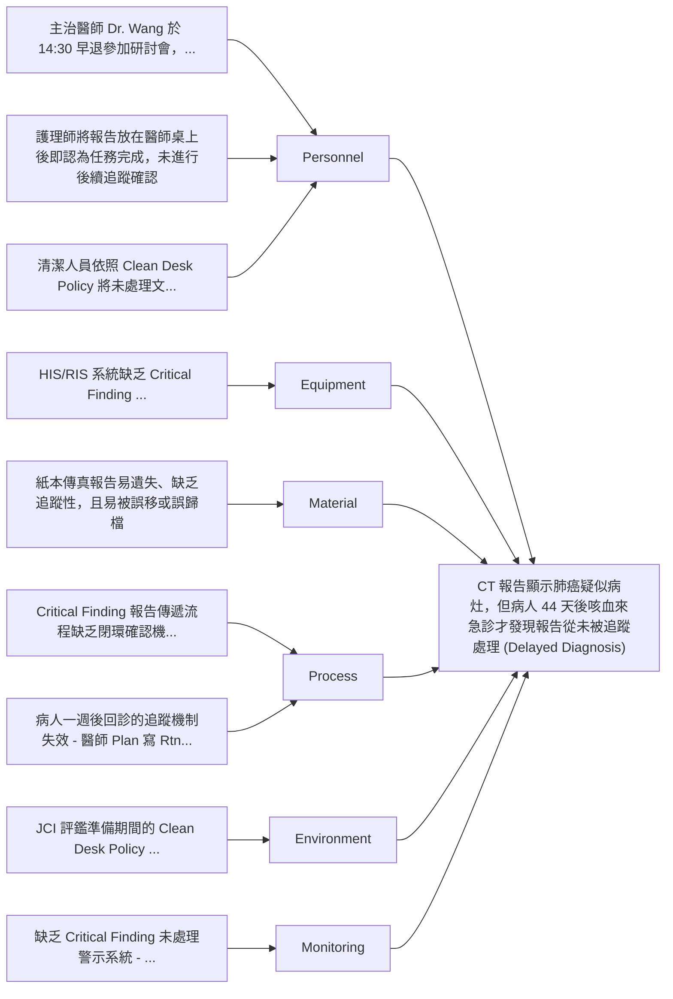

# Fishbone Export

**Session:** `rc_sess_976ad5da`
**Exported:** 2026-01-16T01:11:07.568916

```mermaid
flowchart LR
    PROBLEM["CT 報告顯示肺癌疑似病灶，但病人 44 天後咳血來急診才發現報告從未被追蹤處理 (Delayed Diagnosis)"]
    PERSONNEL["Personnel"] --> PROBLEM
    PERSONNEL_0["主治醫師 Dr. Wang 於 14:30 早退參加研討會，..."] --> PERSONNEL
    PERSONNEL_1["護理師將報告放在醫師桌上後即認為任務完成，未進行後續追蹤確認"] --> PERSONNEL
    PERSONNEL_2["清潔人員依照 Clean Desk Policy 將未處理文..."] --> PERSONNEL
    EQUIPMENT["Equipment"] --> PROBLEM
    EQUIPMENT_0["HIS/RIS 系統缺乏 Critical Finding ..."] --> EQUIPMENT
    MATERIAL["Material"] --> PROBLEM
    MATERIAL_0["紙本傳真報告易遺失、缺乏追蹤性，且易被誤移或誤歸檔"] --> MATERIAL
    PROCESS["Process"] --> PROBLEM
    PROCESS_0["Critical Finding 報告傳遞流程缺乏閉環確認機..."] --> PROCESS
    PROCESS_1["病人一週後回診的追蹤機制失效 - 醫師 Plan 寫 Rtn..."] --> PROCESS
    ENVIRONMENT["Environment"] --> PROBLEM
    ENVIRONMENT_0["JCI 評鑑準備期間的 Clean Desk Policy ..."] --> ENVIRONMENT
    MONITORING["Monitoring"] --> PROBLEM
    MONITORING_0["缺乏 Critical Finding 未處理警示系統 - ..."] --> MONITORING
```