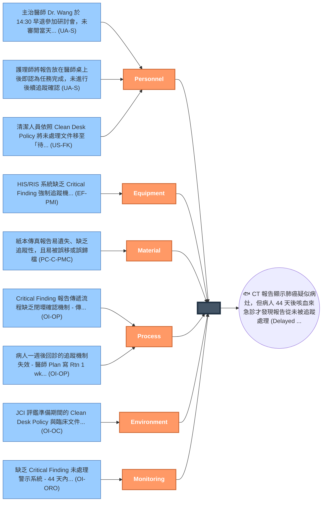

# Fishbone Export

**Session:** `rc_sess_976ad5da`
**Exported:** 2026-01-16T01:16:02.125659

```mermaid
flowchart LR

    %% === FISHBONE (ISHIKAWA) DIAGRAM ===
    %% Problem is the fish head on the right
    %% Categories branch up/down from spine

    %% Fish Head (Problem Statement)
    HEAD(("🐟 CT 報告顯示肺癌疑似病灶，但病人 44 天後咳血來急診才發現報告從未被追蹤處理 (Delayed ..."))

    %% Main Spine
    SPINE[" "]:::spine
    SPINE --> HEAD

    %% === UPPER BRANCHES (Personnel, Equipment, Material) ===
    PERS["Personnel"]:::category
    PERS --> SPINE
    PERS_0["主治醫師 Dr. Wang 於 14:30 早退參加研討會，未審閱當天... (UA-S)"]:::cause
    PERS_0 --> PERS
    PERS_1["護理師將報告放在醫師桌上後即認為任務完成，未進行後續追蹤確認 (UA-S)"]:::cause
    PERS_1 --> PERS
    PERS_2["清潔人員依照 Clean Desk Policy 將未處理文件移至「待... (US-FK)"]:::cause
    PERS_2 --> PERS

    EQUI["Equipment"]:::category
    EQUI --> SPINE
    EQUI_0["HIS/RIS 系統缺乏 Critical Finding 強制追蹤機... (EF-PMI)"]:::cause
    EQUI_0 --> EQUI

    MATE["Material"]:::category
    MATE --> SPINE
    MATE_0["紙本傳真報告易遺失、缺乏追蹤性，且易被誤移或誤歸檔 (PC-C-PMC)"]:::cause
    MATE_0 --> MATE

    %% === LOWER BRANCHES (Process, Environment, Monitoring) ===
    PROC["Process"]:::category
    PROC --> SPINE
    PROC_0["Critical Finding 報告傳遞流程缺乏閉環確認機制 - 傳... (OI-OP)"]:::cause
    PROC_0 --> PROC
    PROC_1["病人一週後回診的追蹤機制失效 - 醫師 Plan 寫 Rtn 1 wk... (OI-OP)"]:::cause
    PROC_1 --> PROC

    ENVI["Environment"]:::category
    ENVI --> SPINE
    ENVI_0["JCI 評鑑準備期間的 Clean Desk Policy 與臨床文件... (OI-OC)"]:::cause
    ENVI_0 --> ENVI

    MONI["Monitoring"]:::category
    MONI --> SPINE
    MONI_0["缺乏 Critical Finding 未處理警示系統 - 44 天內... (OI-ORO)"]:::cause
    MONI_0 --> MONI

    %% === STYLING ===
    classDef spine fill:#456,stroke:#234,stroke-width:4px,color:#fff
    classDef category fill:#f96,stroke:#c63,stroke-width:2px,color:#fff,font-weight:bold
    classDef cause fill:#9cf,stroke:#36a,stroke-width:1px

    %% Layout hints for better fishbone appearance
    %% Upper categories should appear above spine
    %% Lower categories should appear below spine
```