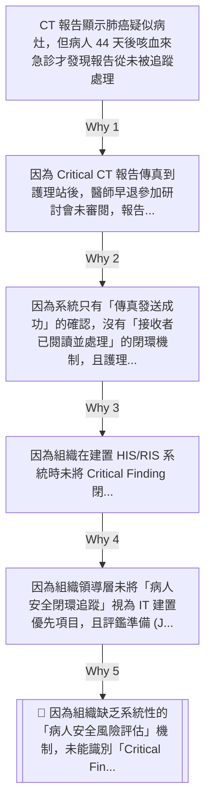

# Why Tree Export

**Session:** `rc_sess_976ad5da`
**Exported:** 2026-01-16T01:11:55.770402

```mermaid
flowchart TD
    PROBLEM["CT 報告顯示肺癌疑似病灶，但病人 44 天後咳血來急診才發現報告從未被追蹤處理"]
    N59dbfbbf["因為 Critical CT 報告傳真到護理站後，醫師早退參加研討會未審閱，報告..."]
    PROBLEM -->|Why 1| N59dbfbbf
    N14ccce74["因為系統只有「傳真發送成功」的確認，沒有「接收者已閱讀並處理」的閉環機制，且護理..."]
    N59dbfbbf -->|Why 2| N14ccce74
    N5a8c0b37["因為組織在建置 HIS/RIS 系統時未將 Critical Finding 閉..."]
    N14ccce74 -->|Why 3| N5a8c0b37
    N78ccead9["因為組織領導層未將「病人安全閉環追蹤」視為 IT 建置優先項目，且評鑑準備 (J..."]
    N5a8c0b37 -->|Why 4| N78ccead9
    N2a08482c[["🎯 因為組織缺乏系統性的「病人安全風險評估」機制，未能識別「Critical Fin..."]]
    N78ccead9 -->|Why 5| N2a08482c
```