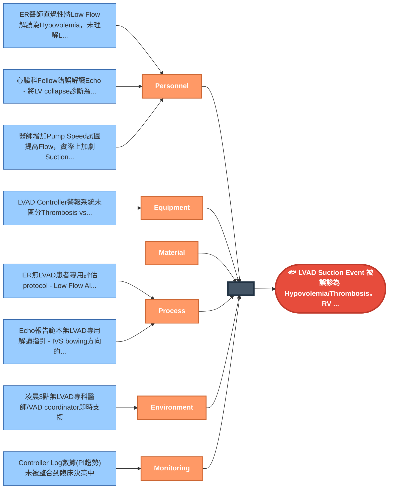

# Fishbone Export

**Session:** `rc_sess_b20ab22a`
**Exported:** 2026-01-16T02:08:46.123724

```mermaid
flowchart LR

    %% === FISHBONE (ISHIKAWA) DIAGRAM ===
    %% Problem is the fish head on the right
    %% Categories branch up/down from spine

    %% Fish Head (Problem Statement)
    HEAD(["🐟 LVAD Suction Event 被誤診為 Hypovolemia/Thrombosis。RV ..."]):::head

    %% Main Spine
    SPINE[ ]:::spine
    SPINE --> HEAD

    %% === UPPER BRANCHES (Personnel, Equipment, Material) ===
    PERS["Personnel"]:::category
    PERS --> SPINE
    PERS_0["ER醫師直覺性將Low Flow解讀為Hypovolemia，未理解L..."]:::cause
    PERS_0 --> PERS
    PERS_1["心臟科Fellow錯誤解讀Echo - 將LV collapse診斷為..."]:::cause
    PERS_1 --> PERS
    PERS_2["醫師增加Pump Speed試圖提高Flow，實際上加劇Suction..."]:::cause
    PERS_2 --> PERS

    EQUI["Equipment"]:::category
    EQUI --> SPINE
    EQUI_0["LVAD Controller警報系統未區分Thrombosis vs..."]:::cause
    EQUI_0 --> EQUI

    MATE["Material"]:::category
    MATE --> SPINE

    %% === LOWER BRANCHES (Process, Environment, Monitoring) ===
    PROC["Process"]:::category
    PROC --> SPINE
    PROC_0["ER無LVAD患者專用評估protocol - Low Flow Al..."]:::cause
    PROC_0 --> PROC
    PROC_1["Echo報告範本無LVAD專用解讀指引 - IVS bowing方向的..."]:::cause
    PROC_1 --> PROC

    ENVI["Environment"]:::category
    ENVI --> SPINE
    ENVI_0["凌晨3點無LVAD專科醫師/VAD coordinator即時支援"]:::cause
    ENVI_0 --> ENVI

    MONI["Monitoring"]:::category
    MONI --> SPINE
    MONI_0["Controller Log數據(PI趨勢)未被整合到臨床決策中"]:::cause
    MONI_0 --> MONI

    %% === STYLING ===
    classDef head fill:#e74c3c,stroke:#c0392b,stroke-width:3px,color:#fff,font-weight:bold
    classDef spine fill:#456,stroke:#234,stroke-width:4px,color:#fff
    classDef category fill:#f96,stroke:#c63,stroke-width:2px,color:#fff,font-weight:bold
    classDef cause fill:#9cf,stroke:#36a,stroke-width:1px
```