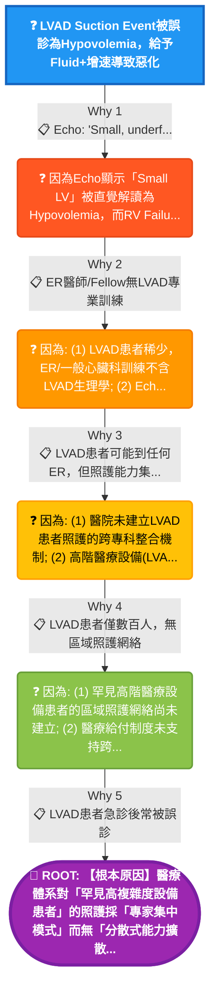

# Why Tree Export

**Session:** `rc_sess_b20ab22a`
**Exported:** 2026-01-16T02:08:46.124783

```mermaid
flowchart TB

    %% === 5-WHY ANALYSIS TREE ===
    %% Deeper levels show progression toward root cause

    PROBLEM["❓ LVAD Suction Event被誤診為Hypovolemia，給予Fluid+增速導致惡化"]:::problem

    %% --- Why Level 1 ---
    Nb1a866b1("❓ 因為Echo顯示「Small LV」被直覺解讀為Hypovolemia，而RV Failu..."):::why1
    PROBLEM -->|"Why 1<br/>📋 Echo: 'Small, underf..."| Nb1a866b1

    %% --- Why Level 2 ---
    N777eb9d7("❓ 因為: (1) LVAD患者稀少，ER/一般心臟科訓練不含LVAD生理學; (2) Ech..."):::why2
    Nb1a866b1 -->|"Why 2<br/>📋 ER醫師/Fellow無LVAD專業訓練"| N777eb9d7

    %% --- Why Level 3 ---
    N289b2100("❓ 因為: (1) 醫院未建立LVAD患者照護的跨專科整合機制; (2) 高階醫療設備(LVA..."):::why3
    N777eb9d7 -->|"Why 3<br/>📋 LVAD患者可能到任何ER，但照護能力集..."| N289b2100

    %% --- Why Level 4 ---
    Nb802bb32("❓ 因為: (1) 罕見高階醫療設備患者的區域照護網絡尚未建立; (2) 醫療給付制度未支持跨..."):::why4
    N289b2100 -->|"Why 4<br/>📋 LVAD患者僅數百人，無區域照護網絡"| Nb802bb32

    %% --- Why Level 5 ---
    N1ce20ee8(["🎯 ROOT: 【根本原因】醫療體系對「罕見高複雜度設備患者」的照護採「專家集中模式」而無「分散式能力擴散..."]):::rootcause
    Nb802bb32 -->|"Why 5<br/>📋 LVAD患者急診後常被誤診"| N1ce20ee8

    %% Analysis Depth: 5
    %% Root Causes Found: 1

    %% === STYLING ===
    %% Colors progress from red (surface) to green (root)
    classDef problem fill:#2196F3,stroke:#1565C0,stroke-width:3px,color:#fff,font-weight:bold
    classDef why1 fill:#FF5722,stroke:#E64A19,stroke-width:2px,color:#fff
    classDef why2 fill:#FF9800,stroke:#F57C00,stroke-width:2px,color:#fff
    classDef why3 fill:#FFC107,stroke:#FFA000,stroke-width:2px,color:#000
    classDef why4 fill:#8BC34A,stroke:#689F38,stroke-width:2px,color:#fff
    classDef why5 fill:#4CAF50,stroke:#388E3C,stroke-width:2px,color:#fff
    classDef rootcause fill:#9C27B0,stroke:#7B1FA2,stroke-width:4px,color:#fff,font-weight:bold
```