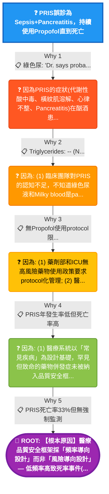

# Why Tree Export

**Session:** `rc_sess_c7d0c7cc`
**Exported:** 2026-01-16T02:08:46.121621

```mermaid
flowchart TB

    %% === 5-WHY ANALYSIS TREE ===
    %% Deeper levels show progression toward root cause

    PROBLEM["❓ PRIS誤診為Sepsis+Pancreatitis，持續使用Propofol直到死亡"]:::problem

    %% --- Why Level 1 ---
    Nd2aa7ff4("❓ 因為PRIS的症狀(代謝性酸中毒、橫紋肌溶解、心律不整、Pancreatitis)在酗酒患..."):::why1
    PROBLEM -->|"Why 1<br/>📋 綠色尿: 'Dr. says proba..."| Nd2aa7ff4

    %% --- Why Level 2 ---
    Nceea1ca3("❓ 因為: (1) 臨床團隊對PRIS的認知不足，不知道綠色尿液和Milky blood是pa..."):::why2
    Nd2aa7ff4 -->|"Why 2<br/>📋 Triglycerides: -- (N..."| Nceea1ca3

    %% --- Why Level 3 ---
    N1b0c7876("❓ 因為: (1) 藥劑部和ICU無高風險藥物使用政策要求protocol化管理; (2) 醫..."):::why3
    Nceea1ca3 -->|"Why 3<br/>📋 無Propofol使用protocol限..."| N1b0c7876

    %% --- Why Level 4 ---
    N03f3b3e4("❓ 因為: (1) 醫療系統以「常見疾病」為設計基礎，罕見但致命的藥物併發症未被納入品質安全框..."):::why4
    N1b0c7876 -->|"Why 4<br/>📋 PRIS年發生率低但死亡率高"| N03f3b3e4

    %% --- Why Level 5 ---
    Neeb55038(["🎯 ROOT: 【根本原因】醫療品質安全框架採「頻率導向設計」而非「風險導向設計」— 低頻率高致死率事件(..."]):::rootcause
    N03f3b3e4 -->|"Why 5<br/>📋 PRIS死亡率33%但無強制監測"| Neeb55038

    %% Analysis Depth: 5
    %% Root Causes Found: 1

    %% === STYLING ===
    %% Colors progress from red (surface) to green (root)
    classDef problem fill:#2196F3,stroke:#1565C0,stroke-width:3px,color:#fff,font-weight:bold
    classDef why1 fill:#FF5722,stroke:#E64A19,stroke-width:2px,color:#fff
    classDef why2 fill:#FF9800,stroke:#F57C00,stroke-width:2px,color:#fff
    classDef why3 fill:#FFC107,stroke:#FFA000,stroke-width:2px,color:#000
    classDef why4 fill:#8BC34A,stroke:#689F38,stroke-width:2px,color:#fff
    classDef why5 fill:#4CAF50,stroke:#388E3C,stroke-width:2px,color:#fff
    classDef rootcause fill:#9C27B0,stroke:#7B1FA2,stroke-width:4px,color:#fff,font-weight:bold
```