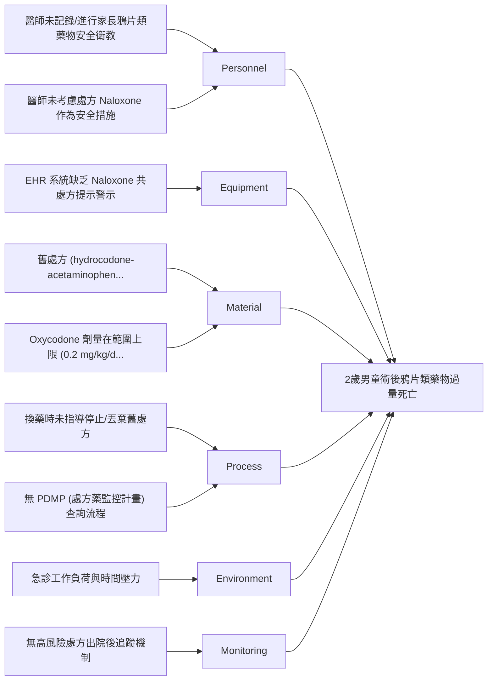

# Fishbone Export

**Session:** `rc_sess_cc4dce8e`
**Exported:** 2026-01-16T01:02:16.877109

```mermaid
flowchart LR
    PROBLEM["2歲男童術後鴉片類藥物過量死亡"]
    PERSONNEL["Personnel"] --> PROBLEM
    PERSONNEL_0["醫師未記錄/進行家長鴉片類藥物安全衛教"] --> PERSONNEL
    PERSONNEL_1["醫師未考慮處方 Naloxone 作為安全措施"] --> PERSONNEL
    EQUIPMENT["Equipment"] --> PROBLEM
    EQUIPMENT_0["EHR 系統缺乏 Naloxone 共處方提示警示"] --> EQUIPMENT
    MATERIAL["Material"] --> PROBLEM
    MATERIAL_0["舊處方 (hydrocodone-acetaminophen..."] --> MATERIAL
    MATERIAL_1["Oxycodone 劑量在範圍上限 (0.2 mg/kg/d..."] --> MATERIAL
    PROCESS["Process"] --> PROBLEM
    PROCESS_0["換藥時未指導停止/丟棄舊處方"] --> PROCESS
    PROCESS_1["無 PDMP (處方藥監控計畫) 查詢流程"] --> PROCESS
    ENVIRONMENT["Environment"] --> PROBLEM
    ENVIRONMENT_0["急診工作負荷與時間壓力"] --> ENVIRONMENT
    MONITORING["Monitoring"] --> PROBLEM
    MONITORING_0["無高風險處方出院後追蹤機制"] --> MONITORING
```