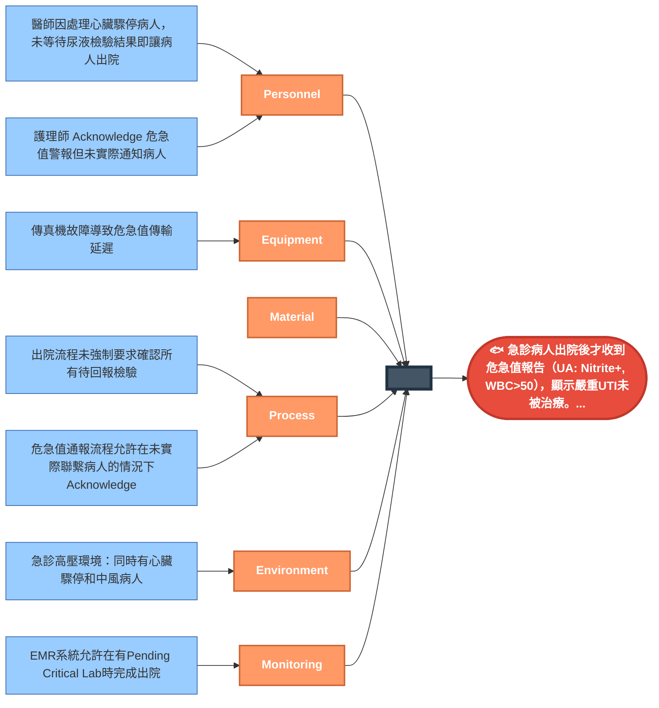

# Fishbone Export

**Session:** `rc_sess_cf93ffa4`
**Exported:** 2026-01-16T01:34:20.034917

```mermaid
flowchart LR

    %% === FISHBONE (ISHIKAWA) DIAGRAM ===
    %% Problem is the fish head on the right
    %% Categories branch up/down from spine

    %% Fish Head (Problem Statement)
    HEAD(["🐟 急診病人出院後才收到危急值報告（UA: Nitrite+, WBC>50），顯示嚴重UTI未被治療。..."]):::head

    %% Main Spine
    SPINE[ ]:::spine
    SPINE --> HEAD

    %% === UPPER BRANCHES (Personnel, Equipment, Material) ===
    PERS["Personnel"]:::category
    PERS --> SPINE
    PERS_0["醫師因處理心臟驟停病人，未等待尿液檢驗結果即讓病人出院"]:::cause
    PERS_0 --> PERS
    PERS_1["護理師 Acknowledge 危急值警報但未實際通知病人"]:::cause
    PERS_1 --> PERS

    EQUI["Equipment"]:::category
    EQUI --> SPINE
    EQUI_0["傳真機故障導致危急值傳輸延遲"]:::cause
    EQUI_0 --> EQUI

    MATE["Material"]:::category
    MATE --> SPINE

    %% === LOWER BRANCHES (Process, Environment, Monitoring) ===
    PROC["Process"]:::category
    PROC --> SPINE
    PROC_0["出院流程未強制要求確認所有待回報檢驗"]:::cause
    PROC_0 --> PROC
    PROC_1["危急值通報流程允許在未實際聯繫病人的情況下Acknowledge"]:::cause
    PROC_1 --> PROC

    ENVI["Environment"]:::category
    ENVI --> SPINE
    ENVI_0["急診高壓環境：同時有心臟驟停和中風病人"]:::cause
    ENVI_0 --> ENVI

    MONI["Monitoring"]:::category
    MONI --> SPINE
    MONI_0["EMR系統允許在有Pending Critical Lab時完成出院"]:::cause
    MONI_0 --> MONI

    %% === STYLING ===
    classDef head fill:#e74c3c,stroke:#c0392b,stroke-width:3px,color:#fff,font-weight:bold
    classDef spine fill:#456,stroke:#234,stroke-width:4px,color:#fff
    classDef category fill:#f96,stroke:#c63,stroke-width:2px,color:#fff,font-weight:bold
    classDef cause fill:#9cf,stroke:#36a,stroke-width:1px
```