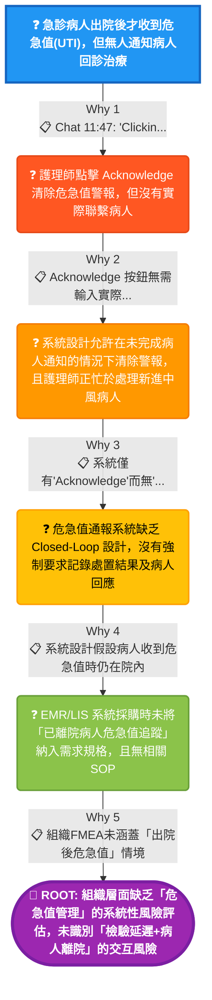

# Why Tree Export

**Session:** `rc_sess_cf93ffa4`
**Exported:** 2026-01-16T01:34:20.113268

```mermaid
flowchart TB

    %% === 5-WHY ANALYSIS TREE ===
    %% Deeper levels show progression toward root cause

    PROBLEM["❓ 急診病人出院後才收到危急值(UTI)，但無人通知病人回診治療"]:::problem

    %% --- Why Level 1 ---
    N9c75c975("❓ 護理師點擊 Acknowledge 清除危急值警報，但沒有實際聯繫病人"):::why1
    PROBLEM -->|"Why 1<br/>📋 Chat 11:47: 'Clickin..."| N9c75c975

    %% --- Why Level 2 ---
    Nb057390b("❓ 系統設計允許在未完成病人通知的情況下清除警報，且護理師正忙於處理新進中風病人"):::why2
    N9c75c975 -->|"Why 2<br/>📋 Acknowledge 按鈕無需輸入實際..."| Nb057390b

    %% --- Why Level 3 ---
    N8ec3db04("❓ 危急值通報系統缺乏 Closed-Loop 設計，沒有強制要求記錄處置結果及病人回應"):::why3
    Nb057390b -->|"Why 3<br/>📋 系統僅有'Acknowledge'而無'..."| N8ec3db04

    %% --- Why Level 4 ---
    Nd42fc9fb("❓ EMR/LIS 系統採購時未將「已離院病人危急值追蹤」納入需求規格，且無相關 SOP"):::why4
    N8ec3db04 -->|"Why 4<br/>📋 系統設計假設病人收到危急值時仍在院內"| Nd42fc9fb

    %% --- Why Level 5 ---
    N23afa524(["🎯 ROOT: 組織層面缺乏「危急值管理」的系統性風險評估，未識別「檢驗延遲+病人離院」的交互風險"]):::rootcause
    Nd42fc9fb -->|"Why 5<br/>📋 組織FMEA未涵蓋「出院後危急值」情境"| N23afa524

    %% Analysis Depth: 5
    %% Root Causes Found: 1

    %% === STYLING ===
    %% Colors progress from red (surface) to green (root)
    classDef problem fill:#2196F3,stroke:#1565C0,stroke-width:3px,color:#fff,font-weight:bold
    classDef why1 fill:#FF5722,stroke:#E64A19,stroke-width:2px,color:#fff
    classDef why2 fill:#FF9800,stroke:#F57C00,stroke-width:2px,color:#fff
    classDef why3 fill:#FFC107,stroke:#FFA000,stroke-width:2px,color:#000
    classDef why4 fill:#8BC34A,stroke:#689F38,stroke-width:2px,color:#fff
    classDef why5 fill:#4CAF50,stroke:#388E3C,stroke-width:2px,color:#fff
    classDef rootcause fill:#9C27B0,stroke:#7B1FA2,stroke-width:4px,color:#fff,font-weight:bold
```