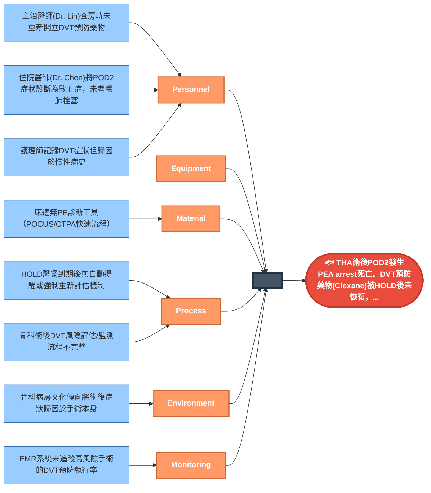

# Fishbone Export

**Session:** `rc_sess_da3c741c`
**Exported:** 2026-01-16T01:42:16.045735

```mermaid
flowchart LR

    %% === FISHBONE (ISHIKAWA) DIAGRAM ===
    %% Problem is the fish head on the right
    %% Categories branch up/down from spine

    %% Fish Head (Problem Statement)
    HEAD(["🐟 THA術後POD2發生PEA arrest死亡。DVT預防藥物(Clexane)被HOLD後未恢復，..."]):::head

    %% Main Spine
    SPINE[ ]:::spine
    SPINE --> HEAD

    %% === UPPER BRANCHES (Personnel, Equipment, Material) ===
    PERS["Personnel"]:::category
    PERS --> SPINE
    PERS_0["主治醫師(Dr. Lin)查房時未重新開立DVT預防藥物"]:::cause
    PERS_0 --> PERS
    PERS_1["住院醫師(Dr. Chen)將POD2症狀診斷為敗血症，未考慮肺栓塞"]:::cause
    PERS_1 --> PERS
    PERS_2["護理師記錄DVT症狀但歸因於慢性病史"]:::cause
    PERS_2 --> PERS

    EQUI["Equipment"]:::category
    EQUI --> SPINE

    MATE["Material"]:::category
    MATE --> SPINE
    MATE_0["床邊無PE診斷工具（POCUS/CTPA快速流程）"]:::cause
    MATE_0 --> MATE

    %% === LOWER BRANCHES (Process, Environment, Monitoring) ===
    PROC["Process"]:::category
    PROC --> SPINE
    PROC_0["HOLD醫囑到期後無自動提醒或強制重新評估機制"]:::cause
    PROC_0 --> PROC
    PROC_1["骨科術後DVT風險評估/監測流程不完整"]:::cause
    PROC_1 --> PROC

    ENVI["Environment"]:::category
    ENVI --> SPINE
    ENVI_0["骨科病房文化傾向將術後症狀歸因於手術本身"]:::cause
    ENVI_0 --> ENVI

    MONI["Monitoring"]:::category
    MONI --> SPINE
    MONI_0["EMR系統未追蹤高風險手術的DVT預防執行率"]:::cause
    MONI_0 --> MONI

    %% === STYLING ===
    classDef head fill:#e74c3c,stroke:#c0392b,stroke-width:3px,color:#fff,font-weight:bold
    classDef spine fill:#456,stroke:#234,stroke-width:4px,color:#fff
    classDef category fill:#f96,stroke:#c63,stroke-width:2px,color:#fff,font-weight:bold
    classDef cause fill:#9cf,stroke:#36a,stroke-width:1px
```