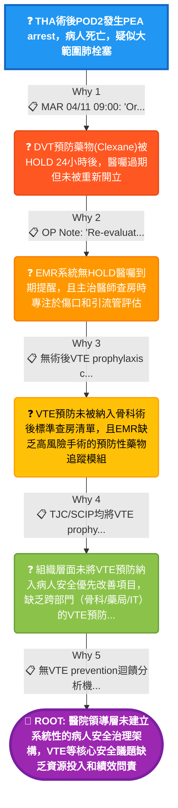

# Why Tree Export

**Session:** `rc_sess_da3c741c`
**Exported:** 2026-01-16T01:42:16.072588

```mermaid
flowchart TB

    %% === 5-WHY ANALYSIS TREE ===
    %% Deeper levels show progression toward root cause

    PROBLEM["❓ THA術後POD2發生PEA arrest，病人死亡，疑似大範圍肺栓塞"]:::problem

    %% --- Why Level 1 ---
    Nb956a641("❓ DVT預防藥物(Clexane)被HOLD 24小時後，醫囑過期但未被重新開立"):::why1
    PROBLEM -->|"Why 1<br/>📋 MAR 04/11 09:00: 'Or..."| Nb956a641

    %% --- Why Level 2 ---
    Naca11e2e("❓ EMR系統無HOLD醫囑到期提醒，且主治醫師查房時專注於傷口和引流管評估"):::why2
    Nb956a641 -->|"Why 2<br/>📋 OP Note: 'Re-evaluat..."| Naca11e2e

    %% --- Why Level 3 ---
    N1c039d64("❓ VTE預防未被納入骨科術後標準查房清單，且EMR缺乏高風險手術的預防性藥物追蹤模組"):::why3
    Naca11e2e -->|"Why 3<br/>📋 無術後VTE prophylaxis c..."| N1c039d64

    %% --- Why Level 4 ---
    N7c15dd85("❓ 組織層面未將VTE預防納入病人安全優先改善項目，缺乏跨部門（骨科/藥局/IT）的VTE預防..."):::why4
    N1c039d64 -->|"Why 4<br/>📋 TJC/SCIP均將VTE prophy..."| N7c15dd85

    %% --- Why Level 5 ---
    N0686e4ba(["🎯 ROOT: 醫院領導層未建立系統性的病人安全治理架構，VTE等核心安全議題缺乏資源投入和績效問責"]):::rootcause
    N7c15dd85 -->|"Why 5<br/>📋 無VTE prevention迴饋分析機..."| N0686e4ba

    %% Analysis Depth: 5
    %% Root Causes Found: 1

    %% === STYLING ===
    %% Colors progress from red (surface) to green (root)
    classDef problem fill:#2196F3,stroke:#1565C0,stroke-width:3px,color:#fff,font-weight:bold
    classDef why1 fill:#FF5722,stroke:#E64A19,stroke-width:2px,color:#fff
    classDef why2 fill:#FF9800,stroke:#F57C00,stroke-width:2px,color:#fff
    classDef why3 fill:#FFC107,stroke:#FFA000,stroke-width:2px,color:#000
    classDef why4 fill:#8BC34A,stroke:#689F38,stroke-width:2px,color:#fff
    classDef why5 fill:#4CAF50,stroke:#388E3C,stroke-width:2px,color:#fff
    classDef rootcause fill:#9C27B0,stroke:#7B1FA2,stroke-width:4px,color:#fff,font-weight:bold
```