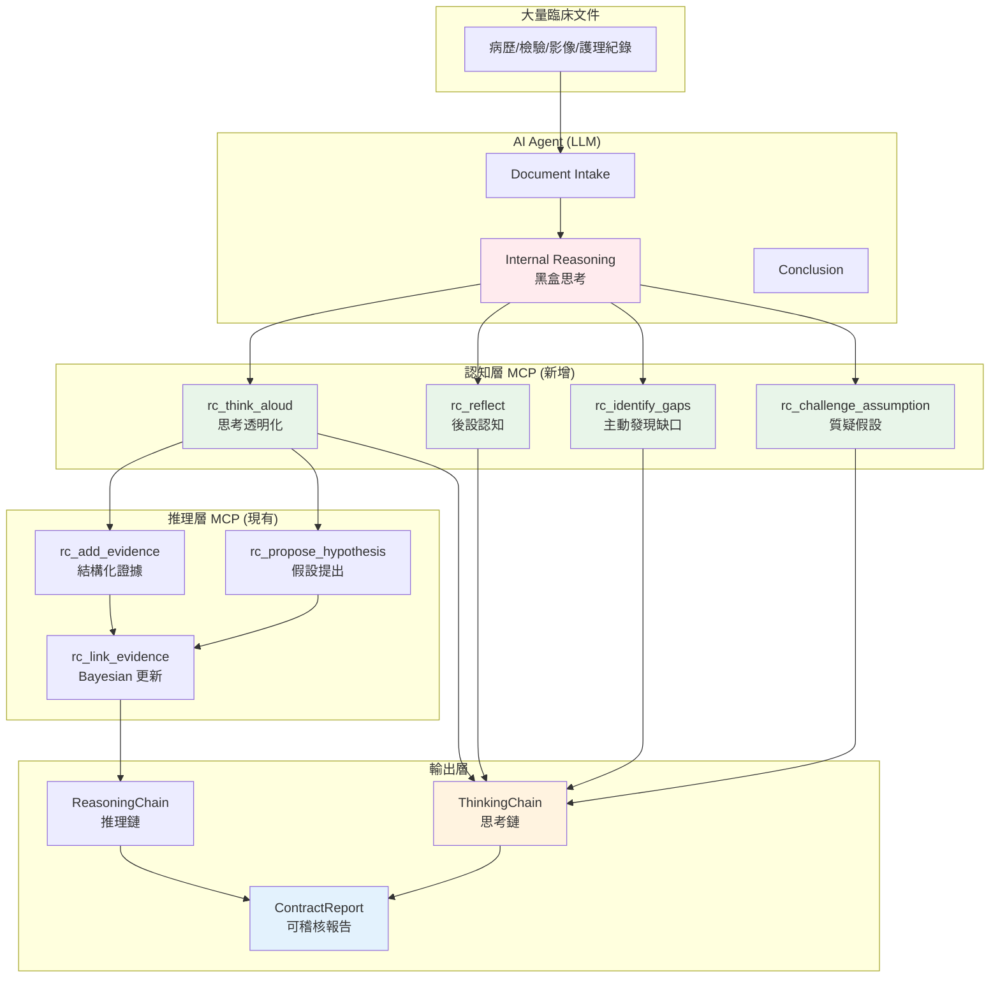

# 深度推理追蹤架構：從「薄 MCP」到「認知層 MCP」

> **問題**：如何讓 Agent 的複雜內部思考過程變得透明且可稽核？  
> **答案**：建立「認知層 MCP」，捕捉思考過程而非僅記錄結果

---

## 🔍 問題分析

### 目前的「薄 MCP」困境

```
┌─────────────────────────────────────────────────────┐
│                   大量臨床文件                         │
│  (病歷、檢驗、影像報告、護理紀錄、會診意見...)              │
└────────────────────┬────────────────────────────────┘
                     │
                     ▼ Agent Intake
┌─────────────────────────────────────────────────────┐
│                  AI Agent 內部思考                     │
│  ┌───────────────────────────────────────────────┐  │
│  │  Token-level reasoning (黑盒)                 │  │
│  │  • Attention weights                         │  │
│  │  • Token probabilities                       │  │
│  │  • Hidden state transitions                  │  │
│  │  • In-context learning                       │  │
│  └───────────────────────────────────────────────┘  │
│                      ↓                               │
│  "我認為是心肌梗塞" (只輸出結論)                         │
└────────────────────┬────────────────────────────────┘
                     │
                     ▼ MCP Tool Call
┌─────────────────────────────────────────────────────┐
│              RootCause MCP Server                   │
│  rc_propose_hypothesis("Acute MI", prior=0.3)      │
│  ❌ 只記錄結論，不記錄為什麼                            │
└─────────────────────────────────────────────────────┘
```

**核心問題**：
1. Agent 的**複雜推理過程**對 MCP 不可見
2. 無法回答「為什麼 Agent 排除了肺栓塞？」
3. 無法回答「Agent 考慮過哪些其他可能性？」
4. 無法稽核 Agent 是否有**認知偏差**

---

## 💡 解決方案：認知層 MCP

### 架構圖



---

## 🧠 核心概念：ThinkingStep

### 與 ReasoningStep 的差異

| 維度 | ReasoningStep (現有) | ThinkingStep (新增) |
|------|---------------------|---------------------|
| **記錄對象** | 推理**結果** | 思考**過程** |
| **內容** | "Proposed hypothesis: MI" | "Considering MI because... Also considered PE but rejected because..." |
| **Alternatives** | ❌ 不記錄 | ✅ 記錄考慮過但拒絕的選項 |
| **Uncertainty** | ❌ 只有 confidence score | ✅ 明確列出 uncertainty factors |
| **Bias** | ❌ 不記錄 | ✅ 主動識別認知偏差 |
| **Assumptions** | ❌ 隱含 | ✅ 明確列出假設 |

### ThinkingStep 範例

```python
ThinkingStep(
    thinking_type=ThinkingType.HYPOTHESIS_CONSIDERED,
    content="Considering pulmonary embolism",
    internal_reasoning="""
        Patient has sudden dyspnea + tachycardia + recent surgery.
        These are classic PE risk factors (Virchow's triad).
        However, no hemoptysis, no pleuritic chest pain.
        D-dimer not yet available.
    """,
    alternatives=[
        AlternativeConsidered(
            alternative="Pneumonia",
            reason_rejected="No fever, no productive cough, WBC normal",
            confidence_if_chosen=0.25
        ),
        AlternativeConsidered(
            alternative="Acute MI",
            reason_rejected="No chest pain, ECG normal, troponin pending",
            confidence_if_chosen=0.40
        ),
    ],
    confidence=0.65,
    uncertainty_factors=[
        "D-dimer not yet available",
        "No CT-PA yet",
        "Troponin pending"
    ],
    assumptions_made=[
        "Patient is not on anticoagulation",
        "No prior history of PE"
    ],
    potential_biases=[
        "Availability bias (recent PE case)",
        "Anchoring bias (first impression)"
    ]
)
```

---

## 🔧 新增的 MCP Tools

### 1. rc_think_aloud

**目的**：記錄 Agent 的思考過程

**使用時機**：
- 考慮一個 hypothesis 時
- 拒絕一個 hypothesis 時
- 評估 evidence 重要性時
- 遇到 conflicting evidence 時

**範例**：
```json
{
  "session_id": "rc_sess_001",
  "thinking_type": "HYPOTHESIS_CONSIDERED",
  "content": "Considering pulmonary embolism",
  "internal_reasoning": "Dyspnea + tachycardia + recent surgery → PE risk factors",
  "alternatives": [
    {
      "alternative": "Pneumonia",
      "reason_rejected": "No fever, no productive cough",
      "confidence_if_chosen": 0.25
    }
  ],
  "confidence": 0.65,
  "uncertainty_factors": ["D-dimer not yet available"],
  "related_evidence_ids": ["EVD-001", "EVD-002"],
  "related_hypothesis_ids": ["HYP-003"],
  "assumptions_made": ["Patient not on anticoagulation"],
  "potential_biases": ["Availability bias"]
}
```

---

### 2. rc_reflect

**目的**：Agent 反思自己的推理過程（後設認知）

**使用時機**：
- 完成一輪推理後
- 發現矛盾時
- 信心度低時

**範例**：
```json
{
  "session_id": "rc_sess_001",
  "reflection_content": "I realize I've been focusing too much on cardiac causes",
  "identified_gaps": [
    "Haven't considered pulmonary causes",
    "Missing D-dimer result"
  ],
  "identified_biases": [
    "Anchoring bias (first BP reading)",
    "Confirmation bias (seeking cardiac evidence)"
  ],
  "alternative_approaches": [
    "Should use systematic approach (e.g., VINDICATE)",
    "Should consider bedside echo"
  ]
}
```

---

### 3. rc_identify_gaps

**目的**：Agent 主動發現知識/證據缺口

**範例**：
```json
{
  "session_id": "rc_sess_001",
  "gap_type": "MISSING_EVIDENCE",
  "gap_description": "No D-dimer result available",
  "impact_on_diagnosis": "Cannot rule out PE without D-dimer",
  "suggested_actions": [
    "Order D-dimer",
    "Consider CT-PA if D-dimer elevated",
    "Use Wells score for pre-test probability"
  ]
}
```

---

### 4. rc_challenge_assumption

**目的**：Agent 質疑自己的假設（魔鬼代言人）

**範例**：
```json
{
  "session_id": "rc_sess_001",
  "assumption": "Assumed patient is not on anticoagulation",
  "challenge_reasoning": "But patient had recent surgery, might be on prophylactic anticoagulation",
  "alternative_scenario": "If on anticoagulation, PE less likely but still possible (breakthrough)",
  "impact_if_wrong": "Would lower PE probability from 0.65 to 0.45"
}
```

---

### 5. rc_get_thinking_chain

**目的**：取得完整的思考鏈（認知稽核軌跡）

**輸出範例**：
```
================================================================================
CLINICAL REASONING AUDIT TRAIL
================================================================================
Session: rc_sess_001
Total Thinking Steps: 12

🎯 KEY DECISION POINTS:
  1. Considering pulmonary embolism (confidence: 65%)
  2. Rejecting pneumonia (confidence: 25%)
  3. Requesting D-dimer (confidence: 80%)

❌ HYPOTHESES CONSIDERED BUT REJECTED:
  - Pneumonia (rejected: no fever, no productive cough)
  - Acute MI (rejected: no chest pain, ECG normal)
  - Aortic dissection (rejected: no tearing pain, no BP differential)

⚠️  UNCERTAINTY MAP:
  HYP-003 (PE):
    - D-dimer not yet available
    - No CT-PA yet
    - Troponin pending

🧠 POTENTIAL COGNITIVE BIASES IDENTIFIED:
  - Availability bias (recent PE case)
  - Anchoring bias (first impression)

📋 ASSUMPTIONS MADE:
  - Patient is not on anticoagulation
  - No prior history of PE

================================================================================
DETAILED THINKING STEPS
================================================================================

Step 1 [14:23:15]:
💭 HYPOTHESIS_CONSIDERED
   Considering pulmonary embolism

   Reasoning: Dyspnea + tachycardia + recent surgery → PE risk factors

   Alternatives Considered:
     - Pneumonia
       Rejected because: No fever, no productive cough
     - Acute MI
       Rejected because: No chest pain, ECG normal

   Uncertainty Factors:
     - D-dimer not yet available
     - No CT-PA yet

   Confidence: 65%

...
```

---

## 📊 與現有架構的整合

### 資料流

```
Agent Internal Thinking
         ↓
    rc_think_aloud (ThinkingStep)
         ↓
    ThinkingChain (認知層)
         ↓
    rc_propose_hypothesis (Hypothesis)
         ↓
    ReasoningChain (推理層)
         ↓
    ContractReport (輸出層)
```

### 雙層追蹤

| 層級 | Entity | 記錄內容 | 用途 |
|------|--------|---------|------|
| **認知層** | ThinkingStep | 思考過程、alternatives、uncertainties、biases | 理解「為什麼」 |
| **推理層** | ReasoningStep | 推理結果、evidence linking、Bayesian updates | 追蹤「做了什麼」 |

---

## 🎯 核心價值

### 1. 透明性 (Transparency)

**Before**:
```
Agent: "我認為是心肌梗塞"
Human: "為什麼？"
Agent: "因為..." (無法解釋)
```

**After**:
```
Agent: "我認為是心肌梗塞"
Human: "為什麼？"
System: 查看 ThinkingChain
  → "Agent 考慮了 3 個 hypotheses"
  → "排除了 PE 因為 no hemoptysis"
  → "排除了 pneumonia 因為 no fever"
  → "Confidence: 68%, Uncertainty: troponin pending"
```

---

### 2. 可稽核性 (Auditability)

**M&M Conference 情境**：

```
Reviewer: "為什麼沒有考慮肺栓塞？"

❌ Before: "Agent 沒有提到"
✅ After: 查看 ThinkingChain
  → Step 3: HYPOTHESIS_REJECTED
  → Content: "Considering pulmonary embolism"
  → Reason rejected: "No hemoptysis, no pleuritic chest pain"
  → Confidence if chosen: 0.35
  → Uncertainty: "D-dimer not available"
```

---

### 3. 偏差識別 (Bias Detection)

**認知偏差追蹤**：

```python
thinking_chain.get_bias_report()
# Output:
# [
#   "Availability bias (recent PE case)",
#   "Anchoring bias (first BP reading)",
#   "Confirmation bias (seeking cardiac evidence)"
# ]
```

---

### 4. 知識缺口主動發現

```python
thinking_chain.get_uncertainty_map()
# Output:
# {
#   "HYP-001 (MI)": ["Troponin pending", "No ECG changes yet"],
#   "HYP-003 (PE)": ["D-dimer not available", "No CT-PA"]
# }
```

---

## 🚀 實作狀態

### ✅ 已完成

- ThinkingStep entity
- ThinkingChain entity
- 5 個 thinking tools（rc_think_aloud, rc_reflect, rc_identify_gaps, rc_challenge_assumption, rc_get_thinking_chain）
- 17 種 ThinkingType（HYPOTHESIS_CONSIDERED, BIAS_IDENTIFIED, etc.）
- AlternativeConsidered VO
- export_for_review() 人類可讀格式

### 🔄 進行中

- 整合到 ClinicalReasoningOrchestrator
- 更新 server_v2.py 註冊新 tools
- 建立 end-to-end 測試

### ⏳ 待實作

- ContractReport 整合 ThinkingChain
- Mermaid visualization of thinking chain
- FHIR QuestionnaireResponse export

---

## 📖 參考文獻

1. Kahneman, D. (2011). *Thinking, Fast and Slow*. Farrar, Straus and Giroux.
2. Croskerry, P. (2003). "The importance of cognitive errors in diagnosis and strategies to minimize them." *Academic Medicine*, 78(8), 775-780.
3. Graber, M. L., et al. (2005). "Diagnostic error in internal medicine." *Archives of Internal Medicine*, 165(13), 1493-1499.

---

**版本**: v1.0  
**最後更新**: 2026-08-09  
**作者**: RootCause MCP Team
