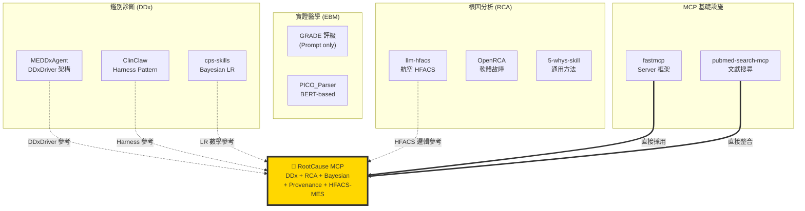

# 現有解決方案研究：醫學推理與鑑別診斷開源專案調查

> **調查時間**：2026-08-09  
> **調查者**：GitHub Copilot Agent (Kimi K3)  
> **目的**：避免重造輪子，確立 RootCause MCP 獨特定位

---

## 📊 Executive Summary

**核心發現**：RootCause MCP 是目前**唯一**同時整合以下五項的開源專案：

1. ✅ Medical Differential Diagnosis (DDx)
2. ✅ Root Cause Analysis (RCA)
3. ✅ Bayesian 機率推理
4. ✅ Evidence Provenance 追蹤
5. ✅ HFACS-MES 醫療分類系統

---

## 🗺️ 開源生態系全景圖



---

## 🔬 重點專案分析

### 1. MEDDxAgent (NEC Research)

**連結**: https://github.com/nec-research/meddxagent  
**License**: Apache-2.0  
**語言**: Python

#### 核心架構

```
DDxDriver (Orchestrator)
├── History Taking Module      # 病史採集
├── Differential Diagnosis     # 鑑別診斷生成
├── Workup Planning            # 檢查規劃
└── Diagnostic Strategy Agent  # RAG 輔助策略
```

#### ✅ 我們學什麼

1. **Orchestrator Pattern**：多模組協調架構
2. **迭代式推理**：每輪更新鑑別診斷
3. **Benchmark 整合**：DDxPlus, ICraftMD, RareBench

#### ❌ 無法直接用

- 不做 RCA
- 無 Bayesian 機率更新
- 無 Evidence provenance

---

### 2. ClinClaw (rbr7)

**連結**: https://github.com/rbr7/ClinClaw  
**License**: MIT

#### 核心架構：Harness Pattern

```python
Pipeline:
1. Checkpoint  → 儲存狀態
2. Context     → 載入病史
3. Tool Chain  → 執行工具鏈
4. Validate    → 驗證品質
5. Recover     → 錯誤恢復
```

#### ✅ 我們學什麼

1. **Harness Pattern**：Checkpoint/Recovery 機制
2. **Clinical NER**：ICD-10/藥物實體辨識
3. **Pydantic Schema**：資料驗證設計

#### ❌ 無法直接用

- 0 stars（品質未驗證）
- 無 Bayesian 推理
- 不做 RCA

---

### 3. cps-skills (htlin222)

**連結**: https://github.com/htlin222/cps-skills  
**Type**: Claude Code Skill (Prompt)

#### 核心功能

- NEJM 格式 Bayesian 診斷
- Likelihood Ratio 計算
- EBM 整合

#### ✅ 我們學什麼

**Bayesian LR 數學實作**：

```python
Posterior Odds = Prior Odds × LR
Posterior P = Odds / (1 + Odds)
```

已實作於我們的 `Hypothesis.bayesian_update()`

---

### 4. llm-hfacs (iHuman-Lab)

**連結**: https://github.com/iHuman-Lab/llm-hfacs  
**領域**: **航空**（非醫療！）

#### ✅ 我們學什麼

- LLM + HFACS 分類邏輯
- Prompt 設計模式

#### ❌ 無法直接用

- 航空領域，需改寫為醫療 HFACS-MES

---

### 5. OpenRCA (Microsoft)

**連結**: https://github.com/microsoft/OpenRCA  
**領域**: **軟體工程**（微服務故障）

#### ❌ 完全不相關

- 軟體故障定位
- 不做醫學推理

---

## 📚 EBM 工具現況

### 關鍵發現：無結構化套件

現有 EBM 工具都是：
- ❌ Prompt-based（無程式碼）
- ❌ 無 Pydantic schema
- ❌ 無 Evidence provenance

**我們的機會**：建立第一個 Oxford CEBM / GRADE Pydantic schema

---

## 🎯 功能對比總表

| 功能 | MEDDx | ClinClaw | OpenRCA | **RootCause MCP** |
|------|:-----:|:--------:|:-------:|:-----------------:|
| Medical DDx | ✅ | ✅ | ❌ | ✅ |
| RCA | ❌ | ❌ | ✅ | ✅ |
| Bayesian | ❌ | ❌ | ❌ | ✅ |
| Evidence Provenance | ❌ | △ | ❌ | ✅ |
| HFACS-MES | ❌ | ❌ | ❌ | ✅ |
| MCP Protocol | ❌ | ✅ | ❌ | ✅ |
| Agent-Agnostic | ❌ | △ | ❌ | ✅ |

---

## 📦 可直接使用的套件

| 套件 | 用途 | License | 優先級 |
|------|------|---------|--------|
| **fastmcp** | MCP framework | Apache-2.0 | P0 |
| **fhir.resources** | FHIR R4 models | Apache-2.0 | P2 |
| **pubmed-search-mcp** | 文獻搜尋 | Unknown | P1 |

---

## 🔨 仍需自建的核心

### 1. 醫療 HFACS-MES 引擎
- **空缺原因**：現有都是航空版
- **我們的優勢**：已有 YAML 配置 + 測試案例

### 2. GRADE/Oxford CEBM Schema
- **空缺原因**：無 Python 套件
- **我們的優勢**：已實作 `EvidenceQuality` VO

### 3. Evidence Provenance 追蹤
- **空缺原因**：無醫療專用
- **我們的優勢**：已實作 `Evidence` entity

### 4. Bayesian DDx + RCA 整合 ⭐
- **空缺原因**：**從未被整合過**
- **我們的優勢**：已實作 `Hypothesis.bayesian_update()`
- **這是核心創新！**

---

## 📖 參考文獻 (GB/T 7714)

1. NEC Research. MEDDxAgent: Modular Explainable Differential Diagnosis Agent[EB/OL]. (2025-06)[2026-08-09]. https://github.com/nec-research/meddxagent.

2. rbr7. ClinClaw: Clinical AI Agent Framework[EB/OL]. (2026-06)[2026-08-09]. https://github.com/rbr7/ClinClaw.

3. htlin222. cps-skills: Clinical Problem Solving Skills[EB/OL]. (2026-03)[2026-08-09]. https://github.com/htlin222/cps-skills.

4. iHuman-Lab. llm-hfacs: LLM-based HFACS Classification[EB/OL]. (2025-06)[2026-08-09]. https://github.com/iHuman-Lab/llm-hfacs.

5. Microsoft. OpenRCA: Benchmarking LLM-based RCA[EB/OL]. (2026-07)[2026-08-09]. https://github.com/microsoft/OpenRCA.

6. PrefectHQ. fastmcp: Fast Pythonic MCP Framework[EB/OL]. (2026-08)[2026-08-09]. https://github.com/PrefectHQ/fastmcp.

7. u9401066. pubmed-search-mcp: Biomedical Literature Search[EB/OL]. (2026-08)[2026-08-09]. https://github.com/u9401066/pubmed-search-mcp.

---

## 🎓 總結

### 我們的獨特價值

**RootCause MCP = 唯一同時整合 DDx + RCA + Bayesian + Provenance + HFACS-MES 的開源專案**

### 設計原則

1. **參考但不複製**：學習架構，不抄程式碼
2. **整合現有輪子**：fastmcp, fhir.resources
3. **專注核心創新**：Bayesian DDx + RCA 整合

---

**版本**: v1.0  
**更新**: 2026-08-09  
**維護**: RootCause MCP Team
