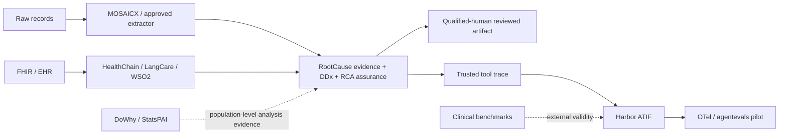

# GitHub 臨床推理、RCA 與 Agent 基礎設施學習庫

> **查核快照**：2026-08-18
> **範圍**：公開 GitHub repository／code 搜尋，以及高相關專案的 README、tree、schema、tests、LICENSE 與 citation metadata。
> **重要限制**：本學習庫不是臨床驗證、採購背書或新穎性證明；未逐一部署的專案會在個別報告明確標示。

本目錄把廣泛搜尋中實際列入決策的 26 個 repository 拆成「一 repo 一份」報告。目的不是蒐集專案名稱，而是回答四個可執行問題：

1. 它真正解決哪一層問題？
2. RootCause MCP 可以學什麼、不能宣稱什麼？
3. 應採 dependency、sidecar、adapter、benchmark，還是只引用概念？
4. 如何留下可重現的軟體、論文、資料集與授權引用？

## 總結判定

公開專案已大量覆蓋 DDx、FHIR/EHR、raw document extraction、RCA templates、agent runtime、trace、benchmark 與統計因果推論。RootCause MCP 不應在這些層面繼續擴張成另一個通用平台。

本次仍未找到單一公開 repo 同時提供：

- exact snippet／source location／whole-file 或 span hash；
- DDx、must-not-miss、direct applied LR 與 planned-test disposition；
- Fishbone、Why、HFACS 與 root/audit/evidence exact lineage；
- 明確區分稽核與臨床因果證明的 conservative causation status；
- server-side recomputed typed conformance；
- named qualified reviewer、final timestamp、recomputable hash 與 deep immutable snapshot。

因此較準確的產品定位是：

> RootCause MCP 是位於 extractor／EHR tools 與 reasoning Agent 之後的 clinical reasoning + medical RCA assurance layer，不是 raw-record parser、FHIR gateway、通用 Agent runner 或臨床因果證明器。

## 建議組合邊界

虛線代表 optional evidence 或 evaluation integration，不代表它能改寫 RootCause 的病例層 conformance 結果。

## 逐 repo 報告

### 臨床推理與直接／相鄰競品

| Repository | 定位 | 報告 |
|---|---|---|
| `jonio87/mastra-asklepios` | 多來源罕病推理、MCP、W3C PROV | [學習報告](repositories/jonio87__mastra-asklepios.md) |
| `Francis1998/medagent-core` | FHIR intake、evidence FOR/AGAINST、安全 audit | [學習報告](repositories/francis1998__medagent-core.md) |
| `makidav/clinical-assistant` | 可稽核 DDx／EBM Agent Skill | [學習報告](repositories/makidav__clinical-assistant.md) |
| `bshepp/clinical-decision-support-agent` | MCP DDx、drug check、guideline RAG | [學習報告](repositories/bshepp__clinical-decision-support-agent.md) |
| `akhilapugazhendhi98/RCA-Assistant-for-Healthcare-Events` | Patient-safety 5-Why facilitation | [學習報告](repositories/akhilapugazhendhi98__rca-assistant-for-healthcare-events.md) |
| `SahajSethi7/agentic-rca-mcp` | 通用 MCP RCA engine | [學習報告](repositories/sahajsethi7__agentic-rca-mcp.md) |
| `mmonfar/clinical-node` | 虛擬 M&M multi-agent committee | [學習報告](repositories/mmonfar__clinical-node.md) |
| `kubla/root-cause-health-history-synthesis` | Longitudinal history Agent Skill | [學習報告](repositories/kubla__root-cause-health-history-synthesis.md) |
| `nec-research/meddxagent` | Iterative DDx research framework | [學習報告](repositories/nec-research__meddxagent.md) |
| `MAGIC-AI4Med/Deep-DxSearch` | Agentic retrieval／diagnostic policy | [學習報告](repositories/magic-ai4med__deep-dxsearch.md) |
| `The-Swarm-Corporation/Open-MAI-Dx-Orchestrator` | Sequential multi-agent diagnosis | [學習報告](repositories/the-swarm-corporation__open-mai-dx-orchestrator.md) |

### 可整合的基礎套件與服務邊界

| Repository | 建議角色 | 報告 |
|---|---|---|
| `DIGIT-X-Lab/MOSAICX` | Local extraction／OCR／de-ID sidecar | [學習與引用報告](repositories/digit-x-lab__mosaicx.md) |
| `healthchainai/HealthChain` | Typed FHIR SDK／adapter | [學習與引用報告](repositories/healthchainai__healthchain.md) |
| `langcare/langcare-mcp-fhir` | FHIR MCP upstream | [學習與引用報告](repositories/langcare__langcare-mcp-fhir.md) |
| `wso2/fhir-mcp-server` | SMART/FHIR MCP upstream | [學習與引用報告](repositories/wso2__fhir-mcp-server.md) |
| `harbor-framework/harbor` | Formal eval execution substrate | [學習與引用報告](repositories/harbor-framework__harbor.md) |
| `agentevals-dev/agentevals` | OTel trajectory evaluation pilot | [學習與引用報告](repositories/agentevals-dev__agentevals.md) |
| `py-why/dowhy` | Population-level causal inference adapter | [學習與引用報告](repositories/py-why__dowhy.md) |
| `brycewang-stanford/StatsPAI` | Agent-native statistical analysis adapter | [學習與引用報告](repositories/brycewang-stanford__statspai.md) |
| `QWED-AI/qwed-verification` | Generic proof/admission envelope reference | [學習與引用報告](repositories/qwed-ai__qwed-verification.md) |

### Agent 與臨床 benchmark

| Repository | 可驗證能力 | 報告 |
|---|---|---|
| `microsoft/HealthAgentBench` | 多 runtime、task verifier、health environments | [學習報告](repositories/microsoft__healthagentbench.md) |
| `stanfordmlgroup/MedAgentBench` | FHIR EHR retrieval/action tasks | [學習報告](repositories/stanfordmlgroup__medagentbench.md) |
| `HealthRex/PhysicianBench` | Long-horizon FHIR physician tasks | [學習報告](repositories/healthrex__physicianbench.md) |
| `IVUL-KAUST/MedCTA` | Tool choice、arguments、evidence faithfulness | [學習報告](repositories/ivul-kaust__medcta.md) |
| `som-shahlab/medalign` | Longitudinal multi-document synthesis | [學習報告](repositories/som-shahlab__medalign.md) |
| `MAGIC-AI4Med/MedSP1000` | Interactive frozen rubrics、clinician scoring | [學習報告](repositories/magic-ai4med__medsp1000.md) |

## 基礎套件引用政策

「引用」不等於複製原始碼。對基礎套件預設採以下順序：

1. **Protocol adapter 或 sidecar**：讓 upstream 保持獨立生命週期與授權邊界。
2. **Optional dependency**：只在額外功能啟用時安裝，不擴大 RootCause 的核心 attack surface。
3. **Pin 可重現版本**：開發以 release/tag 與 lockfile；正式驗證再保存 commit、wheel/container digest 與 SBOM。
4. **分開引用四種物件**：軟體、論文、資料集、模型／權重各自引用，不用 repository URL 取代 DOI 或 DUA。
5. **保留 attribution**：在 dependency inventory、SBOM、NOTICE 或 release note 記錄 upstream、version、URL 與 license。
6. **無授權即不搬碼**：GitHub 公開可讀不等於獲得重製、修改或散布權。

每份基礎套件報告都包含建議依賴形態、fail-closed contract tests 及 citation fallback。

## 維護規則

- 每次重新查核都更新日期與 commit，不靜默覆寫舊判斷。
- Stars 只反映社群可見度，不作為臨床品質或安全性指標。
- Roadmap、README 宣稱與已存在的 source/tests 要分開標記。
- Upstream license、資料 DUA 或模型條款優先於本目錄的摘要；有疑義時交由法務或資料治理人員確認。
- 新增候選時先複製 [報告範本](REPORT_TEMPLATE.md)，再加入此索引。
