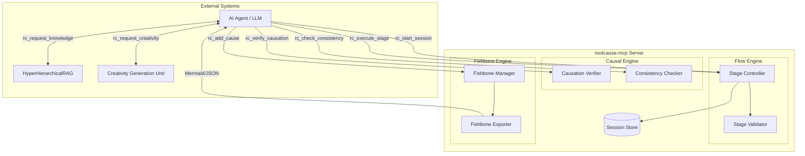
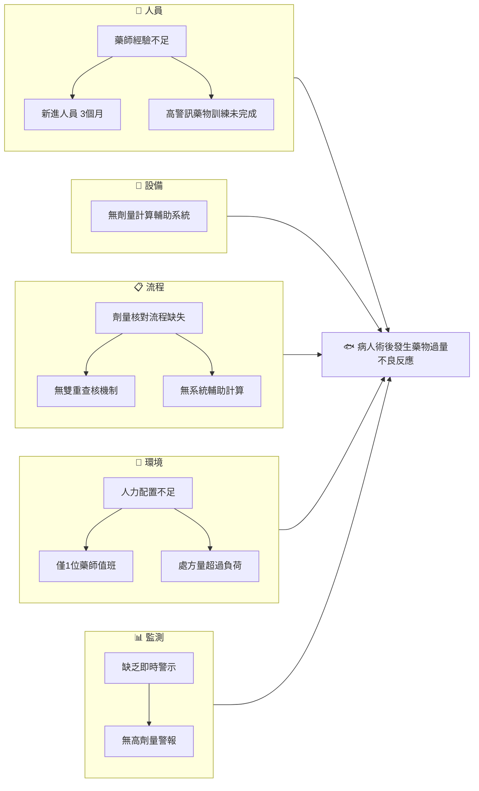

# rootcause-mcp 技術規格書 v2

**專案名稱：** rootcause-mcp  
**版本：** 2.5.0  
**最後更新：** 2026-01-15  
**類型：** Model Context Protocol (MCP) Server  
**GitHub：** https://github.com/[owner]/rootcause-mcp

---

## 🛠️ 確認的技術決策

| 項目 | 決策 | 來源參考 |
|------|------|----------|
| Package Manager | **uv** | lumino-mcp-server |
| MCP Framework | **FastMCP** (Python MCP SDK) | lumino-mcp-server |
| Python | **3.12+** | 升級 |
| Schema | **Pydantic v2** | 標準 |
| Persistence | **SQLite + SQLModel** | 決策 |
| Graph | **networkx** | 決策 |
| Ontology Reasoning | **owlready2** (Phase 2) | KG-RCA |
| Causal Inference | **DoWhy-GCM** (Phase 3) | PMID:35950198 |
| Causal Discovery | **causal-learn** (Phase 3) | py-why |
| Linter | **ruff** | 最佳實踐 |
| Type Checker | **mypy --strict** | 最佳實踐 |
| 架構模式 | **DDD** | 最佳實踐 |
| Confidence Score | **是** (0.0-1.0) | AWS Sample |
| RCA 品質評分 | **是** (5 維度) | rca-ai-analyst |
| Prompt Guidance | **是** (MCP Prompts) | mako10k/mcp-rca |
| Fallback | **Agent 層處理** | 決策 |
| Counterfactual Testing | **是** (4 項測試) | 本專案設計 |

---

## 目錄

1. [專案概述](#1-專案概述) ✅
   - 1.4 創新定位與價值主張 🆕
   - 1.5 風險與不確定性 🆕
2. [理論基礎](#2-理論基礎) ✅
3. [系統架構](#3-系統架構) ✅
4. [RCA 流程引擎](#4-rca-流程引擎) ✅
5. [資料結構定義](#5-資料結構定義) ✅
6. [MCP Tools 定義](#6-mcp-tools-定義) ✅
   - 6.2 因果推論類 Tools（含 Counterfactual Testing）🆕
7. [MCP Prompts 定義](#7-mcp-prompts-定義) 🆕
8. [RCA 品質評分](#8-rca-品質評分) 🆕
9. [領域配置](#9-領域配置) ✅
10. [技術實作參考](#10-技術實作參考) ✅
    - 10.2 DDD 架構設計 🆕
    - 10.3 核心技術選型（DoWhy-GCM, owlready2）🆕
    - 10.4 GitHub Repos 整合建議
    - 10.5 文獻參考
11. [開發路線圖](#11-開發路線圖) ✅
12. [附錄](#12-附錄) ✅

---

## 1. 專案概述

### 1.1 專案定位與核心目標

**rootcause-mcp 是什麼：**
- 一個專注於 **結構化因果推論** 的 MCP Server
- 提供 AI Agent **RCA 流程管控**、**因果驗證**、**魚骨圖生成** 能力
- 確保推論過程有跡可循，杜絕幻覺式的因果宣稱

**rootcause-mcp 不做什麼：**
- ❌ 不負責資料原子化（由 Agent/LLM 處理）
- ❌ 不負責知識檢索（由 RAG 系統處理）
- ❌ 不負責資料讀取（由其他 MCP 處理）

### 1.2 適用場景

| 場景 | 說明 | 典型觸發 |
|------|------|----------|
| **死亡案例 RCA** | 院內死亡事件的根本原因分析 | M&M Conference |
| **併發症 RCA** | 非預期併發症的因果追溯 | 術後併發症討論 |
| **Near Miss RCA** | 差點發生的危險事件分析 | 異常事件通報 |
| **病安事件 RCA** | 病人安全事件的系統性分析 | TPR 通報案例 |
| **臨床人力問題 RCA** | 人力配置相關問題分析 | 人力不足導致的事件 |

### 1.3 系統分工邊界

```
┌─────────────────────────────────────────────────────────────┐
│                      AI Agent (LLM)                         │
│  ┌─────────────────────────────────────────────────────┐   │
│  │ 職責：                                               │   │
│  │ • 理解用戶自然語言輸入                              │   │
│  │ • 將非結構化文本「原子化」為結構化事實              │   │
│  │ • 綜合各 MCP 輸出，生成最終報告                     │   │
│  └─────────────────────────────────────────────────────┘   │
└─────────────────────────────────────────────────────────────┘
        │                    │                    │
        ▼                    ▼                    ▼
┌────────────────────┐  ┌─────────────────┐  ┌─────────────────┐
│  rootcause-mcp     │  │  HHRAG MCP      │  │   CGU MCP       │
│  (本專案)          │  │ (知識檢索)      │  │ (創意發散)      │
├────────────────────┤  ├─────────────────┤  ├─────────────────┤
│ • RCA 流程         │  │ • 知識圖譜查詢  │  │ • Fishbone 發想 │
│ • 因果驗證         │  │ • 相似案例檢索  │  │ • 5W2H 分析     │
│ • 魚骨圖管理       │  │ • 文獻知識提取  │  │ • 六頂帽子思考  │
│ • 一致性檢查       │  │ • 超圖關聯擴展  │  │ • 逆向思維      │
└────────────────────┘  └─────────────────┘  └─────────────────┘
```

**分工原則：**

| 功能 | 負責者 | 原因 |
|------|--------|------|
| 非結構化→結構化 | Agent | LLM 擅長理解語意，傳統切割不準 |
| 知識檢索/相似案例 | HHRAG | 已有成熟的超圖 RAG 架構 |
| 創意發散/多角度思考 | CGU | 15 種創意方法已實作 |
| **流程管控/因果驗證** | **rootcause-mcp** | **本專案核心價值** |

### 1.4 創新定位與價值主張

> **誠實評估：這不是技術突破，而是「整合創新」**

```
┌─────────────────────────────────────────────────────────────────┐
│  創新類型：「整合創新」+ 「時機創新」                            │
├─────────────────────────────────────────────────────────────────┤
│                                                                 │
│  ❌ 不是：                                                      │
│     • 新演算法發明                                              │
│     • 技術突破                                                  │
│     • 學術研究                                                  │
│                                                                 │
│  ✅ 是：                                                        │
│     • 正確的技術組合 + 特定領域 + 正確的時機                    │
│                                                                 │
│  類比：                                                         │
│     Slack 不是發明即時通訊，而是「正確組合」給企業用            │
│     rootcause-mcp 不是發明 RCA，而是「正確組合」給 AI Agent     │
│                                                                 │
└─────────────────────────────────────────────────────────────────┘
```

**為什麼值得做？（Value Proposition）**

| # | 價值點 | 說明 |
|---|--------|------|
| 1 | **市場空白** | 開源臨床 RCA + AI Agent 整合 = 市場幾乎不存在 |
| 2 | **時機正確** | MCP 生態剛興起（2024-2025），搶佔 RCA 生態位 |
| 3 | **領域整合** | HFACS-MES + 6M 魚骨圖 + MCP 的**首次正式整合** |
| 4 | **可擴展** | Domain Cartridge 設計可推廣到航空、製造、IT Incident |

**競爭分析：**

| 方案 | 問題 |
|------|------|
| 通用 RCA 工具 (rca-ai-analyst) | 無臨床領域知識，HFACS 不完整 |
| 商業臨床 RCA 軟體 | 昂貴、不開源、不支援 AI Agent |
| LLM 直接做 RCA | 幻覺問題、無結構化流程、無法追溯 |
| **rootcause-mcp** | ✅ 開源 + 臨床專用 + AI Agent 友好 |

### 1.5 風險與不確定性

**技術風險：**

| 風險 | 影響 | 機率 | 緩解策略 |
|------|------|------|----------|
| FastMCP 成熟度不足 | 需要 workaround 或換框架 | 低 | Week 1 Spike 驗證 |
| SQLite 效能瓶頸 | 大型 Session 變慢 | 低 | 先用，不夠再換 PostgreSQL |
| networkx 大圖效能 | 複雜魚骨圖變慢 | 中 | 限制節點數 + 延遲載入 |

**產品風險：**

| 風險 | 影響 | 機率 | 緩解策略 |
|------|------|------|----------|
| 6 階段流程太複雜 | 用戶不願用 | 中 | MVP 先做 3 階段 (GATHER→ANALYZE→ACTION) |
| HFACS 臨床接受度低 | 分類不被認可 | 中 | 先諮詢 2-3 位臨床專家驗證 |
| 無人使用 | 專案失敗 | 中 | 先找 1-2 個 Pilot 用戶 |

**開發加速策略：**

```
1. Spike First（技術驗證）
   └─ Week 1: 2-3 天 Spike 驗證 FastMCP + SQLite

2. Vertical Slice（垂直切片）
   └─ 每個 Phase 只做「一個完整流程」，不追求完美

3. AI-Assisted Coding
   └─ Copilot/Claude 生成 Pydantic schema → CRUD
   └─ 自動生成測試案例

4. 延遲優化
   └─ 先能跑，再優化
   └─ 先單機，需要再分散式
```

---

## 2. 理論基礎

### 2.1 Swiss Cheese Model（瑞士乳酪模型）

**來源：** Reason, J. (1990). Human Error. Cambridge University Press.

**核心概念：**
事故的發生並非單一原因，而是多層防護同時失效的結果。每一層防護（如 SOP、訓練、設備）都像一片有洞的乳酪，當所有洞剛好對齊時，危害就會穿透所有防線造成事故。

```
     危害源                                    事故
        │                                       │
        ▼                                       ▼
   ┌─────────┐  ┌─────────┐  ┌─────────┐  ┌─────────┐
   │  ○      │  │    ○    │  │  ○      │  │      ○  │
   │    ○    │  │  ○      │  │      ○  │  │  ○      │
   │      ○──┼──┼────○────┼──┼──────○──┼──┼────○────┼──→ 事故!
   │  ○      │  │      ○  │  │    ○    │  │    ○    │
   │      ○  │  │  ○      │  │  ○      │  │      ○  │
   └─────────┘  └─────────┘  └─────────┘  └─────────┘
    組織文化      管理監督      執行條件      個人行為
   (Latent)     (Latent)    (Active)     (Active)
```

**對 rootcause-mcp 的意義：**
- RCA 必須追溯到**潛在原因 (Latent Failures)**，不能只停在直接原因
- 魚骨圖的分類應涵蓋所有防護層級
- 改善措施應針對多層防護，而非單點修補

### 2.2 HFACS-MES（醫療事件人因分析分類系統）

**來源：** 
- 原始 HFACS: Shappell & Wiegmann (2000), 航空領域
- 醫療版 HFACS-MES: 多篇文獻整合，參考 `docs/literature_review_clinical_rca.md`

**四層結構與 36 分類：**

```
Level 4: 組織影響 (Organizational Influences)
├── 資源管理 (Resource Management)
│   ├── OI-RM1: 人力資源不足
│   ├── OI-RM2: 財務資源限制
│   └── OI-RM3: 設備資源不足
├── 組織氛圍 (Organizational Climate)
│   ├── OI-OC1: 組織結構問題
│   ├── OI-OC2: 政策執行落差
│   └── OI-OC3: 組織文化偏差
└── 組織流程 (Organizational Process)
    ├── OI-OP1: 作業流程設計缺陷
    ├── OI-OP2: 程序文件管理不當
    └── OI-OP3: 監督稽核機制不足

Level 3: 不安全監督 (Unsafe Supervision)
├── 監督不足 (Inadequate Supervision)
│   ├── US-IS1: 指導訓練不足
│   ├── US-IS2: 任務規劃不當
│   └── US-IS3: 追蹤監控缺失
├── 計畫不當 (Planned Inappropriate Operations)
│   ├── US-PI1: 風險評估不足
│   └── US-PI2: 超時工作安排
├── 未糾正問題 (Failed to Correct Problem)
│   ├── US-FC1: 已知問題未處理
│   └── US-FC2: 違規行為未糾正
└── 監督違規 (Supervisory Violations)
    ├── US-SV1: 授權不當操作
    └── US-SV2: 未執行規定監督

Level 2: 不安全行為前提 (Preconditions for Unsafe Acts)
├── 環境因素 (Environmental Factors)
│   ├── PC-EF1: 物理環境不良
│   ├── PC-EF2: 技術環境問題
│   └── PC-EF3: 工作環境干擾
├── 人員狀態 (Condition of Operators)
│   ├── PC-CO1: 生理狀態不佳
│   ├── PC-CO2: 心理狀態問題
│   └── PC-CO3: 認知能力受限
└── 人員因素 (Personnel Factors)
    ├── PC-PF1: 溝通協調不良
    ├── PC-PF2: 團隊合作問題
    └── PC-PF3: 適任性問題

Level 1: 不安全行為 (Unsafe Acts)
├── 錯誤 (Errors)
│   ├── UA-ER1: 決策錯誤
│   ├── UA-ER2: 技能性錯誤
│   └── UA-ER3: 感知性錯誤
└── 違規 (Violations)
    ├── UA-VL1: 例行性違規
    └── UA-VL2: 例外性違規
```

**對 rootcause-mcp 的意義：**
- 提供**標準化分類代碼**，確保因素分類一致性
- 強制考慮四個層級，避免只看表面原因
- 可作為 `rc_add_cause` 的 `hfacs_code` 參數選項

### 2.3 Fishbone Diagram（魚骨圖）- 臨床 6M 版

**來源：** 
- 原始: Ishikawa, K. (1968). 品質管理
- 臨床版: 整合 ASQ 指引與醫療品質文獻

**傳統 6M 與臨床 6M 對照：**

| 傳統 6M | 臨床 6M | 說明 | 範例 |
| ------ | ------- | ---- | ---- |
| Man | **人員 (Personnel)** | 人員能力、狀態、行為 | 訓練不足、疲勞、溝通失誤 |
| Machine | **設備 (Equipment)** | 醫療設備、資訊系統 | 儀器故障、系統當機、警報失效 |
| Material | **物料 (Material)** | 藥品、耗材、血品 | 藥品過期、耗材缺貨、血型錯誤 |
| Method | **流程 (Process)** | SOP、交接、核對流程 | 流程不明、交接不全、查核遺漏 |
| Milieu | **環境 (Environment)** | 工作環境、人力配置 | 噪音干擾、人力不足、空間擁擠 |
| Measurement | **監測 (Monitoring)** | 預警系統、品質指標 | 指標未追蹤、預警未設定、異常未通報 |

**魚骨圖結構：**

```
                    ┌─────────────┐
    Personnel ──────┤             │
                    │             │
    Equipment ──────┤             │
                    │             │
    Material  ──────┤  問題/事件  │──────▶ 結果
                    │  (魚頭)     │
    Process   ──────┤             │
                    │             │
    Environment ────┤             │
                    │             │
    Monitoring ─────┤             │
                    └─────────────┘
```

**對 rootcause-mcp 的意義：**
- 6M 作為 `category` 參數的固定選項
- 每個大骨下可有多層小骨（sub-causes）
- 匯出時可轉換為 Mermaid 或結構化 JSON

### 2.4 因果推論理論

**核心框架：** Judea Pearl 的因果階梯 (Ladder of Causation)

**來源：** Pearl, J. (2009). Causality: Models, Reasoning, and Inference. Cambridge University Press.

```
Level 3: 反事實 (Counterfactuals)
         "如果當時 X 不發生，Y 會怎樣？"
         ↑
Level 2: 介入 (Intervention)  
         "如果我們改變 X，Y 會如何變化？"
         ↑
Level 1: 觀察/關聯 (Association)
         "X 和 Y 是否相關？"
```

**因果驗證的三個必要條件：**

| 條件 | 說明 | rootcause-mcp 檢查方式 |
| ---- | ---- | ---------------------- |
| **時序性 (Temporality)** | 原因必須先於結果發生 | 檢查 timestamp |
| **相關性 (Association)** | 原因與結果存在統計關聯 | 若有數據可計算相關係數 |
| **非虛假性 (Non-spuriousness)** | 排除混淆因子的影響 | 邏輯一致性檢查 |

**反事實推理在 RCA 中的應用：**

```
問題：「藥物過量是否導致病人死亡？」

反事實問題：「如果藥物劑量正確，病人是否會存活？」

判斷依據：
1. 若答案為「是」→ 藥物過量是根本原因
2. 若答案為「不一定」→ 可能有其他原因
3. 若答案為「否」→ 藥物過量不是主因
```

**對 rootcause-mcp 的意義：**
- `rc_verify_causation` 需檢查時序性
- `rc_check_consistency` 需檢查邏輯一致性
- 未來可整合 DoWhy 進行統計驗證（Phase 3+）

---

## 3. 系統架構

### 3.1 架構總覽



### 3.2 rootcause-mcp 核心職責

#### 3.2.1 Flow Engine（流程引擎）

**功能：** 強制 RCA 流程走完 6 個階段，確保分析完整性

- 管理 Session 生命週期
- 驗證每個階段的必要輸入
- 控制階段轉換條件
- 記錄完整推論軌跡

#### 3.2.2 Causal Engine（因果引擎）

**功能：** 驗證因果關係的邏輯一致性

- 時序檢查（原因必須先於結果）
- 邏輯一致性檢查（不矛盾）
- 建議遺漏的可能因素
- 反事實推理支援

#### 3.2.3 Fishbone Engine（魚骨圖引擎）

**功能：** 管理魚骨圖的建構與輸出

- 初始化魚骨圖（設定問題/魚頭）
- 新增/修改原因節點
- 6M 分類管理
- 匯出為 Mermaid / JSON / Markdown

### 3.3 與外部 MCP 協作模式

#### 3.3.1 與 HyperHierarchicalRAG 協作

```
場景：分析過程中需要檢索相關知識或相似案例

rootcause Agent                     HHRAG
 │                                    │
 │  rc_request_knowledge              │
 │  {                                 │
 │    "query": "低血壓處置指引",      │
 │    "context": "術中出血"           │
 │  }                                 │
 │ ──────────────────────────────────>│
 │                                    │ 超圖擴展檢索
 │<────────────────────────────────── │
 │  {                                 │
 │    "results": [...],              │
 │    "related_entities": [...]      │
 │  }                                 │
```

#### 3.3.2 與 Creativity-Generation-Unit 協作

```
場景：魚骨圖某分支需要發散思考更多可能原因

rootcause Agent                     CGU
 │                                    │
 │  rc_request_creativity             │
 │  {                                 │
 │    "method": "fishbone",           │
 │    "topic": "術後低血壓",           │
 │    "category": "Method"            │
 │  }                                 │
 │ ──────────────────────────────────>│
 │                                    │ 發散思考
 │<────────────────────────────────── │
 │  {                                 │
 │    "ideas": [                     │
 │      "輸液速度不足",              │
 │      "血管張力藥物延遲",          │
 │      ...                          │
 │    ]                              │
 │  }                                 │
```

### 3.4 Session 狀態管理

```
Session Lifecycle:
═══════════════════════════════════════════════════════════

  ┌─────────┐    start     ┌─────────┐
  │  IDLE   │ ──────────── │ ACTIVE  │
  └─────────┘              └────┬────┘
                                │
       ┌────────────────────────┼────────────────────────┐
       │                        │                        │
       ▼                        ▼                        ▼
  ┌─────────┐            ┌─────────┐            ┌─────────┐
  │ GATHER  │ ────────── │CONTEXT- │ ────────── │ANALYZE  │
  │         │            │ UALIZE  │            │         │
  └─────────┘            └─────────┘            └─────────┘
       │                        │                        │
       │                        │                        │
       ▼                        ▼                        ▼
  ┌─────────┐            ┌─────────┐            ┌─────────┐
  │FISHBONE │ ────────── │ VERIFY  │ ────────── │ ACTION  │
  │         │            │         │            │         │
  └─────────┘            └─────────┘            └────┬────┘
                                                     │
                                                     ▼
                                               ┌──────────┐
                                               │ COMPLETE │
                                               └──────────┘
```

**Session 包含：**
- `session_id`: 唯一識別碼
- `case_type`: RCA 類型（death/complication/near_miss/safety/staffing）
- `current_stage`: 當前階段
- `stage_records`: 各階段記錄
- `fishbone`: 魚骨圖資料
- `created_at` / `updated_at`: 時間戳

---

## 4. RCA 流程引擎

**設計參考：** [thinking-protocol-mcp](https://github.com/RimGit-N/thinking-protocol-mcp) 的強制流程模式

> **設計理念：** Agent 已有 ReAct 等思考鏈能力，rootcause-mcp 提供更好的 reasoning 工具，而非取代 Agent 的思考。

### 4.1 六階段流程總覽

```
┌──────────┐    ┌───────────────┐    ┌──────────┐
│  GATHER  │───▶│ CONTEXTUALIZE │───▶│ ANALYZE  │
│ 事實收集  │    │   脈絡分析     │    │ 根因分析  │
└──────────┘    └───────────────┘    └──────────┘
                                           │
     ┌─────────────────────────────────────┘
     ▼
┌──────────┐    ┌──────────┐    ┌──────────┐
│ FISHBONE │───▶│  VERIFY  │───▶│  ACTION  │
│ 魚骨結構化 │    │ 因果驗證  │    │ 改善措施  │
└──────────┘    └──────────┘    └──────────┘
```

**階段說明：**

| 階段 | 核心任務 | 產出 | Agent 角色 |
|------|----------|------|------------|
| GATHER | 收集客觀事實 | 時間線、資料來源 | 原子化輸入資料 |
| CONTEXTUALIZE | 找更高階概念 | 系統因素、HFACS 分類 | 可呼叫 HMEM/RAG 擴展 |
| ANALYZE | **核心分析階段** | 根因假設、因果鏈 | ReAct reasoning |
| FISHBONE | 結構化呈現 | 6M 魚骨圖 | 組織分析結果 |
| VERIFY | 驗證因果關係 | 驗證報告 | 確認邏輯正確 |
| ACTION | 制定改善措施 | SMART 措施清單 | 產出可行動方案 |

### 4.2 各階段詳細定義

#### Stage 1: GATHER（事實收集）

**目的：** 收集與事件相關的所有客觀事實，建立時間線

**必要輸入 (required_keys)：**

| 欄位 | 類型 | 說明 |
| ---- | ---- | ---- |
| `event_summary` | string | 事件簡述（一句話） |
| `timeline` | array | 時間線事件列表 |
| `data_sources` | array | 資料來源清單 |

**timeline 元素結構：**

```json
{
  "timestamp": "2026-01-15T08:30:00Z",
  "description": "病人到達急診",
  "source": "急診護理紀錄",
  "actor": "急診護理師"
}
```

**驗證規則：**

- `timeline` 至少需有 3 個事件
- 每個事件必須有 `timestamp` 和 `description`
- `event_summary` 不得超過 200 字元

**階段產出：**

- 完整時間線
- 關鍵人員清單
- 待釐清問題清單

---

#### Stage 2: CONTEXTUALIZE（脈絡分析）

> **脈絡建構：** 此階段建立事件的系統性脈絡框架。可使用 HMEM (Human-Machine-Environment-Management) 等模型進行結構化分析，為後續的根因分析奠定基礎。

**目的：** 分析事件發生的系統性脈絡，識別環境因素與更高階的系統面向

**必要輸入 (required_keys)：**

| 欄位 | 類型 | 說明 |
| ---- | ---- | ---- |
| `system_factors` | array | 系統性因素列表 |
| `environmental_context` | object | 環境脈絡 |
| `stakeholders` | array | 相關人員與角色 |
| `contextual_framework` | string | 使用的脈絡分析框架 (選填，如 "HMEM", "SEIPS") |

**system_factors 元素結構：**
```json
{
  "factor": "當日人力配置",
  "status": "護病比 1:12，高於標準",
  "hfacs_level": "Level 2",
  "relevance": "high"
}
```

**environmental_context 結構：**
```json
{
  "workload": "high",
  "shift": "night",
  "staffing_ratio": "1:12",
  "equipment_status": "normal",
  "recent_changes": ["新系統上線一週"]
}
```

**驗證規則：**
- `system_factors` 至少需識別 2 個因素
- 必須涵蓋 HFACS Level 2-4 至少一項
- `stakeholders` 需列出主要當事人

**階段產出：**
- 系統性因素分析
- HFACS 初步分類
- 脈絡摘要

---

#### Stage 3: ANALYZE（根因分析）

> **核心階段：** 這是 RCA 的核心分析階段。Agent 使用 ReAct 或其他思考鏈進行 reasoning，rootcause-mcp 提供結構化工具輔助。

**目的：** 分析根本原因與貢獻因素，建立因果假設

**必要輸入 (required_keys)：**

| 欄位 | 類型 | 說明 |
| ---- | ---- | ---- |
| `primary_cause` | object | 主要根本原因 |
| `contributing_factors` | array | 貢獻因素列表 |
| `causal_chain` | array | 因果鏈描述 |

**primary_cause 結構：**

```json
{
  "description": "藥物劑量計算錯誤",
  "hfacs_code": "UA-ER1",
  "evidence": ["處方箋記錄", "藥局調劑紀錄"],
  "confidence": "high"
}
```

**causal_chain 結構（因果鏈）：**
```json
[
  {
    "sequence": 1,
    "cause": "人力不足導致查核時間壓縮",
    "effect": "藥師未完整核對劑量"
  },
  {
    "sequence": 2,
    "cause": "藥師未完整核對劑量",
    "effect": "錯誤劑量藥物送至病房"
  },
  {
    "sequence": 3,
    "cause": "錯誤劑量藥物送至病房",
    "effect": "病人接受過量藥物"
  }
]
```

**驗證規則：**
- `primary_cause` 必須有 `evidence` 支持
- `causal_chain` 至少 2 個環節
- 因果鏈必須符合時序性（前因在前）

**階段產出：**
- 根本原因假設
- 因果鏈模型
- 證據對照表

---

#### Stage 4: FISHBONE（魚骨結構化）

**目的：** 將識別的原因結構化為 6M 魚骨圖

**必要輸入 (required_keys)：**

| 欄位 | 類型 | 說明 |
| ---- | ---- | ---- |
| `problem_statement` | string | 魚頭（問題陳述） |
| `causes_by_category` | object | 依 6M 分類的原因 |

**causes_by_category 結構：**
```json
{
  "Personnel": [
    {
      "cause": "藥師經驗不足",
      "sub_causes": ["新進人員", "訓練時數不足"],
      "hfacs_code": "PC-PF3",
      "evidence": ["人事資料"]
    }
  ],
  "Process": [
    {
      "cause": "劑量核對流程不完整",
      "sub_causes": ["無雙重查核機制"],
      "hfacs_code": "OI-OP1",
      "evidence": ["SOP 文件"]
    }
  ],
  "Environment": [
    {
      "cause": "人力配置不足",
      "sub_causes": ["護病比過高", "藥師短缺"],
      "hfacs_code": "OI-RM1",
      "evidence": ["排班表"]
    }
  ]
}
```

**驗證規則：**
- `problem_statement` 必填
- 至少需涵蓋 3 個 6M 分類
- 每個 cause 建議有 `hfacs_code` 對照

**階段產出：**
- 完整魚骨圖結構
- 6M 分類原因清單
- Mermaid 視覺化代碼

---

#### Stage 5: VERIFY（因果驗證）

**目的：** 驗證因果關係的邏輯正確性

**必要輸入 (required_keys)：**

| 欄位 | 類型 | 說明 |
| ---- | ---- | ---- |
| `verification_results` | array | 驗證結果列表 |
| `counterfactual_analysis` | object | 反事實分析 |
| `consistency_check` | object | 一致性檢查結果 |

**verification_results 元素結構：**
```json
{
  "cause": "藥物劑量計算錯誤",
  "effect": "病人藥物過量",
  "temporality_check": {
    "passed": true,
    "cause_time": "2026-01-15T09:00:00Z",
    "effect_time": "2026-01-15T10:30:00Z"
  },
  "logic_check": {
    "passed": true,
    "reasoning": "劑量錯誤直接導致給藥過量，因果關係明確"
  }
}
```

**counterfactual_analysis 結構：**
```json
{
  "question": "若藥物劑量正確，病人是否會發生不良反應？",
  "answer": "unlikely",
  "confidence": "high",
  "reasoning": "病人無其他可解釋不良反應的因素"
}
```

**驗證規則：**
- 每個 `causal_chain` 環節都需驗證
- 時序性檢查不通過則標記 `REJECTED`
- 反事實分析需回答核心問題

**階段產出：**
- 驗證通過的因果關係
- 被駁回的假設（含理由）
- 修正後的因果模型

---

#### Stage 6: ACTION（改善措施）

**目的：** 提出針對根本原因的改善措施與預防策略

**必要輸入 (required_keys)：**

| 欄位 | 類型 | 說明 |
| ---- | ---- | ---- |
| `action_items` | array | 改善措施列表 |
| `prevention_strategy` | object | 預防策略 |
| `monitoring_plan` | object | 監測計畫 |

**action_items 元素結構：**
```json
{
  "action_id": "ACT-001",
  "description": "建立藥物劑量雙重查核機制",
  "target_cause": "劑量核對流程不完整",
  "hfacs_code": "OI-OP1",
  "priority": "high",
  "owner": "藥劑部主任",
  "deadline": "2026-02-15",
  "success_criteria": "100% 高警訊藥物完成雙重查核"
}
```

**prevention_strategy 結構：**
```json
{
  "short_term": ["立即增加藥師人力支援", "高警訊藥物全面雙核"],
  "medium_term": ["修訂藥物查核 SOP", "建立劑量計算輔助系統"],
  "long_term": ["導入藥物安全資訊系統", "定期藥物安全稽核"],
  "swiss_cheese_layers": ["Process", "Equipment", "Monitoring"]
}
```

**驗證規則：**
- 每個 `primary_cause` 至少對應一個 `action_item`
- `action_items` 需有明確 `owner` 和 `deadline`
- `prevention_strategy` 需涵蓋短中長期

**階段產出：**
- 改善措施清單（含負責人、期限）
- 預防策略（短中長期）
- 監測指標與追蹤計畫

---

### 4.3 階段轉換規則

**轉換條件表：**

| 從 | 到 | 轉換條件 |
| --- | --- | -------- |
| START | GATHER | Session 建立成功 |
| GATHER | CONTEXTUALIZE | `timeline` ≥ 3 項、`event_summary` 非空 |
| CONTEXTUALIZE | ANALYZE | `system_factors` ≥ 2 項、`stakeholders` 非空 |
| ANALYZE | FISHBONE | `primary_cause` 有證據、`causal_chain` ≥ 2 環節 |
| FISHBONE | VERIFY | `causes_by_category` 涵蓋 ≥ 3 個 6M 分類 |
| VERIFY | ACTION | 所有因果關係通過時序性檢查 |
| ACTION | COMPLETE | 每個根因有對應改善措施、有監測計畫 |

**允許的回退：**

```
VERIFY → ANALYZE    （發現因果邏輯錯誤，需重新分析）
VERIFY → FISHBONE    （需補充遺漏原因）
ACTION → VERIFY      （發現改善措施無法對應原因）
```

**不允許的跳躍：**
- 不可跳過 FISHBONE 直接到 ACTION
- 不可跳過 VERIFY 直接到 ACTION
- 不可從 GATHER 直接到 ANALYZE

---

## 5. 資料結構定義

本節定義 rootcause-mcp 的核心資料結構，採用 TypeScript 風格的型別定義。

### 5.1 RCA Session

```typescript
interface RCASession {
  // 識別資訊
  session_id: string;          // UUID, e.g., "rc_sess_a1b2c3d4"
  case_type: CaseType;         // RCA 類型
  
  // 狀態
  current_stage: Stage;        // 當前階段
  status: SessionStatus;       // 狀態
  
  // 內容
  stage_records: StageRecord[];   // 各階段記錄
  fishbone: FishboneStructure | null;  // 魚骨圖
  
  // 元資料
  created_at: string;          // ISO 8601 timestamp
  updated_at: string;          // ISO 8601 timestamp
  created_by: string;          // 建立者識別
}

type CaseType = 
  | "death"          // 死亡案例
  | "complication"   // 併發症
  | "near_miss"      // Near Miss
  | "safety"         // 病安事件
  | "staffing";      // 人力問題

type Stage = 
  | "GATHER"
  | "CONTEXTUALIZE"
  | "ANALYZE"
  | "FISHBONE"
  | "VERIFY"
  | "ACTION";

type SessionStatus = 
  | "active"         // 進行中
  | "completed"      // 已完成
  | "abandoned";     // 已放棄
```

### 5.2 Stage Record

```typescript
interface StageRecord {
  stage: Stage;                    // 階段名稱
  status: StageStatus;             // 階段狀態
  data: StageData;                 // 階段資料 (依階段不同)
  validation_result: ValidationResult;  // 驗證結果
  started_at: string;              // 開始時間
  completed_at: string | null;     // 完成時間
}

type StageStatus = 
  | "not_started"
  | "in_progress"
  | "completed"
  | "failed";

interface ValidationResult {
  passed: boolean;
  errors: string[];
  warnings: string[];
}

// 各階段特定資料結構
type StageData = 
  | GatherData 
  | ContextualizeData 
  | AnalyzeData 
  | FishboneData 
  | VerifyData 
  | ActionData;
```

**各階段 StageData 定義：**

```typescript
// Stage 1: GATHER
interface GatherData {
  event_summary: string;
  timeline: TimelineEvent[];
  data_sources: string[];
  key_personnel: string[];
  pending_questions: string[];
}

interface TimelineEvent {
  timestamp: string;
  description: string;
  source: string;
  actor?: string;
}

// Stage 2: CONTEXTUALIZE
interface ContextualizeData {
  system_factors: SystemFactor[];
  environmental_context: EnvironmentalContext;
  stakeholders: Stakeholder[];
}

interface SystemFactor {
  factor: string;
  status: string;
  hfacs_level: HFACSLevel;
  relevance: "high" | "medium" | "low";
}

interface EnvironmentalContext {
  workload: "high" | "normal" | "low";
  shift: "day" | "evening" | "night";
  staffing_ratio?: string;
  equipment_status: string;
  recent_changes: string[];
}

interface Stakeholder {
  name: string;
  role: string;
  involvement: string;
}

// Stage 3: ANALYZE
interface AnalyzeData {
  primary_cause: PrimaryCause;
  contributing_factors: ContributingFactor[];
  causal_chain: CausalChainLink[];
}

interface PrimaryCause {
  description: string;
  hfacs_code: string;
  evidence: string[];
  confidence: "high" | "medium" | "low";
}

interface ContributingFactor {
  description: string;
  hfacs_code?: string;
  relationship_to_primary: string;
}

interface CausalChainLink {
  sequence: number;
  cause: string;
  effect: string;
  evidence?: string;
}

// Stage 4: FISHBONE
interface FishboneData {
  problem_statement: string;
  causes_by_category: CausesByCategory;
}

// Stage 5: VERIFY
interface VerifyData {
  verification_results: VerificationResult[];
  counterfactual_analysis: CounterfactualAnalysis;
  consistency_check: ConsistencyCheck;
}

interface VerificationResult {
  cause: string;
  effect: string;
  temporality_check: TemporalityCheck;
  logic_check: LogicCheck;
  overall_passed: boolean;
}

interface TemporalityCheck {
  passed: boolean;
  cause_time?: string;
  effect_time?: string;
  reason?: string;
}

interface LogicCheck {
  passed: boolean;
  reasoning: string;
}

interface CounterfactualAnalysis {
  question: string;
  answer: "likely" | "unlikely" | "uncertain";
  confidence: "high" | "medium" | "low";
  reasoning: string;
}

interface ConsistencyCheck {
  passed: boolean;
  contradictions: string[];
  missing_links: string[];
}

// Stage 6: ACTION
interface ActionData {
  action_items: ActionItem[];
  prevention_strategy: PreventionStrategy;
  monitoring_plan: MonitoringPlan;
}

interface ActionItem {
  action_id: string;
  description: string;
  target_cause: string;
  hfacs_code?: string;
  priority: "high" | "medium" | "low";
  owner: string;
  deadline: string;
  success_criteria: string;
  status: "pending" | "in_progress" | "completed";
}

interface PreventionStrategy {
  short_term: string[];
  medium_term: string[];
  long_term: string[];
  swiss_cheese_layers: string[];
}

interface MonitoringPlan {
  metrics: MetricDefinition[];
  review_schedule: string;
  escalation_criteria: string;
}

interface MetricDefinition {
  name: string;
  target: string;
  measurement_method: string;
  frequency: string;
}
```

### 5.3 Fishbone Structure

```typescript
interface FishboneStructure {
  fishbone_id: string;
  problem_statement: string;       // 魚頭
  categories: FishboneCategory[];  // 6M 大骨
  created_at: string;
  updated_at: string;
}

interface FishboneCategory {
  category: FishboneCategoryType;  // 6M 分類
  causes: FishboneCause[];         // 該分類下的原因
}

type FishboneCategoryType = 
  | "Personnel"      // 人員
  | "Equipment"      // 設備
  | "Material"       // 物料
  | "Process"        // 流程
  | "Environment"    // 環境
  | "Monitoring";    // 監測

interface FishboneCause {
  // === Level 1: 必填（自然語言優先）===
  cause_id: string;
  description: string;             // 原因描述（自然語言，必填）
  category: FishboneCategoryType;  // 6M 分類（必填）
  
  // === Level 2: 系統建議（Agent 確認）===
  hfacs_code?: string;             // HFACS 對照代碼（系統建議，Agent 可修改）
  hfacs_confidence?: number;       // 系統建議的信心度 0.0-1.0
  
  // === Level 3: 選填進階 ===
  sub_causes: FishboneCause[];     // 子原因（遞迴結構，支援多層）
  evidence: string[];              // 支持證據
  confidence?: number;             // 此原因的整體信心度 0.0-1.0
  verified: boolean;               // 是否已通過因果驗證
  
  // === 元資料 ===
  depth: number;                   // 層數（從魚頭算起，1-5）
  created_at: string;
  updated_at: string;
}

// 魚骨圖配置
interface FishboneConfig {
  max_depth: number;               // 最大層數（預設 3，最多 5）
  require_evidence_at_depth: number;  // 幾層後需要證據（預設 2）
  auto_suggest_hfacs: boolean;     // 是否自動建議 HFACS（預設 true）
}
```

**Fishbone JSON 範例：**

```json
{
  "fishbone_id": "fb_001",
  "problem_statement": "病人術後發生藥物過量不良反應",
  "categories": [
    {
      "category": "Personnel",
      "causes": [
        {
          "cause_id": "c_001",
          "description": "藥師經驗不足",
          "sub_causes": ["新進人員（到職3個月）", "高警訊藥物訓練未完成"],
          "hfacs_code": "PC-PF3",
          "evidence": ["人事資料", "訓練紀錄"],
          "verified": true
        }
      ]
    },
    {
      "category": "Process",
      "causes": [
        {
          "cause_id": "c_002",
          "description": "藥物劑量核對流程缺失",
          "sub_causes": ["無雙重查核機制", "無系統輔助計算"],
          "hfacs_code": "OI-OP1",
          "evidence": ["SOP文件", "系統功能清單"],
          "verified": true
        }
      ]
    },
    {
      "category": "Environment",
      "causes": [
        {
          "cause_id": "c_003",
          "description": "藥師人力配置不足",
          "sub_causes": ["當日僅1位藥師值班", "處方量超過負荷"],
          "hfacs_code": "OI-RM1",
          "evidence": ["排班表", "處方量統計"],
          "verified": true
        }
      ]
    }
  ],
  "created_at": "2026-01-15T10:00:00Z",
  "updated_at": "2026-01-15T14:30:00Z"
}
```

### 5.4 HFACS Code Reference

```typescript
type HFACSLevel = "Level 1" | "Level 2" | "Level 3" | "Level 4";

interface HFACSCode {
  code: string;
  level: HFACSLevel;
  category: string;
  subcategory: string;
  description: string;
}

// 完整 HFACS-MES 代碼表見附錄 A
const HFACS_CODES: HFACSCode[] = [
  // Level 4: 組織影響
  { code: "OI-RM1", level: "Level 4", category: "資源管理", subcategory: "人力資源", description: "人力資源不足" },
  { code: "OI-RM2", level: "Level 4", category: "資源管理", subcategory: "財務資源", description: "財務資源限制" },
  { code: "OI-RM3", level: "Level 4", category: "資源管理", subcategory: "設備資源", description: "設備資源不足" },
  // ... 其餘見附錄 A
];
```

---

## 6. MCP Tools 定義

本節定義 rootcause-mcp 對外暴露的所有 Tools，遵循 MCP 協定規範。

### 6.0 Tools 設計原則：Agent 友善

> **核心理念：不會用的 Tools = 失敗的專案**

```
┌─────────────────────────────────────────────────────────────────┐
│  Agent 友善 Tools 設計原則                                       │
├─────────────────────────────────────────────────────────────────┤
│                                                                 │
│  1. 命名直覺化                                                  │
│     ├── 使用 CRUD 動詞：create/get/update/delete/list           │
│     ├── 資源名稱清楚：session/cause/bone/action                 │
│     └── 範例：rc_create_cause, rc_get_session, rc_list_causes   │
│                                                                 │
│  2. 參數最小化                                                  │
│     ├── 必填參數 ≤ 3 個                                         │
│     ├── 有合理預設值                                            │
│     └── 複雜參數用 object 包裝                                  │
│                                                                 │
│  3. 返回值資訊豐富                                              │
│     ├── 永遠包含 success: boolean                               │
│     ├── 失敗時有 error_code + message                           │
│     ├── 成功時包含 next_action 建議                             │
│     └── 包含 agent_guidance 指引 Agent 下一步                   │
│                                                                 │
│  4. 錯誤訊息可行動                                              │
│     ├── 不只說「失敗」，要說「為什麼」和「怎麼修」              │
│     └── 建議具體的修復步驟                                      │
│                                                                 │
│  5. 每個實體都有完整 CRUD                                       │
│     ├── Session: start/get/list/archive/delete                  │
│     ├── Cause: create/get/list/update/delete/link               │
│     ├── Bone: create/get/list/update/delete                     │
│     └── Action: create/get/list/update/delete                   │
│                                                                 │
└─────────────────────────────────────────────────────────────────┘
```

### 6.1 Tools 總覽

| 類別 | Tool 名稱 | 功能 | CRUD |
|------|-----------|------|------|
| **Session** | `rc_start_session` | 建立新 Session | Create |
| | `rc_get_session` | 取得 Session 詳情 | Read |
| | `rc_list_sessions` | 列出所有 Sessions | Read |
| | `rc_archive_session` | 歸檔 Session | Update |
| | `rc_delete_session` | 刪除 Session | Delete |
| **Stage** | `rc_execute_stage` | 執行/提交階段 | Create |
| | `rc_get_stage` | 取得階段資料 | Read |
| | `rc_rollback_stage` | 回退階段 | Update |
| **Cause** | `rc_create_cause` | 新增原因 | Create |
| | `rc_get_cause` | 取得原因詳情 | Read |
| | `rc_list_causes` | 列出所有原因 | Read |
| | `rc_update_cause` | 更新原因 | Update |
| | `rc_delete_cause` | 刪除原因 | Delete |
| | `rc_link_causes` | 建立因果關係 | Create |
| **Fishbone** | `rc_init_fishbone` | 初始化魚骨圖 | Create |
| | `rc_create_bone` | 新增魚骨 | Create |
| | `rc_get_fishbone` | 取得魚骨圖 | Read |
| | `rc_update_bone` | 更新魚骨 | Update |
| | `rc_delete_bone` | 刪除魚骨 | Delete |
| | `rc_export_fishbone` | 匯出魚骨圖 | Read |
| **Verification** | `rc_verify_causation` | 驗證因果關係 | Create |
| | `rc_check_consistency` | 檢查一致性 | Read |
| | `rc_check_hfacs_coverage` | 檢查 HFACS 覆蓋 | Read |
| **Action** | `rc_create_action` | 新增改善措施 | Create |
| | `rc_get_action` | 取得措施詳情 | Read |
| | `rc_list_actions` | 列出所有措施 | Read |
| | `rc_update_action` | 更新措施 | Update |
| | `rc_delete_action` | 刪除措施 | Delete |
| **Quality** | `rc_evaluate_quality` | 評估 RCA 品質 | Read |
| | `rc_suggest_missing` | 建議遺漏項目 | Read |
| **Utility** | `rc_export_report` | 匯出 RCA 報告 | Read |
| | `rc_get_6m_hfacs_mapping` | 取得 6M-HFACS 對照 | Read |

---

### 6.2 返回值標準結構

**所有 Tools 返回值都包含以下標準欄位：**

```json
{
  // === 標準欄位 ===
  "success": true,
  "error_code": null,
  "message": "操作成功",
  
  // === 資料欄位（依 Tool 不同）===
  "data": { ... },
  
  // === Agent 指引欄位 ===
  "agent_guidance": {
    "next_actions": ["建議的下一步操作"],
    "warnings": ["需要注意的事項"],
    "tips": ["提示資訊"]
  },
  
  // === 資料品質報告（適用於 stage 類 Tools）===
  "data_quality_report": {
    "completeness_score": 75,
    "missing_items": ["缺少的資料項目"],
    "improvement_suggestions": ["改善建議"],
    "rag_query_hints": ["建議查詢 RAG 的關鍵字"]
  }
}
```

**錯誤返回標準：**

```json
{
  "success": false,
  "error_code": "INVALID_STAGE_TRANSITION",
  "message": "無法從 GATHER 跳到 VERIFY，必須先完成中間階段",
  
  "agent_guidance": {
    "how_to_fix": "請先完成 CONTEXTUALIZE 和 ANALYZE 階段",
    "current_stage": "GATHER",
    "required_next": "CONTEXTUALIZE"
  }
}
```

---

### 6.3 流程控制類 Tools

#### `rc_start_session`

**功能：** 建立新的 RCA 分析 Session

**參數：**

| 參數名 | 類型 | 必填 | 說明 |
| ------ | ---- | ---- | ---- |
| `case_type` | enum | ✓ | RCA 類型：`death` / `complication` / `near_miss` / `safety` / `staffing` |
| `case_title` | string | ✓ | 案例標題 |
| `initial_description` | string | ✗ | 案例初步描述 |

**回傳：**

```json
{
  "success": true,
  "session_id": "rc_sess_a1b2c3d4",
  "case_type": "death",
  "current_stage": "GATHER",
  "message": "Session 建立成功，請開始收集事實資料"
}
```

**使用範例：**

```json
// Request
{
  "tool": "rc_start_session",
  "arguments": {
    "case_type": "death",
    "case_title": "術後24小時內非預期死亡案例",
    "initial_description": "65歲男性，接受腹腔鏡膽囊切除術，術後12小時發現心跳停止"
  }
}
```

---

#### `rc_execute_stage`

**功能：** 執行指定階段，提交該階段的資料

**參數：**

| 參數名 | 類型 | 必填 | 說明 |
| ------ | ---- | ---- | ---- |
| `session_id` | string | ✓ | Session ID |
| `stage` | enum | ✓ | 階段名稱：`GATHER` / `CONTEXTUALIZE` / `ANALYZE` / `FISHBONE` / `VERIFY` / `ACTION` |
| `data` | object | ✓ | 階段資料（依階段不同，參見 Section 4） |

**回傳：**

```json
{
  "success": true,
  "stage": "GATHER",
  "validation": {
    "passed": true,
    "errors": [],
    "warnings": ["建議補充更多時間線細節"]
  },
  "next_stage": "CONTEXTUALIZE",
  "message": "GATHER 階段完成，可進入 CONTEXTUALIZE"
}
```

**驗證失敗回傳：**

```json
{
  "success": false,
  "stage": "GATHER",
  "validation": {
    "passed": false,
    "errors": [
      "timeline 至少需要 3 個事件，目前只有 1 個",
      "event_summary 為空"
    ],
    "warnings": []
  },
  "next_stage": null,
  "message": "GATHER 階段驗證失敗，請補充必要資料"
}
```

---

#### `rc_get_session_status`

**功能：** 取得 Session 當前狀態

**參數：**

| 參數名 | 類型 | 必填 | 說明 |
| ------ | ---- | ---- | ---- |
| `session_id` | string | ✓ | Session ID |

**回傳：**

```json
{
  "session_id": "rc_sess_a1b2c3d4",
  "case_type": "death",
  "case_title": "術後24小時內非預期死亡案例",
  "status": "active",
  "current_stage": "ANALYZE",
  "stage_progress": {
    "GATHER": "completed",
    "CONTEXTUALIZE": "completed",
    "ANALYZE": "in_progress",
    "FISHBONE": "not_started",
    "VERIFY": "not_started",
    "ACTION": "not_started"
  },
  "created_at": "2026-01-15T10:00:00Z",
  "updated_at": "2026-01-15T14:30:00Z"
}
```

---

#### `rc_rollback_stage`

**功能：** 回退到前一階段（當發現需要修正時）

**參數：**

| 參數名 | 類型 | 必填 | 說明 |
| ------ | ---- | ---- | ---- |
| `session_id` | string | ✓ | Session ID |
| `target_stage` | enum | ✓ | 目標階段（必須是已完成的階段） |
| `reason` | string | ✓ | 回退原因 |

**回傳：**

```json
{
  "success": true,
  "previous_stage": "VERIFY",
  "current_stage": "ANALYZE",
  "message": "已回退到 ANALYZE 階段，原因：發現因果鏈有遺漏環節",
  "preserved_data": ["GATHER", "CONTEXTUALIZE"],
  "cleared_data": ["ANALYZE", "FISHBONE", "VERIFY"]
}
```

**限制：**
- 只能回退到允許的階段（見 Section 4.3）
- 回退會清除目標階段及之後的資料

---

### 6.2 因果推論類 Tools

#### `rc_verify_causation`

**功能：** 驗證兩個事件之間的因果關係（整合 Counterfactual Testing Framework）

**參數：**

| 參數名 | 類型 | 必填 | 說明 |
| ------ | ---- | ---- | ---- |
| `session_id` | string | ✓ | Session ID |
| `cause` | object | ✓ | 原因事件 |
| `effect` | object | ✓ | 結果事件 |
| `verification_level` | enum | ✗ | 驗證深度：`standard`（預設）/ `comprehensive` |

**verification_level 說明：**

| Level | 執行測試 | 說明 | 適用場景 |
| ----- | -------- | ---- | -------- |
| `standard` | 時序 + 必要性 | 快速驗證（預設） | 一般 RCA、快速確認 |
| `comprehensive` | 全部 4 項測試 | 深度分析 | 重大事件、法律相關 |

**Counterfactual Testing Framework（4 項測試）：**

| 測試 | 核心問題 | 優先順序 | 說明 |
| ---- | -------- | -------- | ---- |
| **時序性** (Temporality) | 原因在結果之前發生嗎？ | ⭐必做 | 最基本的因果條件 |
| **必要性** (Necessity) | 沒有這個原因，結果還會發生嗎？ | ⭐必做 | 核心反事實驗證 |
| **機制性** (Mechanism) | 因果路徑有合理機制嗎？ | 可選 | 驗證邏輯合理性 |
| **充分性** (Sufficiency) | 只有這個原因，結果就會發生嗎？ | 可選 | 進階分析，排除混淆因子 |

**cause / effect 結構：**

```json
{
  "description": "藥物劑量計算錯誤",
  "timestamp": "2026-01-15T09:00:00Z",
  "evidence": ["處方箋記錄"]
}
```

**回傳（standard level）：**

```json
{
  "verification_id": "ver_001",
  "verification_level": "standard",
  "cause": "藥物劑量計算錯誤",
  "effect": "病人藥物過量",
  "tests": {
    "temporality": {
      "passed": true,
      "cause_time": "2026-01-15T09:00:00Z",
      "effect_time": "2026-01-15T10:30:00Z",
      "time_diff_minutes": 90,
      "conclusion": "時序正確：原因在結果前 90 分鐘發生"
    },
    "necessity": {
      "passed": true,
      "counterfactual_question": "若藥物劑量正確，病人是否會發生藥物過量？",
      "counterfactual_answer": "unlikely",
      "confidence": 0.85,
      "reasoning": "病人無其他可解釋過量的因素，劑量錯誤是必要條件"
    }
  },
  "overall_result": "VERIFIED",
  "confidence": 0.85,
  "agent_guidance": {
    "interpretation": "因果關係通過基礎驗證",
    "next_steps": ["如需更高確信度，可使用 comprehensive level 進行深度驗證"]
  }
}
```

**回傳（comprehensive level）：**

```json
{
  "verification_id": "ver_003",
  "verification_level": "comprehensive",
  "cause": "藥物劑量計算錯誤",
  "effect": "病人藥物過量",
  "tests": {
    "temporality": {
      "passed": true,
      "cause_time": "2026-01-15T09:00:00Z",
      "effect_time": "2026-01-15T10:30:00Z",
      "time_diff_minutes": 90
    },
    "necessity": {
      "passed": true,
      "counterfactual_question": "若藥物劑量正確，病人是否會發生藥物過量？",
      "counterfactual_answer": "unlikely",
      "confidence": 0.85
    },
    "mechanism": {
      "passed": true,
      "causal_pathway": [
        "劑量計算錯誤",
        "處方顯示錯誤劑量",
        "藥師依處方調劑",
        "護理師依處方給藥",
        "病人接受過量藥物"
      ],
      "mechanism_plausibility": "high",
      "domain_knowledge_support": true
    },
    "sufficiency": {
      "passed": false,
      "analysis": "劑量錯誤本身不足以導致過量，還需要查核機制失效",
      "confounders_identified": ["藥師查核未發現", "系統未警示"],
      "conclusion": "劑量錯誤是必要但非充分條件"
    }
  },
  "overall_result": "VERIFIED_WITH_CAVEATS",
  "confidence": 0.78,
  "causal_strength": "contributing_factor",
  "agent_guidance": {
    "interpretation": "確認為貢獻因素，但非單一根因",
    "caveats": ["充分性測試未通過，表示存在其他必要因素"],
    "recommendation": "建議同時分析防護機制失效（藥師查核、系統警示）"
  }
}
```

**驗證失敗回傳：**

```json
{
  "verification_id": "ver_002",
  "verification_level": "standard",
  "cause": "病人過敏體質",
  "effect": "藥物劑量計算錯誤",
  "tests": {
    "temporality": {
      "passed": false,
      "reason": "無法建立時序關係：病人體質是狀態而非事件"
    },
    "necessity": {
      "passed": false,
      "reason": "時序測試未通過，跳過必要性測試"
    }
  },
  "overall_result": "REJECTED",
  "confidence": 0.95,
  "agent_guidance": {
    "interpretation": "此關係不構成因果",
    "suggestion": "病人過敏體質應作為背景因素（Context），而非直接原因",
    "alternative_framing": "可在 CONTEXTUALIZE 階段記錄為病人特徵"
  }
}
```

**技術實現備註：**
- 時序性測試：純邏輯檢查，比較時間戳
- 必要性測試：使用 DoWhy-GCM 的反事實推論（Phase 3+），Phase 1-2 用規則判斷
- 機制性測試：查詢領域知識庫（HFACS、醫學知識）驗證路徑合理性
- 充分性測試：使用 causal-learn 識別混淆因子（Phase 3+），Phase 1-2 用啟發式規則

---

#### `rc_check_consistency`

**功能：** 檢查整體因果模型的一致性

**參數：**

| 參數名 | 類型 | 必填 | 說明 |
| ------ | ---- | ---- | ---- |
| `session_id` | string | ✓ | Session ID |

**回傳：**

```json
{
  "consistency_check": {
    "passed": false,
    "contradictions": [
      {
        "item1": "藥師有充足時間核對",
        "item2": "藥師因時間壓力未完整核對",
        "location": "CONTEXTUALIZE vs ANALYZE",
        "suggestion": "請釐清當時藥師的實際工作狀況"
      }
    ],
    "circular_references": [],
    "missing_links": [
      {
        "gap": "從「人力不足」到「藥物錯誤」缺少中間環節",
        "suggestion": "建議補充：人力不足→查核時間壓縮→查核不完整→藥物錯誤"
      }
    ]
  },
  "overall_score": 0.7,
  "recommendation": "請修正矛盾並補充遺漏環節"
}
```

---

#### `rc_suggest_missing`

**功能：** 根據 HFACS 框架建議可能遺漏的因素

**參數：**

| 參數名 | 類型 | 必填 | 說明 |
| ------ | ---- | ---- | ---- |
| `session_id` | string | ✓ | Session ID |
| `focus_area` | enum | ✗ | 聚焦領域：`organizational` / `supervision` / `preconditions` / `unsafe_acts` |

**回傳：**

```json
{
  "current_coverage": {
    "Level 4 (Organizational)": ["OI-RM1"],
    "Level 3 (Supervision)": [],
    "Level 2 (Preconditions)": ["PC-PF1"],
    "Level 1 (Unsafe Acts)": ["UA-ER1"]
  },
  "missing_areas": [
    {
      "level": "Level 3",
      "category": "Supervision",
      "suggestion": "尚未分析監督層面的因素",
      "guiding_questions": [
        "當時的主管是否知道人力不足的情況？",
        "是否有進行過風險評估？",
        "新進藥師是否有適當的監督機制？"
      ]
    }
  ],
  "recommended_next_steps": [
    "訪談藥劑部主管了解監督機制",
    "查閱該藥師的督導紀錄"
  ]
}
```

---

#### `rc_check_hfacs_coverage`

**功能：** 檢查 HFACS 各層級的覆蓋率，提醒 Agent 遺漏的系統性分析

**參數：**

| 參數名 | 類型 | 必填 | 說明 |
| ------ | ---- | ---- | ---- |
| `session_id` | string | ✓ | Session ID |

**回傳：**

```json
{
  "coverage_summary": {
    "Level 4 (Organizational)": {
      "codes": ["OI-RM1"],
      "coverage_rate": 0.33,
      "status": "partial"
    },
    "Level 3 (Supervision)": {
      "codes": [],
      "coverage_rate": 0.0,
      "status": "missing"
    },
    "Level 2 (Preconditions)": {
      "codes": ["PC-PF1", "PC-CO2"],
      "coverage_rate": 0.67,
      "status": "good"
    },
    "Level 1 (Unsafe Acts)": {
      "codes": ["UA-ER1"],
      "coverage_rate": 0.25,
      "status": "partial"
    }
  },
  "overall_coverage": 0.42,
  "agent_guidance": {
    "warnings": ["Level 3 (Supervision) 完全沒有分析，這是系統性 RCA 的常見盲點"],
    "next_actions": [
      "建議詢問：當時的督導機制如何？",
      "建議詢問：主管是否知道風險？"
    ],
    "tips": ["好的 RCA 通常至少涵蓋 3 個 HFACS 層級"]
  }
}
```

---

#### `rc_get_6m_hfacs_mapping`

**功能：** 取得 6M 魚骨圖分類與 HFACS 碼的對照關係，協助 Agent 進行跨框架分析

**參數：**

| 參數名 | 類型 | 必填 | 說明 |
| ------ | ---- | ---- | ---- |
| `category` | enum | ✗ | 指定分類，不填則返回全部：`Personnel` / `Equipment` / `Material` / `Process` / `Environment` / `Monitoring` |

**回傳（部分範例）：**

```json
{
  "mapping": {
    "Personnel": {
      "hfacs_codes": ["UA-*", "PC-PF*", "PC-CO*"],
      "hfacs_description": "人員因素通常對應 HFACS Level 1 (不安全行為) 和 Level 2 (前置條件)",
      "example_mappings": [
        { "cause": "護理師疲勞", "6m": "Personnel", "hfacs": "PC-PF1 (Adverse Mental States)" },
        { "cause": "醫師遺漏交班", "6m": "Personnel", "hfacs": "UA-ER1 (Skill-Based Error)" }
      ]
    },
    "Process": {
      "hfacs_codes": ["US-*", "OI-OP*"],
      "hfacs_description": "流程因素通常對應 HFACS Level 3 (不當督導) 和 Level 4 (組織影響)",
      "example_mappings": [
        { "cause": "查核流程不完整", "6m": "Process", "hfacs": "US-IO1 (Inadequate Oversight)" },
        { "cause": "SOP 未更新", "6m": "Process", "hfacs": "OI-OP1 (Operational Planning)" }
      ]
    },
    "Environment": {
      "hfacs_codes": ["PC-PH*", "OI-*"],
      "hfacs_description": "環境因素涵蓋物理環境 (Level 2) 和組織文化 (Level 4)",
      "example_mappings": [
        { "cause": "照明不足", "6m": "Environment", "hfacs": "PC-PH1 (Physical Environment)" },
        { "cause": "安全文化薄弱", "6m": "Environment", "hfacs": "OI-OC1 (Organizational Culture)" }
      ]
    }
  },
  "usage_guidance": "建議在 ANALYZE 階段同時標記 6M 分類和 HFACS 碼，確保分析的完整性"
}
```

---

### 6.3 魚骨圖類 Tools

#### `rc_init_fishbone`

**功能：** 初始化魚骨圖

**參數：**

| 參數名 | 類型 | 必填 | 說明 |
| ------ | ---- | ---- | ---- |
| `session_id` | string | ✓ | Session ID |
| `problem_statement` | string | ✓ | 問題陳述（魚頭） |

**回傳：**

```json
{
  "fishbone_id": "fb_001",
  "problem_statement": "病人術後發生藥物過量不良反應",
  "categories": [
    { "category": "Personnel", "causes": [] },
    { "category": "Equipment", "causes": [] },
    { "category": "Material", "causes": [] },
    { "category": "Process", "causes": [] },
    { "category": "Environment", "causes": [] },
    { "category": "Monitoring", "causes": [] }
  ],
  "message": "魚骨圖已初始化，請使用 rc_add_cause 新增原因"
}
```

---

#### `rc_add_cause`

**功能：** 新增原因到魚骨圖（漸進式輸入 + HFACS 自動建議）

**設計理念：**

```
┌─────────────────────────────────────────────────────────────────┐
│  漸進式輸入設計：降低 Agent 輸入門檻                             │
├─────────────────────────────────────────────────────────────────┤
│                                                                 │
│  Level 1（必填）：自然語言 + 分類                                │
│  └── description: "護理師因疲勞未及時發現病人低血壓"             │
│  └── category: "Personnel"                                      │
│                                                                 │
│  Level 2（系統建議）：HFACS 代碼                                 │
│  └── MCP 分析 description → 建議 hfacs_code                     │
│  └── Agent 可接受、修改或忽略                                   │
│                                                                 │
│  Level 3（選填）：證據、子原因、信心度                           │
│  └── 深入分析時補充                                             │
│                                                                 │
└─────────────────────────────────────────────────────────────────┘
```

**參數：**

| 參數名 | 類型 | 必填 | 說明 |
| ------ | ---- | ---- | ---- |
| `session_id` | string | ✓ | Session ID |
| `category` | enum | ✓ | 6M 分類：`Personnel` / `Equipment` / `Material` / `Process` / `Environment` / `Monitoring` |
| `description` | string | ✓ | 原因描述（自然語言，系統會分析並建議 HFACS） |
| `parent_cause_id` | string | ✗ | 父原因 ID（若為子原因）|
| `hfacs_code` | string | ✗ | HFACS 代碼（可覆蓋系統建議） |
| `evidence` | array | ✗ | 支持證據 |
| `confidence` | number | ✗ | 信心度 0.0-1.0 |

**回傳（含 HFACS 建議）：**

```json
{
  "success": true,
  "cause_id": "c_001",
  "category": "Personnel",
  "description": "護理師因疲勞未及時發現病人低血壓",
  "depth": 1,
  
  "hfacs_suggestion": {
    "suggested_code": "PC-CO1",
    "suggested_name": "生理狀態不佳",
    "confidence": 0.85,
    "reasoning": "描述提到『疲勞』，符合 Level 2 人員狀態 > 生理狀態",
    "alternatives": [
      { "code": "PC-CO2", "name": "心理狀態問題", "confidence": 0.45 },
      { "code": "UA-ER3", "name": "感知性錯誤", "confidence": 0.40 }
    ]
  },
  
  "agent_guidance": {
    "next_actions": [
      "確認 HFACS 建議是否正確：rc_update_cause(hfacs_code='PC-CO1')",
      "或選擇其他建議：rc_update_cause(hfacs_code='PC-CO2')",
      "新增子原因深入分析：rc_add_cause(parent_cause_id='c_001', ...)"
    ],
    "tips": [
      "目前深度為 1，最多可新增至 5 層",
      "建議在第 2 層後補充 evidence"
    ]
  },
  
  "verified": false,
  "message": "原因已新增，系統建議 HFACS 代碼 PC-CO1（生理狀態不佳），請確認或修改"
}
```

**子原因範例（多層結構）：**

```json
// 新增子原因
{
  "tool": "rc_add_cause",
  "arguments": {
    "session_id": "rc_sess_xxx",
    "category": "Personnel",
    "description": "連續值班超過 16 小時",
    "parent_cause_id": "c_001",
    "evidence": ["排班表", "打卡紀錄"]
  }
}

// 回傳
{
  "success": true,
  "cause_id": "c_001_1",
  "parent_cause_id": "c_001",
  "depth": 2,
  "description": "連續值班超過 16 小時",
  "hfacs_suggestion": {
    "suggested_code": "US-PI2",
    "suggested_name": "超時工作安排",
    "confidence": 0.92,
    "reasoning": "描述提到『連續值班超過16小時』，符合 Level 3 監督違規 > 超時工作安排"
  }
}
```

**層數限制：**

| 層數 | 說明 | 建議 |
| ---- | ---- | ---- |
| 1 | 大骨（6M 分類下的主因） | 必填 description + category |
| 2 | 中骨（細化原因） | 建議補充 evidence |
| 3 | 小骨（更深層原因） | 預設最大層數 |
| 4-5 | 極細分支 | 需要理由才能突破 max_depth |

---

#### `rc_export_fishbone`

**功能：** 匯出魚骨圖

**參數：**

| 參數名 | 類型 | 必填 | 說明 |
| ------ | ---- | ---- | ---- |
| `session_id` | string | ✓ | Session ID |
| `format` | enum | ✓ | 輸出格式：`mermaid` / `json` / `markdown` |
| `include_evidence` | boolean | ✗ | 是否包含證據（預設 false） |

**Mermaid 格式回傳：**

```json
{
  "format": "mermaid",
  "content": "graph LR\n  HEAD[病人術後發生藥物過量不良反應]\n  \n  subgraph Personnel\n    P1[藥師經驗不足]\n    P1a[新進人員]\n    P1b[訓練未完成]\n    P1 --> P1a\n    P1 --> P1b\n  end\n  \n  subgraph Process\n    PR1[劑量核對流程缺失]\n    PR1a[無雙重查核]\n    PR1 --> PR1a\n  end\n  \n  subgraph Environment\n    E1[人力配置不足]\n    E1a[僅1位藥師值班]\n    E1 --> E1a\n  end\n  \n  Personnel --> HEAD\n  Process --> HEAD\n  Environment --> HEAD"
}
```

**Markdown 格式回傳：**

```json
{
  "format": "markdown",
  "content": "# 魚骨圖分析\n\n## 問題：病人術後發生藥物過量不良反應\n\n### 人員 (Personnel)\n- **藥師經驗不足** [PC-PF3]\n  - 新進人員（到職3個月）\n  - 高警訊藥物訓練未完成\n\n### 流程 (Process)\n- **劑量核對流程缺失** [OI-OP1]\n  - 無雙重查核機制\n\n### 環境 (Environment)\n- **人力配置不足** [OI-RM1]\n  - 當日僅1位藥師值班"
}
```

---

### 6.4 協作介面類 Tools

#### `rc_request_knowledge`

**功能：** 向 HyperHierarchicalRAG 請求知識檢索

**參數：**

| 參數名 | 類型 | 必填 | 說明 |
| ------ | ---- | ---- | ---- |
| `session_id` | string | ✓ | Session ID |
| `query` | string | ✓ | 查詢內容 |
| `context` | string | ✗ | 額外脈絡 |
| `knowledge_type` | enum | ✗ | 知識類型：`guideline` / `case` / `literature` / `sop` |

**回傳：**

```json
{
  "request_id": "req_001",
  "query": "高警訊藥物劑量核對標準作業流程",
  "target_mcp": "HyperHierarchicalRAG",
  "status": "forwarded",
  "message": "請求已轉發至 HHRAG，等待回應"
}
```

**說明：**
此 Tool 作為 rootcause-mcp 與 HHRAG 之間的協作介面。實際檢索由 HHRAG 執行，rootcause-mcp 負責：
1. 記錄知識請求（追溯性）
2. 將請求脈絡化（附加 Session 上下文）
3. 接收並整合回應

---

#### `rc_request_creativity`

**功能：** 向 Creativity-Generation-Unit 請求創意發散

**參數：**

| 參數名 | 類型 | 必填 | 說明 |
| ------ | ---- | ---- | ---- |
| `session_id` | string | ✓ | Session ID |
| `method` | enum | ✓ | 創意方法：`fishbone` / `5w2h` / `six_hats` / `reverse` / `brainstorm` |
| `topic` | string | ✓ | 發散主題 |
| `category` | string | ✗ | 聚焦分類（用於 fishbone） |

**回傳：**

```json
{
  "request_id": "req_002",
  "method": "fishbone",
  "topic": "術後低血壓的可能原因",
  "target_mcp": "CreativityGenerationUnit",
  "status": "forwarded",
  "message": "請求已轉發至 CGU，等待回應"
}
```

**CGU 回應整合範例：**

```json
{
  "request_id": "req_002",
  "method": "fishbone",
  "ideas": [
    {
      "category": "Personnel",
      "ideas": ["麻醉深度監測不足", "交接資訊不完整"]
    },
    {
      "category": "Process", 
      "ideas": ["術後監測頻率不足", "血壓閾值設定過低"]
    },
    {
      "category": "Equipment",
      "ideas": ["監測儀警報音量不足", "輸液幫浦流速不準"]
    }
  ],
  "source": "CGU_fishbone_method",
  "suggestion": "建議將這些 ideas 評估後加入魚骨圖"
}
```

---

### 6.5 Tools 總覽表

| Tool 名稱 | 類別 | 主要功能 | 必要階段 |
| --------- | ---- | -------- | -------- |
| `rc_start_session` | 流程控制 | 建立 Session | - |
| `rc_execute_stage` | 流程控制 | 執行/提交階段 | 任何 |
| `rc_get_session_status` | 流程控制 | 查詢狀態 | 任何 |
| `rc_rollback_stage` | 流程控制 | 回退階段 | 任何 |
| `rc_verify_causation` | 因果推論 | 驗證因果關係 | VERIFY |
| `rc_check_consistency` | 因果推論 | 檢查一致性 | VERIFY |
| `rc_suggest_missing` | 因果推論 | 建議遺漏因素 | ANALYZE+ |
| `rc_init_fishbone` | 魚骨圖 | 初始化魚骨圖 | FISHBONE |
| `rc_add_cause` | 魚骨圖 | 新增原因 | FISHBONE |
| `rc_export_fishbone` | 魚骨圖 | 匯出魚骨圖 | FISHBONE+ |
| `rc_request_knowledge` | 協作介面 | 請求知識檢索 | 任何 |
| `rc_request_creativity` | 協作介面 | 請求創意發散 | 任何 |

---

## 7. MCP Prompts 定義

> **設計來源：** mako10k/mcp-rca 的 Prompt-based Guidance 設計

MCP Prompts 用於引導 LLM 進入正確的分析模式，提供結構化的指導。

### 7.1 Prompts 總覽

```
┌─────────────────────────────────────────────────────────────────┐
│              rootcause-mcp Prompts 流程引導                      │
├─────────────────────────────────────────────────────────────────┤
│                                                                 │
│  rc_start_investigation  → 建立 Session + 初步觀察引導          │
│         ↓                                                       │
│  rc_next_step            → 根據當前狀態建議下一步               │
│         ↓                                                       │
│  rc_stage_checklist      → 提供各階段必要檢查清單               │
│         ↓                                                       │
│  rc_hypothesis_guide     → 引導產生可測試的根因假說             │
│         ↓                                                       │
│  rc_verification_guide   → 引導因果驗證流程                     │
│         ↓                                                       │
│  rc_conclusion_guide     → 引導結論與改善措施撰寫               │
│                                                                 │
└─────────────────────────────────────────────────────────────────┘
```

### 7.2 Prompt 詳細定義

#### `rc_start_investigation`

**功能：** 引導開始 RCA 調查

```python
@mcp.prompt()
async def rc_start_investigation(case_type: str) -> str:
    """引導 LLM 開始結構化的 RCA 調查"""
    return f"""
# RCA 調查啟動指南

## 案例類型：{case_type}

### 第一步：收集基本資訊

請收集以下必要資訊：

1. **事件摘要** (200字內)
   - 何時發生？
   - 發生什麼事？
   - 影響為何？

2. **時間線** (至少3個事件)
   - 何時發現問題？
   - 關鍵時間點為何？
   - 事件發展順序？

3. **資料來源**
   - 哪些紀錄可查閱？
   - 誰可以訪談？

### 提醒
- 此階段僅收集事實，不做推論
- 使用 `rc_start_session` 建立 Session
- 使用 `rc_execute_stage` 提交 GATHER 階段
"""
```

#### `rc_next_step`

**功能：** 根據當前狀態建議下一步

```python
@mcp.prompt()
async def rc_next_step(session_id: str) -> str:
    """根據 Session 狀態建議下一步行動"""
    # 取得 session 狀態
    status = await get_session_status(session_id)
    stage = status["current_stage"]
    
    guidance = {
        "GATHER": "收集完事實後，使用 rc_execute_stage 進入 CONTEXTUALIZE",
        "CONTEXTUALIZE": "分析系統脈絡後，使用 rc_execute_stage 進入 ANALYZE",
        "ANALYZE": "分析根因後，使用 rc_init_fishbone 建立魚骨圖",
        "FISHBONE": "完成魚骨圖後，使用 rc_verify_causation 驗證因果",
        "VERIFY": "驗證通過後，使用 rc_execute_stage 進入 ACTION",
        "ACTION": "完成改善措施後，Session 可結案"
    }
    
    return f"""
# 下一步建議

**當前階段：** {stage}
**建議行動：** {guidance[stage]}

## 本階段檢查清單
{get_stage_checklist(stage)}
"""
```

#### `rc_stage_checklist`

**功能：** 提供各階段必要檢查清單

```python
@mcp.prompt()
async def rc_stage_checklist(stage: str) -> str:
    """返回特定階段的檢查清單"""
    checklists = {
        "GATHER": """
## GATHER 階段檢查清單

- [ ] 事件摘要是否清晰？(200字內)
- [ ] 時間線是否完整？(至少3個事件)
- [ ] 每個事件是否有時間戳？
- [ ] 資料來源是否列出？
- [ ] 是否區分「事實」與「推測」？
""",
        "CONTEXTUALIZE": """
## CONTEXTUALIZE 階段檢查清單

- [ ] 是否識別至少2個系統性因素？
- [ ] 是否涵蓋 HFACS Level 2-4？
- [ ] 環境脈絡是否完整？(人力、負荷、班別)
- [ ] 相關人員是否列出？
- [ ] 是否有近期系統變更？
""",
        "ANALYZE": """
## ANALYZE 階段檢查清單

- [ ] 主要根因是否有證據支持？
- [ ] 因果鏈是否至少2個環節？
- [ ] 是否應用5-Why分析？
- [ ] 貢獻因素是否識別？
- [ ] 是否區分根因vs貢獻因素？
""",
        # ... 其他階段
    }
    return checklists.get(stage, "未知階段")
```

#### `rc_hypothesis_guide`

**功能：** 引導產生可測試的根因假說

```python
@mcp.prompt()
async def rc_hypothesis_guide() -> str:
    """引導產生結構化的根因假說"""
    return """
# 根因假說產生指南

## 假說格式

每個假說應包含：

1. **假說陳述**
   - 清晰的因果關係描述
   - 可測試、可證偽

2. **支持證據**
   - 來源明確
   - 可查證

3. **驗證方法**
   - 如何測試這個假說？
   - 預期結果是什麼？

## 5-Why 範例

問題：病人藥物過量
- Why 1: 為什麼過量？→ 藥師計算錯誤
- Why 2: 為什麼計算錯誤？→ 未使用計算輔助工具
- Why 3: 為什麼未使用？→ 系統沒有此功能
- Why 4: 為什麼沒有此功能？→ 未被納入優先開發
- Why 5: 為什麼未優先？→ 風險評估不足

## 使用方式
產生假說後，使用 `rc_verify_causation` 驗證
"""
```

### 7.3 最佳實踐引導

#### `rc_best_practices`

```python
@mcp.prompt()
async def rc_best_practices() -> str:
    """RCA 最佳實踐提醒"""
    return """
# RCA 最佳實踐

## ✅ 應該做的
- 聚焦系統問題，而非個人責備
- 追溯到 HFACS Level 4 (組織層面)
- 每個結論都要有證據支持
- 改善措施要具體、可執行、有負責人

## ❌ 避免的反模式
- 停在表面原因 (例如「人為疏失」)
- 沒有證據的推測
- 改善措施過於籠統 (例如「加強宣導」)
- 只責備當事人

## Swiss Cheese 提醒
事故是多層防護同時失效的結果，
改善措施應涵蓋多層防護：
- 組織層面 (政策、資源)
- 監督層面 (訓練、監控)
- 執行層面 (流程、工具)
- 個人層面 (能力、狀態)
"""
```

---

## 8. RCA 品質評分

> **設計來源：** rca-ai-analyst 的 5 維度評分系統

### 8.1 評分架構

```
┌─────────────────────────────────────────────────────────────────┐
│              RCA 品質評分系統 (臨床版)                           │
├─────────────────────────────────────────────────────────────────┤
│                                                                 │
│  輸入: RCA Session (所有階段資料)                               │
│         │                                                       │
│         ▼                                                       │
│  ┌─────────────────────────────────────────────────────────┐   │
│  │  5 維度評分 (0-100 分)                                   │   │
│  │                                                          │   │
│  │  1. Factual Completeness    事實完整性                   │   │
│  │  2. Root Cause Depth        根因深度                     │   │
│  │  3. Evidence Strength       證據強度                     │   │
│  │  4. Corrective Action       矯正措施品質                 │   │
│  │  5. Systemic Prevention     系統性預防                   │   │
│  └─────────────────────────────────────────────────────────┘   │
│         │                                                       │
│         ▼                                                       │
│  ┌─────────────────────────────────────────────────────────┐   │
│  │  輸出                                                    │   │
│  │  ├─ overall_score: 0-100                                │   │
│  │  ├─ dimension_scores: { ... }                           │   │
│  │  ├─ strengths: ["...", "..."]                           │   │
│  │  ├─ gaps: ["...", "..."]                                │   │
│  │  └─ recommendations: ["...", "..."]                     │   │
│  └─────────────────────────────────────────────────────────┘   │
│                                                                 │
└─────────────────────────────────────────────────────────────────┘
```

### 8.2 五維度評分標準

#### 維度 1: Factual Completeness (事實完整性)

| 分數 | 標準 |
|------|------|
| 90-100 | Timeline 完整 (≥5事件)、5W1H 齊全、資料來源多元 |
| 70-89 | Timeline 足夠 (3-4事件)、主要資訊完整 |
| 50-69 | 基本 Timeline、部分資訊缺失 |
| 30-49 | Timeline 不完整、重要資訊缺失 |
| 0-29 | 幾乎無 Timeline、大量資訊缺失 |

**檢查項目：**
- Timeline 事件數量
- 每個事件是否有明確時間戳
- 5W1H (Who/What/When/Where/Why/How) 覆蓋率
- 資料來源數量與多樣性

#### 維度 2: Root Cause Depth (根因深度)

| 分數 | 標準 |
|------|------|
| 90-100 | 5-Why 完整、達 HFACS Level 4、系統性因素明確 |
| 70-89 | 4-Why、達 HFACS Level 3 |
| 50-69 | 3-Why、達 HFACS Level 2 |
| 30-49 | 2-Why、僅 HFACS Level 1 |
| 0-29 | 停在表面原因、未深入分析 |

**檢查項目：**
- 因果鏈長度
- HFACS 層級覆蓋
- 是否有系統性因素分析
- 是否區分根因vs貢獻因素

#### 維度 3: Evidence Strength (證據強度)

| 分數 | 標準 |
|------|------|
| 90-100 | 每個因果關係都有明確證據、多重來源交叉驗證 |
| 70-89 | 主要因果關係有證據、來源明確 |
| 50-69 | 部分有證據、來源不完整 |
| 30-49 | 證據薄弱、多為推測 |
| 0-29 | 幾乎無證據支持 |

**檢查項目：**
- evidence 欄位填寫率
- 證據來源多樣性
- 因果驗證通過率
- 是否有矛盾被標記

#### 維度 4: Corrective Action (矯正措施品質)

| 分數 | 標準 |
|------|------|
| 90-100 | SMART 原則完整、每個根因有對應措施、優先級明確 |
| 70-89 | 措施具體、有負責人和期限 |
| 50-69 | 措施較籠統、部分缺負責人 |
| 30-49 | 措施模糊、無明確執行計畫 |
| 0-29 | 無實質改善措施 |

**SMART 檢查：**
- **S**pecific: 措施是否具體？
- **M**easurable: 是否有成功標準？
- **A**ssignable: 是否有負責人？
- **R**ealistic: 是否可執行？
- **T**ime-bound: 是否有期限？

#### 維度 5: Systemic Prevention (系統性預防)

| 分數 | 標準 |
|------|------|
| 90-100 | 涵蓋 Swiss Cheese 多層防護、有長期監測計畫 |
| 70-89 | 有系統性改善、涵蓋2-3層防護 |
| 50-69 | 部分系統性、以短期措施為主 |
| 30-49 | 僅針對個案、無系統性思考 |
| 0-29 | 純粹歸咎個人、無預防措施 |

**檢查項目：**
- prevention_strategy 短中長期完整性
- Swiss Cheese 層級覆蓋
- monitoring_plan 是否完整
- 是否有追蹤機制

### 8.3 評分 Tool 定義

#### `rc_evaluate_quality`

**功能：** 評估 RCA Session 的品質

**參數：**

| 參數名 | 類型 | 必填 | 說明 |
| ------ | ---- | ---- | ---- |
| `session_id` | string | ✓ | Session ID |

**回傳：**

```json
{
  "session_id": "rc_sess_a1b2c3d4",
  "evaluation_time": "2026-01-15T15:30:00Z",
  "overall_score": 78,
  "grade": "B",
  "dimension_scores": {
    "factual_completeness": 85,
    "root_cause_depth": 75,
    "evidence_strength": 80,
    "corrective_action": 70,
    "systemic_prevention": 80
  },
  "strengths": [
    "時間線完整，有5個事件並附時間戳",
    "因果鏈達4層，涵蓋 HFACS Level 3",
    "預防策略涵蓋短中長期"
  ],
  "gaps": [
    "改善措施缺少明確負責人",
    "部分因果關係證據來源單一",
    "未達 HFACS Level 4 (組織層面)"
  ],
  "recommendations": [
    "為每項 action_item 指定明確 owner",
    "增加訪談以交叉驗證證據",
    "探索是否有組織政策/資源層面的因素"
  ],
  "confidence": {
    "score": 0.82,
    "factors": [
      { "factor": "evidence_coverage", "value": 0.85 },
      { "factor": "verification_rate", "value": 0.90 },
      { "factor": "consistency_check", "value": 0.70 }
    ]
  }
}
```

**等級對照：**

| 等級 | 分數範圍 | 說明 |
|------|----------|------|
| **A** | 90-100 | 優秀，可作為範本 |
| **B** | 75-89 | 良好，小幅改善即可 |
| **C** | 60-74 | 合格，需補強特定領域 |
| **D** | 40-59 | 不合格，需重大改善 |
| **F** | 0-39 | 嚴重不足，建議重做 |

### 8.4 品質評分的使用時機

```
Session 生命週期與品質評分：
═══════════════════════════════════════════════════════════

  建立 Session
       │
       ▼
  ┌─────────────────────────────────────────────────────┐
  │  GATHER → CONTEXTUALIZE → ANALYZE → FISHBONE      │
  │                                                     │
  │  [可選] rc_evaluate_quality (中期檢查)              │
  │  - 提早發現資訊不足                                 │
  │  - 建議補充哪些資料                                 │
  └─────────────────────────────────────────────────────┘
       │
       ▼
  ┌─────────────────────────────────────────────────────┐
  │  VERIFY → ACTION                                    │
  │                                                     │
  │  [建議] rc_evaluate_quality (結案前檢查)            │
  │  - 確保品質達標                                     │
  │  - 產生改善建議                                     │
  └─────────────────────────────────────────────────────┘
       │
       ▼
  Session 結案
       │
       ▼
  [可選] 輸出品質報告附於 RCA 文件
```

---

## 9. 領域配置

rootcause-mcp 透過 YAML 配置檔實現領域客製化，無需修改程式碼。

### 9.1 配置檔結構

**檔案位置：** `config/domains/{domain_id}.yaml`

```yaml
# config/domains/clinical_rca_v1.yaml

domain_id: "clinical_rca_v1"
version: "1.0.0"
description: "臨床 RCA 通用配置 - 整合 HFACS-MES 與 6M 魚骨圖"

# ============================================
# Section 1: 案例類型定義
# ============================================
case_types:
  death:
    label: "死亡案例"
    description: "院內非預期死亡事件"
    required_stages: ["GATHER", "CONTEXTUALIZE", "ANALYZE", "FISHBONE", "VERIFY", "ACTION"]
    special_requirements:
      - "timeline 必須包含發現時間和宣告時間"
      - "必須有病理報告或死因判定"
  
  complication:
    label: "併發症案例"
    description: "非預期併發症事件"
    required_stages: ["GATHER", "CONTEXTUALIZE", "ANALYZE", "FISHBONE", "VERIFY", "ACTION"]
  
  near_miss:
    label: "Near Miss"
    description: "差點發生的危險事件"
    required_stages: ["GATHER", "CONTEXTUALIZE", "ANALYZE", "FISHBONE", "ACTION"]
    special_requirements:
      - "VERIFY 階段可選（因未實際發生）"
  
  safety:
    label: "病安事件"
    description: "病人安全通報事件"
    required_stages: ["GATHER", "CONTEXTUALIZE", "ANALYZE", "FISHBONE", "VERIFY", "ACTION"]
  
  staffing:
    label: "人力問題"
    description: "人力配置相關問題"
    required_stages: ["GATHER", "CONTEXTUALIZE", "ANALYZE", "FISHBONE", "ACTION"]

# ============================================
# Section 2: 魚骨圖 6M 分類定義
# ============================================
fishbone_categories:
  Personnel:
    label: "人員"
    description: "人員能力、狀態、行為相關因素"
    subcategories:
      - "訓練/能力"
      - "疲勞/狀態"
      - "溝通/協調"
      - "態度/動機"
    hfacs_mapping: ["UA-*", "PC-PF*", "PC-CO*"]
    guiding_questions:
      - "相關人員的訓練是否充足？"
      - "當時的身心狀態如何？"
      - "人員之間的溝通是否有效？"
  
  Equipment:
    label: "設備"
    description: "醫療設備、資訊系統相關因素"
    subcategories:
      - "設備故障"
      - "系統問題"
      - "警報設定"
      - "操作介面"
    hfacs_mapping: ["PC-EF2"]
    guiding_questions:
      - "使用的設備是否正常運作？"
      - "資訊系統是否有異常？"
      - "警報設定是否適當？"
  
  Material:
    label: "物料"
    description: "藥品、耗材、血品相關因素"
    subcategories:
      - "藥品問題"
      - "耗材問題"
      - "血品問題"
      - "供應問題"
    hfacs_mapping: []
    guiding_questions:
      - "使用的藥品/耗材是否有問題？"
      - "物料供應是否充足？"
  
  Process:
    label: "流程"
    description: "SOP、作業流程、查核機制相關因素"
    subcategories:
      - "SOP 缺失"
      - "流程設計"
      - "交接流程"
      - "查核機制"
    hfacs_mapping: ["OI-OP*"]
    guiding_questions:
      - "是否有相關 SOP？是否被遵循？"
      - "流程設計是否有缺陷？"
      - "交接是否完整？"
  
  Environment:
    label: "環境"
    description: "工作環境、人力配置相關因素"
    subcategories:
      - "物理環境"
      - "人力配置"
      - "工作負荷"
      - "時間壓力"
    hfacs_mapping: ["OI-RM*", "PC-EF1", "PC-EF3"]
    guiding_questions:
      - "工作環境是否適當？"
      - "人力配置是否足夠？"
      - "當時的工作負荷如何？"
  
  Monitoring:
    label: "監測"
    description: "預警系統、品質監測相關因素"
    subcategories:
      - "監測頻率"
      - "預警系統"
      - "指標追蹤"
      - "異常通報"
    hfacs_mapping: ["US-IS3", "US-FC*"]
    guiding_questions:
      - "是否有適當的監測機制？"
      - "預警系統是否有效？"
      - "異常發現後是否有及時通報？"

# ============================================
# Section 3: 階段驗證規則
# ============================================
stage_validation:
  GATHER:
    required_fields:
      - field: "event_summary"
        type: "string"
        max_length: 200
        error_message: "事件摘要不得超過 200 字"
      - field: "timeline"
        type: "array"
        min_items: 3
        error_message: "時間線至少需要 3 個事件"
      - field: "data_sources"
        type: "array"
        min_items: 1
        error_message: "至少需要 1 個資料來源"
  
  CONTEXTUALIZE:
    required_fields:
      - field: "system_factors"
        type: "array"
        min_items: 2
        error_message: "至少需要識別 2 個系統性因素"
      - field: "stakeholders"
        type: "array"
        min_items: 1
        error_message: "至少需要 1 位相關人員"
    custom_rules:
      - rule: "hfacs_coverage"
        condition: "至少涵蓋 HFACS Level 2-4 其中一項"
        error_message: "請分析更深層的系統性因素"
  
  ANALYZE:
    required_fields:
      - field: "primary_cause"
        type: "object"
        required_properties: ["description", "evidence"]
        error_message: "主要原因必須有證據支持"
      - field: "causal_chain"
        type: "array"
        min_items: 2
        error_message: "因果鏈至少需要 2 個環節"
  
  FISHBONE:
    required_fields:
      - field: "problem_statement"
        type: "string"
        error_message: "必須設定問題陳述"
      - field: "causes_by_category"
        type: "object"
        min_categories: 3
        error_message: "至少需要涵蓋 3 個 6M 分類"
  
  VERIFY:
    required_fields:
      - field: "verification_results"
        type: "array"
        min_items: 1
        error_message: "至少需要驗證 1 個因果關係"
    custom_rules:
      - rule: "all_causal_chains_verified"
        condition: "所有 causal_chain 環節都需通過驗證"
        error_message: "有因果關係尚未驗證"
  
  ACTION:
    required_fields:
      - field: "action_items"
        type: "array"
        min_items: 1
        error_message: "至少需要 1 項改善措施"
    custom_rules:
      - rule: "cause_action_mapping"
        condition: "每個 primary_cause 至少對應一個 action_item"
        error_message: "有根本原因尚無對應的改善措施"

# ============================================
# Section 4: HFACS-MES 代碼對照
# ============================================
hfacs_codes:
  # Level 4: 組織影響
  OI-RM1: { level: 4, category: "資源管理", description: "人力資源不足" }
  OI-RM2: { level: 4, category: "資源管理", description: "財務資源限制" }
  OI-RM3: { level: 4, category: "資源管理", description: "設備資源不足" }
  OI-OC1: { level: 4, category: "組織氛圍", description: "組織結構問題" }
  OI-OC2: { level: 4, category: "組織氛圍", description: "政策執行落差" }
  OI-OC3: { level: 4, category: "組織氛圍", description: "組織文化偏差" }
  OI-OP1: { level: 4, category: "組織流程", description: "作業流程設計缺陷" }
  OI-OP2: { level: 4, category: "組織流程", description: "程序文件管理不當" }
  OI-OP3: { level: 4, category: "組織流程", description: "監督稽核機制不足" }
  
  # Level 3: 不安全監督
  US-IS1: { level: 3, category: "監督不足", description: "指導訓練不足" }
  US-IS2: { level: 3, category: "監督不足", description: "任務規劃不當" }
  US-IS3: { level: 3, category: "監督不足", description: "追蹤監控缺失" }
  US-PI1: { level: 3, category: "計畫不當", description: "風險評估不足" }
  US-PI2: { level: 3, category: "計畫不當", description: "超時工作安排" }
  US-FC1: { level: 3, category: "未糾正問題", description: "已知問題未處理" }
  US-FC2: { level: 3, category: "未糾正問題", description: "違規行為未糾正" }
  US-SV1: { level: 3, category: "監督違規", description: "授權不當操作" }
  US-SV2: { level: 3, category: "監督違規", description: "未執行規定監督" }
  
  # Level 2: 不安全行為前提
  PC-EF1: { level: 2, category: "環境因素", description: "物理環境不良" }
  PC-EF2: { level: 2, category: "環境因素", description: "技術環境問題" }
  PC-EF3: { level: 2, category: "環境因素", description: "工作環境干擾" }
  PC-CO1: { level: 2, category: "人員狀態", description: "生理狀態不佳" }
  PC-CO2: { level: 2, category: "人員狀態", description: "心理狀態問題" }
  PC-CO3: { level: 2, category: "人員狀態", description: "認知能力受限" }
  PC-PF1: { level: 2, category: "人員因素", description: "溝通協調不良" }
  PC-PF2: { level: 2, category: "人員因素", description: "團隊合作問題" }
  PC-PF3: { level: 2, category: "人員因素", description: "適任性問題" }
  
  # Level 1: 不安全行為
  UA-ER1: { level: 1, category: "錯誤", description: "決策錯誤" }
  UA-ER2: { level: 1, category: "錯誤", description: "技能性錯誤" }
  UA-ER3: { level: 1, category: "錯誤", description: "感知性錯誤" }
  UA-VL1: { level: 1, category: "違規", description: "例行性違規" }
  UA-VL2: { level: 1, category: "違規", description: "例外性違規" }
```

### 9.2 配置載入機制

```python
# 配置載入偽代碼
class DomainConfigLoader:
    def __init__(self, config_dir: str = "config/domains"):
        self.config_dir = config_dir
        self.active_config = None
    
    def load(self, domain_id: str) -> dict:
        """載入指定領域配置"""
        config_path = f"{self.config_dir}/{domain_id}.yaml"
        with open(config_path, 'r', encoding='utf-8') as f:
            config = yaml.safe_load(f)
        
        # 驗證配置結構
        self._validate_config(config)
        self.active_config = config
        return config
    
    def get_case_type(self, case_type: str) -> dict:
        """取得案例類型配置"""
        return self.active_config['case_types'].get(case_type)
    
    def get_fishbone_category(self, category: str) -> dict:
        """取得魚骨圖分類配置"""
        return self.active_config['fishbone_categories'].get(category)
    
    def get_hfacs_code(self, code: str) -> dict:
        """取得 HFACS 代碼詳情"""
        return self.active_config['hfacs_codes'].get(code)
    
    def get_stage_validation(self, stage: str) -> dict:
        """取得階段驗證規則"""
        return self.active_config['stage_validation'].get(stage)
```

---

## 10. 技術實作參考

### 10.1 確定技術棧

| 層級 | 技術選擇 | 說明 | 來源 |
| ---- | -------- | ---- | ---- |
| **語言** | Python 3.12+ | 更好的錯誤訊息、效能提升 | 升級 |
| **套件管理** | **uv** | 快速、現代的 Python 套件管理 | lumino-mcp-server |
| **MCP 框架** | **FastMCP** | Python MCP SDK 的高階 API | lumino-mcp-server |
| **配置解析** | PyYAML | YAML 配置檔解析 | 標準 |
| **資料驗證** | **Pydantic v2** | Schema 驗證與序列化 | 標準 |
| **圖結構** | **networkx** | 因果圖/魚骨圖內部表示 | 決策 |
| **持久化** | **SQLite + SQLModel** | Session 持久化 | 決策 |
| **日誌** | structlog | 結構化日誌 | 標準 |
| **測試** | pytest + pytest-asyncio | 單元測試與整合測試 | 標準 |
| **Linter** | **ruff** | 取代 black+isort+flake8，快 10-100x | 最佳實踐 |
| **Type Checker** | **mypy --strict** | 靜態類型安全 | 最佳實踐 |
| **架構模式** | **DDD** | Domain-Driven Design | 最佳實踐 |

**pyproject.toml 參考：**

```toml
[project]
name = "rootcause-mcp"
version = "0.1.0"
requires-python = ">=3.12"
dependencies = [
    "mcp[cli]>=1.10.1",      # FastMCP
    "pydantic>=2.0.0",
    "sqlmodel>=0.0.16",
    "networkx>=3.0",
    "pyyaml>=6.0",
    "structlog>=23.0.0",
]

[project.optional-dependencies]
dev = [
    "pytest>=8.0.0",
    "pytest-asyncio>=0.23.0",
    "ruff>=0.4.0",
    "mypy>=1.10.0",
    "pre-commit>=3.7.0",
]

[tool.ruff]
target-version = "py312"
line-length = 100
select = ["E", "F", "I", "N", "W", "UP", "ANN", "B", "C4", "SIM"]

[tool.ruff.lint.isort]
known-first-party = ["rootcause_mcp"]

[tool.mypy]
python_version = "3.12"
strict = true
warn_return_any = true
warn_unused_configs = true

[tool.pytest.ini_options]
asyncio_mode = "auto"
testpaths = ["tests"]
```

### 10.2 DDD 架構設計

```
src/rootcause_mcp/
├── domain/                    # 領域層 (純業務邏輯)
│   ├── models/               # Domain Models (Entities, Value Objects)
│   │   ├── session.py        # RcaSession (Aggregate Root)
│   │   ├── stage.py          # Stage, StageData
│   │   ├── fishbone.py       # FishboneNode, CausalLink
│   │   └── evidence.py       # Evidence, VerificationResult
│   ├── services/             # Domain Services
│   │   ├── flow_engine.py    # 流程引擎
│   │   ├── fishbone_engine.py
│   │   └── verification.py   # 因果驗證
│   └── events/               # Domain Events
│       └── rca_events.py     # SessionCreated, StageCompleted, etc.
│
├── application/              # 應用層 (用例協調)
│   ├── commands/             # Command Handlers
│   │   ├── session_commands.py
│   │   └── fishbone_commands.py
│   ├── queries/              # Query Handlers
│   │   └── session_queries.py
│   └── dto/                  # Data Transfer Objects
│       └── responses.py
│
├── infrastructure/           # 基礎設施層
│   ├── persistence/          # SQLite + SQLModel
│   │   ├── repositories.py   # Repository 實作
│   │   └── db.py
│   ├── config/               # 配置載入
│   │   └── domain_loader.py
│   └── logging/
│       └── structured.py
│
├── interface/                # 介面層 (MCP Tools)
│   ├── tools/                # FastMCP Tool 定義
│   │   ├── session_tools.py  # rc_start_session, etc.
│   │   ├── flow_tools.py     # rc_advance_stage, etc.
│   │   └── fishbone_tools.py
│   └── prompts/              # MCP Prompts
│       └── guidance.py
│
└── server.py                 # FastMCP Server 入口
```

**DDD 核心原則：**

1. **Aggregate Root**: `RcaSession` 是唯一的 Aggregate Root
2. **Repository Pattern**: 所有持久化透過 Repository 抽象
3. **Domain Events**: 重要狀態變更發送 Event（可擴展通知）
4. **Dependency Inversion**: Domain 層不依賴 Infrastructure

### 10.3 核心技術選型

**參考來源：** `docs/rca_repo_analysis.md`、`docs/literature_review_clinical_rca.md`

#### 10.3.1 核心依賴庫（分 Phase 引入）

| Library | 版本 | Phase | 用途 | 參考來源 |
| ------- | ---- | ----- | ---- | -------- |
| **networkx** | ≥3.0 | 1 | 魚骨圖/因果圖結構 | 基礎 |
| **pydantic** | ≥2.0 | 1 | Model 驗證 | 基礎 |
| **sqlmodel** | ≥0.0.16 | 1 | Session 持久化 | 基礎 |
| **owlready2** | ≥0.46 | 2 | OWL 本體 + SWRL 推理 | jorge-martinez-gil/KG-RCA |
| **dowhy[gcm]** | ≥0.11 | 3 | 反事實推論、因果歸因 | PMID:35950198, py-why/dowhy |
| **causal-learn** | ≥0.1.3 | 3 | 因果發現演算法 | py-why/causal-learn |

**pyproject.toml 更新：**

```toml
[project]
dependencies = [
    # Phase 1: Core
    "mcp[cli]>=1.10.1",
    "pydantic>=2.0.0",
    "sqlmodel>=0.0.16",
    "networkx>=3.0",
    "pyyaml>=6.0",
    "structlog>=23.0.0",
]

[project.optional-dependencies]
phase2 = [
    # Phase 2: Ontology Reasoning
    "owlready2>=0.46",
]
phase3 = [
    # Phase 3: Causal Inference
    "dowhy[gcm]>=0.11",
    "causal-learn>=0.1.3",
]
full = [
    "rootcause-mcp[phase2,phase3]",
]
```

#### 10.3.2 各 Library 具體用法

**networkx - 雙視圖架構：**

```python
import networkx as nx

class DualViewCausalGraph:
    """魚骨圖 + 因果圖同步維護"""
    
    def __init__(self):
        # 魚骨視圖：階層樹狀結構
        self.fishbone = nx.DiGraph()
        # 因果視圖：DAG 因果圖
        self.causal_dag = nx.DiGraph()
    
    def add_cause(self, cause_id: str, parent_id: str, 
                  fishbone_category: str, description: str):
        """同時更新兩個視圖"""
        # 魚骨視圖：加入階層
        self.fishbone.add_node(cause_id, 
            category=fishbone_category, 
            description=description
        )
        self.fishbone.add_edge(parent_id, cause_id)
        
        # 因果視圖：加入因果關係
        self.causal_dag.add_node(cause_id, description=description)
        # 因果邊在 verify_causation 後才加入
    
    def add_verified_causal_link(self, cause_id: str, effect_id: str, 
                                   confidence: float):
        """驗證通過後，在因果視圖加入邊"""
        self.causal_dag.add_edge(cause_id, effect_id, 
            verified=True, 
            confidence=confidence
        )
```

**DoWhy-GCM - 反事實推論（Phase 3）：**

```python
from dowhy import gcm
import numpy as np

def necessity_test_with_dowhy(causal_model, cause_node: str, 
                               effect_node: str, observed_data: dict) -> dict:
    """
    使用 DoWhy-GCM 進行必要性測試
    回答：「若沒有這個原因，結果還會發生嗎？」
    """
    # 建立反事實情境：移除原因
    counterfactual_data = observed_data.copy()
    counterfactual_data[cause_node] = 0  # 假設原因不存在
    
    # 計算反事實結果
    cf_result = gcm.counterfactual_samples(
        causal_model,
        interventions={cause_node: lambda x: 0},
        observed_data=observed_data
    )
    
    # 比較實際結果 vs 反事實結果
    actual_effect = observed_data[effect_node]
    counterfactual_effect = cf_result[effect_node].mean()
    
    necessity_score = abs(actual_effect - counterfactual_effect)
    
    return {
        "passed": necessity_score > 0.5,  # 閾值可調
        "counterfactual_question": f"若 {cause_node} 不存在，{effect_node} 還會發生嗎？",
        "counterfactual_answer": "unlikely" if necessity_score > 0.5 else "likely",
        "confidence": float(min(necessity_score, 1.0)),
        "reasoning": f"反事實分析顯示移除原因後，結果發生機率降低 {necessity_score:.0%}"
    }
```

**owlready2 - HFACS 本體推理（Phase 2）：**

```python
from owlready2 import get_ontology, Thing, ObjectProperty

def load_hfacs_ontology():
    """載入 HFACS-MES 本體"""
    onto = get_ontology("hfacs_mes.owl").load()
    return onto

def infer_hfacs_code(onto, cause_description: str) -> list[str]:
    """
    使用 SWRL 規則推理 HFACS 代碼
    """
    with onto:
        # 建立暫時個體
        cause = onto.Cause(cause_description)
        
        # 執行推理
        sync_reasoner_pellet(infer_property_values=True)
        
        # 取得推理結果
        suggested_codes = [c.name for c in cause.hasHfacsCode]
    
    return suggested_codes
```

#### 10.3.3 Phase 對應功能

| Phase | 驗證能力 | 技術實現 |
| ----- | -------- | -------- |
| 1 | 時序性測試 | 純邏輯比較（時間戳） |
| 1 | 機制性測試（基礎） | 規則庫 + 領域知識 YAML |
| 2 | 機制性測試（進階） | owlready2 SWRL 推理 |
| 2 | HFACS 代碼推薦 | OWL 本體推理 |
| 3 | 必要性測試 | DoWhy-GCM 反事實推論 |
| 3 | 充分性測試 | causal-learn 混淆因子識別 |
| 3 | 因果歸因 | DoWhy-GCM attribute_anomalies |

### 10.4 GitHub Repos 整合建議

**參考來源：** `docs/rca_repo_analysis.md`

#### 10.4.1 因果推論（Phase 3 整合）

| Repo | 用途 | 整合方式 |
| ---- | ---- | -------- |
| **[DoWhy](https://github.com/py-why/dowhy)** | 反事實推論 | `rc_verify_causation` 的必要性/充分性測試 |
| **[causal-learn](https://github.com/py-why/causal-learn)** | 因果發現 | 從數據自動發現因果結構 |

#### 10.4.2 異常檢測（Phase 3+ 整合）

| Repo | 用途 | 整合方式 |
| ---- | ---- | -------- |
| **[PyRCA](https://github.com/salesforce/PyRCA)** | 根因分析評分 | 計算節點的異常歸因分數 |
| **[BARO](https://github.com/NetManAIOps/BARO)** | 系統異常定位 | 複雜系統的根因定位 |

#### 10.4.3 本體推理（Phase 2 整合）

| Repo | 用途 | 整合方式 |
| ---- | ---- | -------- |
| **[KG-RCA](https://github.com/jorge-martinez-gil/KG-RCA)** | 知識圖譜 RCA | owlready2 使用模式、SWRL 規則設計 |

#### 10.4.4 臨床 NLP（資料預處理輔助）

| Repo | 用途 | 整合方式 |
| ---- | ---- | -------- |
| **[medspacy](https://github.com/medspacy/medspacy)** | 臨床文本處理 | 從護理紀錄提取關鍵資訊 |
| **[clinphen](https://github.com/deepphe/clinphen)** | 表型提取 | 從病歷提取臨床表型 |

#### 10.4.5 流程引擎參考

| Repo | 用途 | 借鏡點 |
| ---- | ---- | ------ |
| **[thinking-protocol-mcp](https://github.com/RimGit-N/thinking-protocol-mcp)** | 結構化思考流程 | 6 階段強制流程設計模式 |

### 10.5 文獻參考

**參考來源：** `docs/literature_review_clinical_rca.md`

| 主題 | 文獻 | 應用 |
| ---- | ---- | ---- |
| **HFACS-MES** | Diller et al. (2024). PMID:38394116 | HFACS-MES 36 碼定義 |
| **Causal ML for Medicine** | Sanchez et al. (2022). PMID:35950198 | DoWhy-GCM 反事實推論 |
| **Swiss Cheese** | Reason J. (1990). Human Error | 多層防護概念 |
| **因果推論** | Pearl J. (2009). Causality | 因果階梯理論 |
| **臨床 RCA** | VA NCPS RCA Guidelines | 臨床 RCA 實務流程 |

---

## 11. 開發路線圖

### Phase 1: Flow Engine MVP（預估 2-3 週）

**目標：** Agent 可以走完完整的 6 階段 RCA 流程

**交付項目：**

| 項目 | 說明 | 驗收標準 |
| ---- | ---- | -------- |
| Session 管理 | 建立/查詢/關閉 Session | `rc_start_session`, `rc_get_session_status` 可用 |
| 階段執行 | 執行各階段並驗證 | `rc_execute_stage` 可用，驗證規則生效 |
| 狀態持久化 | Session 資料不遺失 | 重啟後 Session 可恢復 |
| 配置載入 | 載入 YAML 配置 | `clinical_rca_v1.yaml` 可正確解析 |

**技術重點：**
- MCP Server 基礎架構
- Pydantic 資料驗證
- Session 狀態機實作

---

### Phase 2: Fishbone + Verification（預估 2-3 週）

**目標：** 完整的魚骨圖建構與基礎因果驗證

**交付項目：**

| 項目 | 說明 | 驗收標準 |
| ---- | ---- | -------- |
| 魚骨圖初始化 | 建立 6M 結構 | `rc_init_fishbone` 可用 |
| 原因新增 | 新增/修改原因節點 | `rc_add_cause` 可用 |
| 魚骨圖匯出 | Mermaid/JSON/Markdown | `rc_export_fishbone` 三種格式可用 |
| 時序驗證 | 檢查因果時序 | `rc_verify_causation` 時序檢查可用 |
| 一致性檢查 | 檢查邏輯矛盾 | `rc_check_consistency` 可用 |

**技術重點：**
- NetworkX 圖結構操作
- Mermaid 語法生成
- 時序邏輯驗證

---

### Phase 3: MCP 協作整合（預估 2 週）

**目標：** 與 HHRAG、CGU 的協作介面

**交付項目：**

| 項目 | 說明 | 驗收標準 |
| ---- | ---- | -------- |
| 知識請求介面 | 向 HHRAG 請求 | `rc_request_knowledge` 可發送請求 |
| 創意請求介面 | 向 CGU 請求 | `rc_request_creativity` 可發送請求 |
| 回應整合 | 整合外部回應 | 回應可正確解析並建議加入魚骨圖 |

**技術重點：**
- MCP Client 呼叫
- 非同步請求處理
- 回應格式轉換

---

### Phase 4: Domain Cartridges（預估 1-2 週）

**目標：** 可切換不同領域配置

**交付項目：**

| 項目 | 說明 | 驗收標準 |
| ---- | ---- | -------- |
| 配置熱載入 | 不重啟切換配置 | 可動態載入不同 YAML |
| 臨床 RCA 配置 | 完整臨床配置 | `clinical_rca_v1.yaml` 完善 |
| HFACS 建議 | 根據 HFACS 建議遺漏 | `rc_suggest_missing` 可用 |

**技術重點：**
- 配置熱更新機制
- HFACS 覆蓋率計算

---

### Phase 5: MCP Prompts + 品質評分 🆕（預估 1-2 週）

> **設計來源：** mako10k/mcp-rca + rca-ai-analyst

**目標：** Prompt-based Guidance 和 RCA 品質評分機制

**交付項目：**

| 項目 | 說明 | 驗收標準 |
| ---- | ---- | -------- |
| MCP Prompts | 階段引導 Prompts | 6 個 Prompts 可用 |
| 品質評分 | 5 維度評分 | `rc_evaluate_quality` 可用 |
| 檢查清單 | 各階段 checklist | `rc_stage_checklist` 可用 |
| 最佳實踐 | 反模式提醒 | `rc_best_practices` 可用 |

**技術重點：**
- FastMCP Prompt 定義
- 評分演算法實作
- Confidence Score 計算

---

### Phase 6: 進階整合（預估 2-3 週）

**目標：** 整合進階因果推論與企業特性

**交付項目：**

| 項目 | 說明 | 驗收標準 |
| ---- | ---- | -------- |
| Confidence Score | 0.0-1.0 信心分數 | 每個因果關係有信心評估 |
| Token 優化 | 選擇性返回 | `include` 參數支援 |
| Prometheus Metrics | 可觀測性 | 基本 metrics 可用 |
| DoWhy 整合 | 統計驗證 | 可選用 DoWhy 強化驗證 |

**技術重點：**
- 信心分數演算法
- 選擇性 JSON 返回
- 可觀測性架構

---

### 里程碑總覽（更新版）

```text
Week 1-3:   Phase 1 - Flow Engine MVP
            ├── FastMCP Server 架構
            ├── SQLite + SQLModel 持久化
            ├── Session 管理
            └── 6 階段流程

Week 4-6:   Phase 2 - Fishbone + Verification
            ├── 魚骨圖引擎 (networkx)
            ├── 因果驗證
            └── Mermaid/JSON/Markdown 匯出

Week 7-8:   Phase 3 - MCP 協作
            ├── HHRAG 整合
            └── CGU 整合

Week 9-10:  Phase 4 - Domain Cartridges
            ├── 配置系統
            └── HFACS 建議

Week 11-12: Phase 5 - Prompts + 品質評分 🆕
            ├── MCP Prompts 引導
            ├── 5 維度品質評分
            └── 最佳實踐 / 反模式提醒

Week 13+:   Phase 6 - 進階整合
            ├── Confidence Score
            ├── Token 優化
            ├── Prometheus Metrics
            └── DoWhy 統計驗證 (可選)
```

### 技術棧確認

```text
✅ 已確定的技術棧：
├── Package Manager:    uv
├── MCP Framework:      FastMCP (Python MCP SDK)
├── Python:             3.11+
├── Schema:             Pydantic v2
├── Persistence:        SQLite + SQLModel
├── Graph:              networkx
├── Config:             PyYAML
└── Logging:            structlog

✅ 已確定的功能設計：
├── Confidence Score:   是 (0.0-1.0)
├── RCA 品質評分:       是 (5 維度，臨床版)
├── Prompt Guidance:    是 (MCP Prompts)
└── Fallback:           Agent 層處理（不是 MCP server）
```

---

## 12. 附錄

### 附錄 A: HFACS-MES 完整分類表

```
Level 4: 組織影響 (Organizational Influences)
═══════════════════════════════════════════════════════════════
┌─────────┬────────────────┬────────────────────────────────────┐
│ 代碼    │ 分類           │ 說明                               │
├─────────┼────────────────┼────────────────────────────────────┤
│ OI-RM1  │ 資源管理       │ 人力資源不足                       │
│ OI-RM2  │ 資源管理       │ 財務資源限制                       │
│ OI-RM3  │ 資源管理       │ 設備資源不足                       │
│ OI-OC1  │ 組織氛圍       │ 組織結構問題                       │
│ OI-OC2  │ 組織氛圍       │ 政策執行落差                       │
│ OI-OC3  │ 組織氛圍       │ 組織文化偏差                       │
│ OI-OP1  │ 組織流程       │ 作業流程設計缺陷                   │
│ OI-OP2  │ 組織流程       │ 程序文件管理不當                   │
│ OI-OP3  │ 組織流程       │ 監督稽核機制不足                   │
└─────────┴────────────────┴────────────────────────────────────┘

Level 3: 不安全監督 (Unsafe Supervision)
═══════════════════════════════════════════════════════════════
┌─────────┬────────────────┬────────────────────────────────────┐
│ 代碼    │ 分類           │ 說明                               │
├─────────┼────────────────┼────────────────────────────────────┤
│ US-IS1  │ 監督不足       │ 指導訓練不足                       │
│ US-IS2  │ 監督不足       │ 任務規劃不當                       │
│ US-IS3  │ 監督不足       │ 追蹤監控缺失                       │
│ US-PI1  │ 計畫不當       │ 風險評估不足                       │
│ US-PI2  │ 計畫不當       │ 超時工作安排                       │
│ US-FC1  │ 未糾正問題     │ 已知問題未處理                     │
│ US-FC2  │ 未糾正問題     │ 違規行為未糾正                     │
│ US-SV1  │ 監督違規       │ 授權不當操作                       │
│ US-SV2  │ 監督違規       │ 未執行規定監督                     │
└─────────┴────────────────┴────────────────────────────────────┘

Level 2: 不安全行為前提 (Preconditions for Unsafe Acts)
═══════════════════════════════════════════════════════════════
┌─────────┬────────────────┬────────────────────────────────────┐
│ 代碼    │ 分類           │ 說明                               │
├─────────┼────────────────┼────────────────────────────────────┤
│ PC-EF1  │ 環境因素       │ 物理環境不良                       │
│ PC-EF2  │ 環境因素       │ 技術環境問題                       │
│ PC-EF3  │ 環境因素       │ 工作環境干擾                       │
│ PC-CO1  │ 人員狀態       │ 生理狀態不佳                       │
│ PC-CO2  │ 人員狀態       │ 心理狀態問題                       │
│ PC-CO3  │ 人員狀態       │ 認知能力受限                       │
│ PC-PF1  │ 人員因素       │ 溝通協調不良                       │
│ PC-PF2  │ 人員因素       │ 團隊合作問題                       │
│ PC-PF3  │ 人員因素       │ 適任性問題                         │
└─────────┴────────────────┴────────────────────────────────────┘

Level 1: 不安全行為 (Unsafe Acts)
═══════════════════════════════════════════════════════════════
┌─────────┬────────────────┬────────────────────────────────────┐
│ 代碼    │ 分類           │ 說明                               │
├─────────┼────────────────┼────────────────────────────────────┤
│ UA-ER1  │ 錯誤           │ 決策錯誤                           │
│ UA-ER2  │ 錯誤           │ 技能性錯誤                         │
│ UA-ER3  │ 錯誤           │ 感知性錯誤                         │
│ UA-VL1  │ 違規           │ 例行性違規                         │
│ UA-VL2  │ 違規           │ 例外性違規                         │
└─────────┴────────────────┴────────────────────────────────────┘
```

### 附錄 B: Mermaid 魚骨圖範例

**完整魚骨圖輸出範例：**



### 附錄 C: JSON Schema

**Session Schema:**

```json
{
  "$schema": "http://json-schema.org/draft-07/schema#",
  "title": "RCASession",
  "type": "object",
  "required": ["session_id", "case_type", "current_stage", "status"],
  "properties": {
    "session_id": {
      "type": "string",
      "pattern": "^rc_sess_[a-z0-9]+$"
    },
    "case_type": {
      "type": "string",
      "enum": ["death", "complication", "near_miss", "safety", "staffing"]
    },
    "current_stage": {
      "type": "string",
      "enum": ["GATHER", "CONTEXTUALIZE", "ANALYZE", "FISHBONE", "VERIFY", "ACTION"]
    },
    "status": {
      "type": "string",
      "enum": ["active", "completed", "abandoned"]
    },
    "stage_records": {
      "type": "array",
      "items": { "$ref": "#/definitions/StageRecord" }
    },
    "fishbone": {
      "oneOf": [
        { "$ref": "#/definitions/FishboneStructure" },
        { "type": "null" }
      ]
    },
    "created_at": { "type": "string", "format": "date-time" },
    "updated_at": { "type": "string", "format": "date-time" }
  },
  "definitions": {
    "StageRecord": {
      "type": "object",
      "required": ["stage", "status"],
      "properties": {
        "stage": { "type": "string" },
        "status": {
          "type": "string",
          "enum": ["not_started", "in_progress", "completed", "failed"]
        },
        "data": { "type": "object" },
        "validation_result": { "$ref": "#/definitions/ValidationResult" },
        "started_at": { "type": "string", "format": "date-time" },
        "completed_at": { "type": ["string", "null"], "format": "date-time" }
      }
    },
    "ValidationResult": {
      "type": "object",
      "properties": {
        "passed": { "type": "boolean" },
        "errors": { "type": "array", "items": { "type": "string" } },
        "warnings": { "type": "array", "items": { "type": "string" } }
      }
    },
    "FishboneStructure": {
      "type": "object",
      "required": ["fishbone_id", "problem_statement", "categories"],
      "properties": {
        "fishbone_id": { "type": "string" },
        "problem_statement": { "type": "string" },
        "categories": {
          "type": "array",
          "items": { "$ref": "#/definitions/FishboneCategory" }
        }
      }
    },
    "FishboneCategory": {
      "type": "object",
      "required": ["category", "causes"],
      "properties": {
        "category": {
          "type": "string",
          "enum": ["Personnel", "Equipment", "Material", "Process", "Environment", "Monitoring"]
        },
        "causes": {
          "type": "array",
          "items": { "$ref": "#/definitions/FishboneCause" }
        }
      }
    },
    "FishboneCause": {
      "type": "object",
      "required": ["cause_id", "description"],
      "properties": {
        "cause_id": { "type": "string" },
        "description": { "type": "string" },
        "sub_causes": { "type": "array", "items": { "type": "string" } },
        "hfacs_code": { "type": "string", "pattern": "^(OI|US|PC|UA)-[A-Z]{2}[0-9]$" },
        "evidence": { "type": "array", "items": { "type": "string" } },
        "verified": { "type": "boolean" }
      }
    }
  }
}
```

### 附錄 D: 相關文件連結

| 文件 | 路徑 | 說明 |
| ---- | ---- | ---- |
| 原始 Spec v1 | `spec_v1.md` | 初版規格（已棄用） |
| Repo 分析 | `docs/rca_repo_analysis.md` | 22 個 GitHub Repos 分析 |
| 文獻回顧 | `docs/literature_review_clinical_rca.md` | PubMed 文獻整理 |
| 架構深入 | `docs/core_architecture_deep_dive.md` | DoWhy 與 Domain Cartridge |

---

**文件狀態：** ✅ 全部章節已完成

**版本歷史：**

| 版本 | 日期 | 變更說明 |
| ---- | ---- | -------- |
| 2.5.0 | 2026-01-15 | 漸進式輸入設計；HFACS 自動建議；魚骨圖多層結構（max 5 層） |
| 2.4.0 | 2026-01-15 | 加入 Counterfactual Testing Framework；完整技術選型（DoWhy-GCM, causal-learn, owlready2） |
| 2.3.0 | 2026-01-15 | 階段重命名 IDENTIFY → ANALYZE；強化 Agent 友善 Tools 設計 |
| 2.2.0 | 2026-01-15 | 新增 DDD 架構、ruff/mypy、創新定位、風險分析、開發加速策略 |
| 2.1.0 | 2026-01-15 | 整合 MCP Prompts、RCA 品質評分、確認技術棧 |
| 2.0.0 | 2026-01-15 | 完整重寫，新增 6 階段流程、HFACS-MES 整合、MCP Tools 定義 |
| 1.0.0 | 2026-01-15 | 初版（已棄用，見 spec_v1.md） |

---

rootcause-mcp Specification v2.5.0 - 最後更新：2026-01-15

