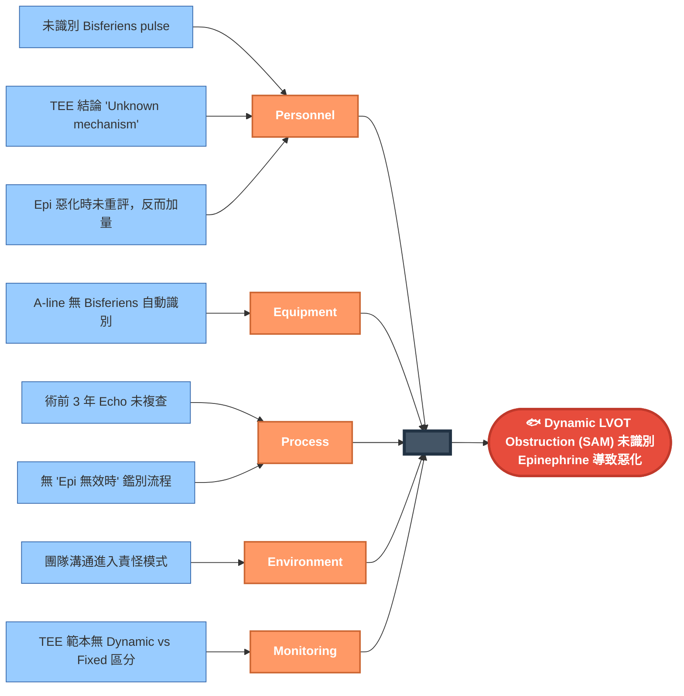
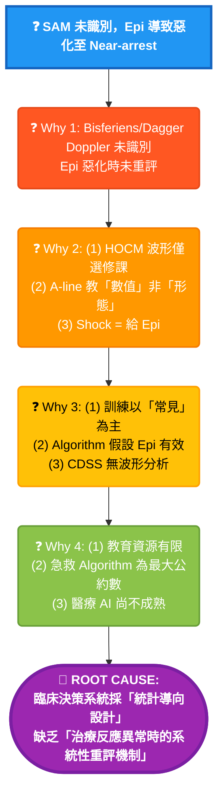

# Case 6: Dynamic LVOT Obstruction (SAM) - RCA 分析報告

> **Session ID:** `rc_sess_5c486e7c`  
> **案例類型:** Near Miss (Near Cardiac Arrest)  
> **分析日期:** 2026-01-16  

---

## 📋 案例摘要

**患者:** 72歲女性，Frail (48kg)，髖關節骨折  
**手術:** Right Total Hip Replacement  
**事件:** 全身麻醉誘導後難治性休克，Epinephrine 使病情惡化

### 關鍵臨床時序

| 時間 | 事件 | BP | HR | 關鍵發現 |
|------|------|-----|-----|----------|
| 08:00 | Baseline | 165/90 | 85 | A-line placed |
| 08:05 | Induction | 150/85 | 90 | Propofol 80mg |
| 08:10 | Positioning | 80/40 | 100 | Lateral decubitus |
| 08:12 | Hypotension | 70/35 | 110 | Ephedrine 10mg - No response |
| 08:14 | -- | -- | -- | **A-line: Bisferiens pulse** (未識別) |
| 08:15 | Worsening | 60/30 | 130 | Ephedrine 10mg - **Getting worse** |
| 08:16 | Crisis | 50/?? | 145 | Epi 10mcg - ST depression |
| 08:18 | CRASH | **35/15** | 160 | **Epi 50mcg - WORSE** |
| 08:20 | TEE | -- | -- | **Dagger-shaped Doppler** (未識別) |

---

## 🎯 最終診斷

### **Dynamic LVOT Obstruction secondary to SAM (Systolic Anterior Motion)**

```
觸發因子組合：
├── Propofol → ↓ Preload + ↓ Afterload
├── Lateral positioning → ↓ Venous return  
├── Frail + NPO → Baseline hypovolemia
└── ?Undiagnosed septal hypertrophy

結果：
├── Small, underfilled, hyperdynamic LV
├── Venturi effect → SAM (Anterior leaflet into LVOT)
├── Dynamic LVOT obstruction (Gradient >80 mmHg)
└── Secondary MR (eccentric posterior jet)

為什麼 Epinephrine 是致命的：
├── β1: ↑ Contractility → 更強的 SAM
├── β2: ↓ SVR (low dose) → ↓ Afterload → 更嚴重
├── β1: ↑ HR → 更少填充時間 → LV 更小
└── 惡性循環 → Near-arrest
```

---

## 🔬 病徵確定性徵象 (Pathognomonic Signs)

| 徵象 | 來源 | 意義 | 狀態 |
|------|------|------|------|
| **Bisferiens Pulse** | A-line | HOCM 經典波形 | ❌ 未識別 |
| **Spike and Dome** | A-line | 同上 | ❌ 未識別 |
| **Dagger-shaped Doppler** | TEE CW | Late-peaking = Dynamic | ❌ 未識別 |
| **SAM** | TEE 2D | Anterior leaflet → Septum | ⚠️ 記錄但未診斷 |
| **Eccentric MR (posterior)** | TEE Color | Secondary to SAM | ⚠️ 記錄但未連結 |
| **Kissing Walls** | TEE | Hyperdynamic + Empty | ⚠️ 記錄但誤解 |
| **Worsening with Epi** | Clinical | Inotropes 禁忌 | ❌ 未觸發重評 |

---

## 🚨 三層診斷陷阱

| Level | 診斷 | 觸發線索 | 處置 | 結果 |
|-------|------|----------|------|------|
| **1** | Hypovolemia / Light | "Is patient light?" | Volume, deepen | ⚠️ 部分對 |
| **2** | Massive PE / MI | Shock protocol | Epi/Thrombolytics | ❌ 致命 |
| **3** | **Dynamic LVOT Obstruction** | Bisferiens + Dagger | **Phenylephrine, Volume, Esmolol** | ✅ 正確 |

### 治療原則：**完全相反**

| 一般休克 | SAM/Dynamic Obstruction |
|----------|-------------------------|
| ↑ Contractility (Epi) | ❌ **停止** inotropes |
| Any vasopressor | ✅ **Phenylephrine** (純 α) |
| Fluid restriction ok | ✅ **大量補液** |
| Avoid β-blockers | ✅ **Esmolol** if tolerated |

---

## 🐟 Fishbone (6M) 分析



---

## 🔍 5-Why 分析



---

## 🎯 根本原因

> **臨床決策系統（人類訓練 + Algorithm + AI）皆採「統計導向設計」**
>
> 優化對「大多數病人」的處置，但缺乏「**治療反應異常時的系統性重新評估機制**」。
>
> 當標準治療使病情惡化時，系統應強制暫停並觸發替代診斷流程，但目前依賴個別醫師的專家知識而非系統性防護。

### 核心問題

**標準 Shock Algorithm 缺少這一步：**

```
[ 給 Epinephrine ]
        ↓
    效果如何？
        ↓
    ┌─────────────────────────────────────┐
    │ ❌ 惡化或無效                         │
    │    ↓                                 │
    │ 【強制停點】為什麼標準治療沒效？        │
    │    ↓                                 │
    │ 重新評估：                            │
    │ - Dynamic obstruction?               │
    │ - Anaphylaxis (需要 large volume)?   │
    │ - Tension pneumothorax?              │
    │ - Pericardial tamponade?             │
    │ - Severe hypovolemia?                │
    └─────────────────────────────────────┘
```

---

## 📝 改善建議

### 立即行動

1. **建立「Epi 無效/惡化」鑑別清單**
   - Dynamic LVOT Obstruction (SAM/HOCM)
   - Severe RV failure (LVAD Suction-like)
   - Severe Hypovolemia (needs volume not vasopressor)
   - Anaphylaxis (Epi dose may be insufficient)

2. **A-line 波形形態教學**
   - Bisferiens = HOCM/SAM
   - Pulsus Alternans = Severe LV failure
   - Pulsus Paradoxus = Tamponade

3. **TEE 報告強制結構化**
   - LVOT Doppler: Early/Mid/Late peaking
   - Mitral Leaflet Motion: Normal/SAM
   - MR Jet Direction: Central/Eccentric (which direction?)

### 系統性改變

4. **修改 Shock Algorithm**
   - 加入「治療反應評估」節點
   - 「Epi 惡化」觸發替代診斷流程

5. **監視器 AI 警示**
   - A-line waveform pattern recognition
   - Bisferiens → 提示 HOCM/SAM

---

## 💡 記憶口訣

> **"If Epi makes it WORSE, think OBSTRUCTION"**
>
> - Dynamic LVOT (SAM/HOCM)
> - Severe RV failure + Suction
> - Any mechanical obstruction

> **治療口訣：STOP the βeta**
> - **S**top inotropes
> - **T**rendelenburg / Volume
> - **O**nly pure α (Phenylephrine)
> - **P**erhaps β-blocker (Esmolol)

---

## 📚 參考資料

1. Perioperative Management of HOCM. *Anesthesiology* 2019.
2. The Bisferiens Pulse: Bedside Recognition. *Circulation* 2015.
3. Dynamic LVOT Obstruction in Non-HOCM Patients. *JASE* 2020.
4. SAM in Stress Cardiomyopathy and Sepsis. *Critical Care* 2018.
