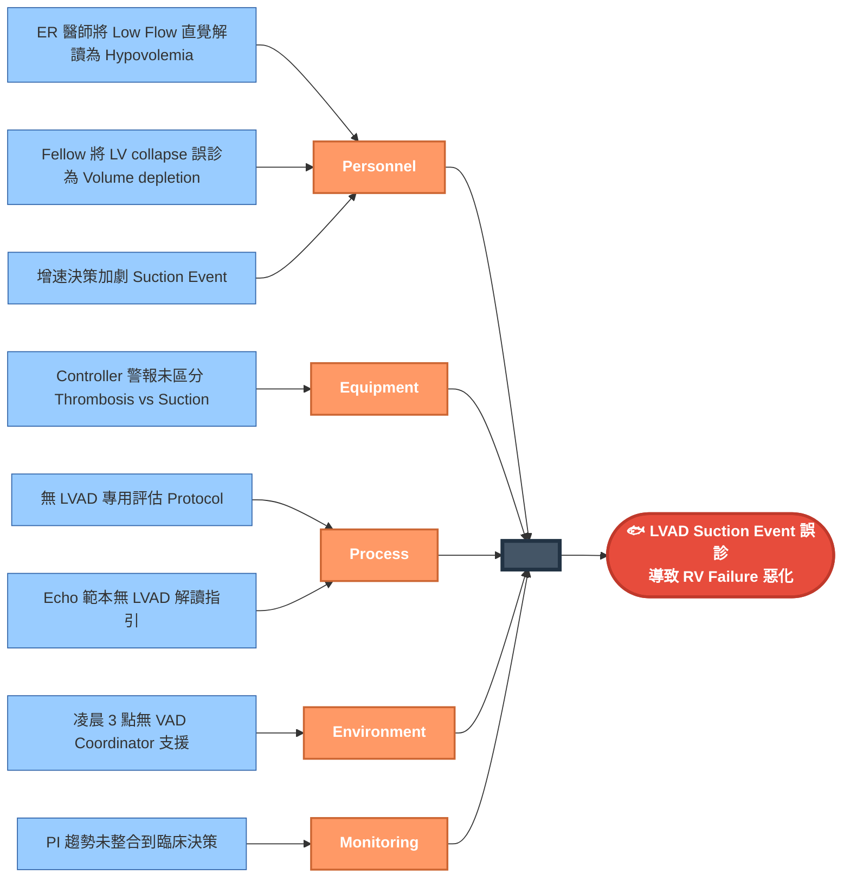
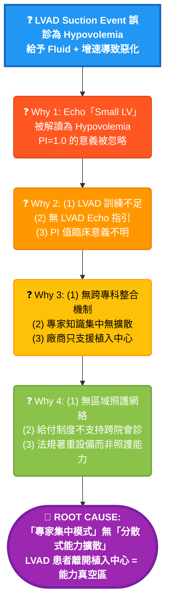

# Case 5: LVAD Suction Event - RCA 分析報告

> **Session ID:** `rc_sess_b20ab22a`  
> **案例類型:** Complication (Near Death)  
> **分析日期:** 2026-01-16  

---

## 📋 案例摘要

**患者:** 58歲男性，End-stage HFrEF，HeartMate 3 LVAD 術後 8 個月  
**主訴:** Low Flow Alarm 響起  
**最終結果:** RV Failure 進展，需 ECMO 支持

### 關鍵臨床時序

| 時間 | 事件 | 關鍵數據 |
|------|------|----------|
| 03:00 | Low Flow Alarm 響起，Flow 2.8 L/min | PI 1.0 (正常 3-5) |
| 03:15 | ER 診斷：Hypovolemia → 給 NS 1L | Echo: Small LV, IVS bowing |
| 03:45 | Flow 仍低 → 增加 Pump Speed 6000 RPM | **加劇 Suction** |
| 04:30 | 惡化：Flow 2.2 L/min，RV 擴張 | Power spikes 出現 |
| 05:00 | 心臟科 Fellow 診斷：Pump Thrombosis | LDH 3500, Free Hb 150 |
| 06:00 | 轉 CVICU，最終診斷：**Suction Event** | **RV Failure 為根因** |

---

## 🐟 Fishbone (6M) 分析



---

## 🔍 5-Why 分析



---

## 🎯 根本原因

> **醫療體系對「罕見高複雜度設備患者」採「專家集中模式」而無「分散式能力擴散機制」**
>
> 當 LVAD 患者離開植入中心，即進入「能力真空區」。現行體系假設罕見疾病患者會返回專家中心，未考慮緊急情況下任何醫院都可能需要處置。

### 支持證據

- ❌ LVAD 患者急診後常被誤診
- ❌ 設備製造商僅支援植入中心
- ❌ 無區域 LVAD 緊急處置指引
- ❌ VAD 專家跨院會診無給付碼

---

## 🚨 三層診斷陷阱分析

### 為什麼這是「God Level」案例？

| 層級 | 診斷思路 | 觸發線索 | 結果 |
|------|----------|----------|------|
| **Level 1** | Hypovolemia | Small LV on Echo | ❌ 錯誤 |
| **Level 2** | Pump Thrombosis | Power spike + LDH ↑ | ❌ 錯誤 (我的錯誤) |
| **Level 3** | **Suction Event** | **PI=1.0 + IVS bowing INTO LV + RV dilated** | ✅ 正確 |

### 關鍵鑑別：Thrombosis vs Suction Event

| 特徵 | Thrombosis | Suction Event |
|------|------------|---------------|
| **Power** | 持續升高 | **間歇性 spikes** |
| **PI** | 正常或略低 | **極低 (<1.5)** |
| **LDH** | 極高 (>2500) | 中度升高 |
| **Echo LV** | 正常或擴張 | **Collapsed + IVS bowing INTO LV** |
| **Echo RV** | 正常 | **擴張** |
| **處置** | 抗凝/tPA | **降速 + 支持 RV** |

### 關鍵線索被忽略

1. **PI (Pulsatility Index) = 1.0**
   - 正常：3-5
   - PI < 1.5 = LV 幾乎無搏動 = 極度 under-filled 或 RV failure
   
2. **IVS Bowing 方向**
   - Bowing into RV = Volume overload (不是這個 case)
   - **Bowing into LV = LV under-filled = Suction**

3. **RV 擴張 + LV collapse**
   - **這是 RV failure 的徵象**
   - RV failure → RV 無法將血液送到 LV → LV under-filled → Suction

### 為什麼 Fluid + 增速是致命的？

```
RV Failure
    ↓
LV Under-filled (因為 RV 打不過去)
    ↓
LVAD 嘗試抽血但 LV 是空的 → Suction Event
    ↓
Echo 看到「Small LV」→ 誤以為 Hypovolemia
    ↓
給 Fluid → RV 更脹 → RV failure 更嚴重
增速 → Suction 更嚴重 → LV 壁被吸住
    ↓
惡性循環 → 最終需要 ECMO
```

---

## 📝 改善建議

### 立即行動

1. **建立 LVAD Emergency Protocol**
   - Low Flow Alarm 鑑別流程
   - 強調 PI 值解讀
   - 禁止盲目增速

2. **LVAD Echo 解讀指引**
   - IVS bowing 方向 = 關鍵
   - 同時評估 RV function
   - Small LV ≠ 一定是 Hypovolemia

3. **24/7 VAD Coordinator Hotline**
   - 任何 LVAD 患者急診必須聯繫
   - 遠端 Controller Log 解讀

### 系統性改變

4. **區域 LVAD 照護網絡**
   - 非植入中心急診人員基礎訓練
   - 快速轉診通道
   - 遠距專家會診

5. **Controller 警報系統改進**
   - 區分 Thrombosis vs Suction
   - PI 趨勢警示
   - 建議處置方向

---

## 📚 LVAD 生理學速記

### Normal LVAD Function
```
RA → RV → PA → Lungs → LA → LV → LVAD → Aorta
                                    ↑
                              連續流，PI 3-5
```

### Suction Event (RV Failure)
```
RA → RV (Dilated, Failing) → PA ↓ → ... → LV (Empty) → LVAD tries to suck
                                                            ↓
                                                      Nothing to pump
                                                            ↓
                                                      PI drops to ~1.0
                                                      Power spikes (intermittent contact)
```

### 處置原則
- **Thrombosis**: 抗凝、考慮 tPA、可能需要換 pump
- **Suction (RV Failure)**: **降速**、支持 RV (Inotropes, 考慮 RVAD/ECMO)

---

## 📚 參考資料

- LVAD Suction Events: Recognition and Management. *ASAIO J* 2019.
- Echocardiographic Assessment of LVAD Function. *JASE* 2021.
- HeartMate 3 Troubleshooting Guide. *Abbott* 2023.
