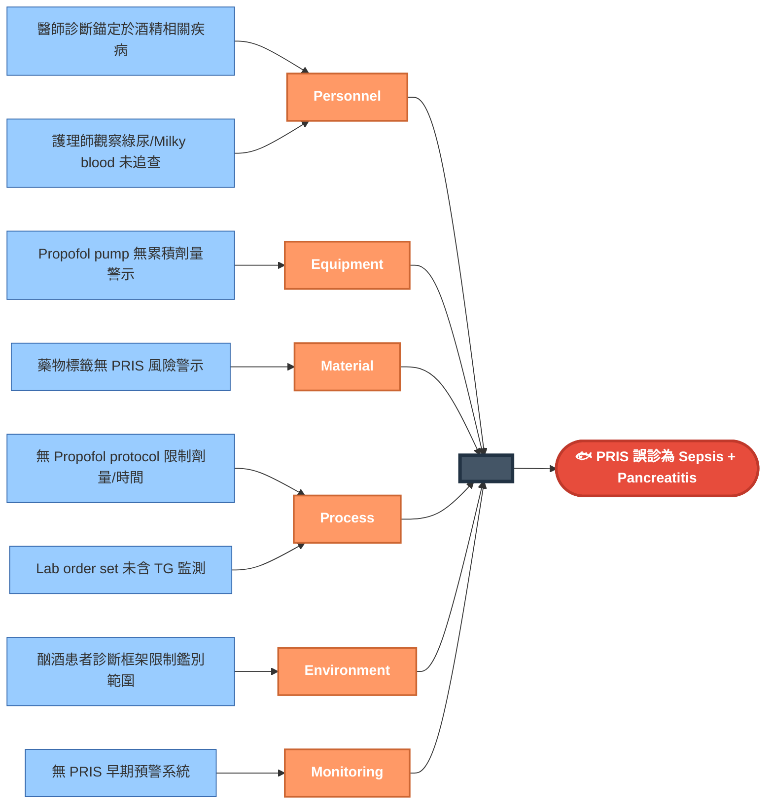
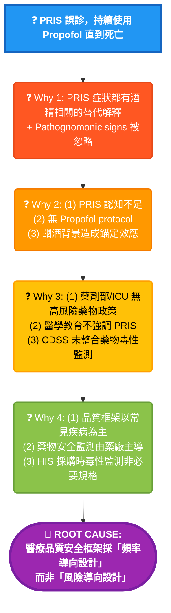

# Case 4: PRIS (Propofol Infusion Syndrome) - RCA 分析報告

> **Session ID:** `rc_sess_c7d0c7cc`  
> **案例類型:** Death  
> **分析日期:** 2026-01-16  

---

## 📋 案例摘要

**患者:** 32歲男性，長期酗酒史  
**入院診斷:** Status Epilepticus  
**最終結果:** 死亡 (PRIS 誤診為 Sepsis/Pancreatitis)

### 關鍵臨床時序

| 時間 | 事件 | 關鍵數據 |
|------|------|----------|
| Day 0 | ER 接收，Status Epilepticus 控制後轉 MICU | Propofol 開始 |
| Day 1 | Propofol 45 ml/hr，約 7.5 mg/kg/hr | CK 450, Lactate 2.1 |
| Day 2 | Propofol 增至 60 ml/hr (10 mg/kg/hr) | CK 15,000, Lactate 6.8 |
| Day 2 | 護理師觀察：**綠色尿液**、**Milky blood** | **Pathognomonic signs 被忽略** |
| Day 3 | ECG: Brugada-like pattern，VT/VF | **TG 從未被 ordered** |
| Day 3 | 死亡 | 診斷: Sepsis + Pancreatitis |

---

## 🐟 Fishbone (6M) 分析

---

## 🔍 5-Why 分析

---

## 🎯 根本原因

> **醫療品質安全框架採「頻率導向設計」而非「風險導向設計」**
>
> 低頻率高致死率事件 (PRIS 死亡率 33%) 缺乏系統性預防機制，因為資源分配優先考慮常見問題，導致罕見致命併發症依賴個別醫師的知識和警覺，而非系統性防護。

### 支持證據

- ❌ PRIS 死亡率 33%，但無強制監測
- ❌ 品質指標著重常見併發症
- ❌ 罕見事件無 sentinel event 報告要求
- ❌ TG 監測從未被 order

---

## 🚨 診斷陷阱分析

### 為什麼這是「God Level」案例？

| 層級 | 診斷思路 | 結果 |
|------|----------|------|
| Level 1 | Sepsis + Pancreatitis（符合酗酒者常見問題） | ❌ 錯誤 |
| Level 2 | Alcoholic Ketoacidosis + Rhabdomyolysis | ❌ 錯誤 |
| **Level 3** | **PRIS - 看到綠尿 + Milky blood = Pathognomonic** | ✅ 正確 |

### Pathognomonic Signs（病徵確定性徵象）

1. **綠色尿液** - Propofol 代謝物 (phenolic metabolites)
2. **Milky blood** - 高脂血症 + Propofol 乳劑
3. **Brugada-like ECG** - PRIS 特徵性心電圖變化

### 診斷錨定效應 (Anchoring Bias)

每個 PRIS 症狀都有「酒精相關」的替代解釋：
- 代謝性酸中毒 → Alcoholic Ketoacidosis
- 橫紋肌溶解 → Alcohol withdrawal seizures
- Lipase 上升 → Alcoholic Pancreatitis
- 心律不整 → Alcoholic Cardiomyopathy

**陷阱：所有解釋都「合理」，但組合起來只有 PRIS 能解釋全貌**

---

## 📝 改善建議

### 立即行動

1. **建立 Propofol 使用 Protocol**
   - 劑量限制：≤4 mg/kg/hr
   - 時間限制：≤48 小時高劑量
   - 強制監測：每 12 小時 TG、CK、Lactate

2. **PRIS 早期預警系統**
   - 累積劑量自動計算
   - Lab 異常趨勢警示
   - 觸發後強制 TG 檢驗

3. **護理師教育**
   - 綠色尿液 = 立即通報
   - Milky blood = 立即通報

### 系統性改變

4. **品質框架改為「風險導向設計」**
   - 低頻率高致死率事件納入監測
   - Sentinel event 擴大定義

5. **CDSS 整合藥物毒性監測**
   - 高風險藥物自動觸發監測
   - AI 輔助識別罕見併發症模式

---

## 📚 參考資料

- Propofol Infusion Syndrome: A Structured Review of Experimental Studies and 153 Published Case Reports. *Crit Care Med* 2019.
- PRIS pathognomonic signs: green urine, lipemic serum. *Anesthesiology* 2009.
- Risk factors for PRIS: dose >4-5 mg/kg/hr, duration >48h. *Intensive Care Med* 2017.
