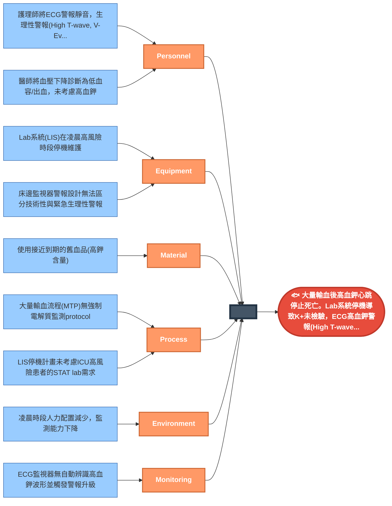
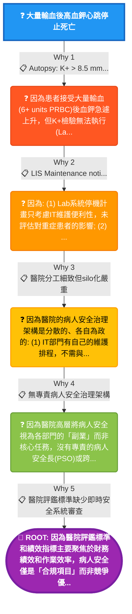

# RCA分析結果：MTP後高血鉀心跳停止

**Session ID:** `rc_sess_415940b8`  
**案例類型:** Death  
**分析日期:** 2026-01-16

---

## 📋 案例摘要

- **患者:** 32歲男性
- **事件:** 高速車禍(MVA)，肝臟撕裂傷，啟動大量輸血(MTP)
- **結果:** 02:45 PEA arrest → 死亡
- **法醫發現:** K+ > 8.5 mmol/L，**非失血致死**

### 瑞士乳酪模型 - 所有層都失效

```
Layer 1: 大量輸血舊血品 → ↑K+ 負荷
Layer 2: AKI/ATN → 無法排出 K+
Layer 3: Lab系統停機 → K+ 未檢驗
Layer 4: ECG警報被忽略 → High T-wave, Wide QRS IGNORED
Layer 5: 誤診為低血容 → 給更多液體而非治療高血鉀
```

---

## 🐟 魚骨圖 (Fishbone / Ishikawa)



---

## 🔍 5-Why 分析樹



---

## 🎯 根本原因 (Root Cause)

> **因為醫院評鑑標準和績效指標主要聚焦於財務績效和作業效率，病人安全僅是「合規項目」而非競爭優勢或組織核心價值。醫院領導層的績效考核不包含病人安全指標(如Serious Safety Events、RCA完成率等)**

**信心度:** 92%

### HFACS 分類
- **Level 4:** Organizational Influences (組織影響)
- **Code:** OI-RP (Resource Management / Process)

---

## 💡 建議改善措施

### 立即 (0-30天)
1. **MTP Protocol 更新**
   - 加入強制電解質監測 (每2小時 K+/Ca2+/iCa)
   - 配置 POC i-STAT 作為備援

2. **警報管理**
   - HI_T_WAVE, Wide QRS 設為「不可忽略」警報
   - 連續3個生理警報觸發自動升級

3. **IT停機政策**
   - 任何影響STAT lab的停機需臨床主管簽核
   - ICU/急診必須有backup方案

### 中期 (30-90天)
4. **血庫政策**
   - MTP優先使用新鮮血品 (<7天)
   - 高風險患者(AKI)標註「避免舊血品」

5. **跨部門安全委員會**
   - 建立IT/工程/臨床的風險協調機制
   - 定期審查系統性風險

### 長期 (90-365天)
6. **領導層KPI**
   - 將病人安全指標納入高層績效考核
   - 設立專責病人安全長(PSO)

---

## 📁 相關檔案

- 原始資料: `examples/trauma_hyperkalemia_arrest/`
- 匯出報告: `data/exports/rc_sess_415940b8/`
